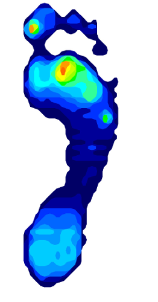
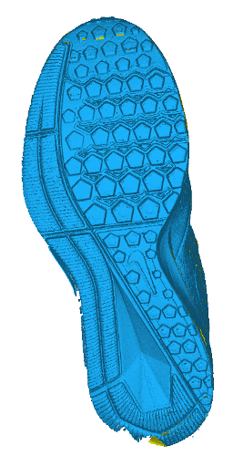
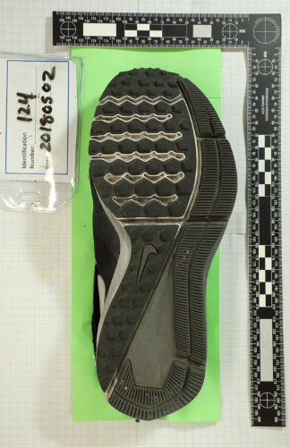
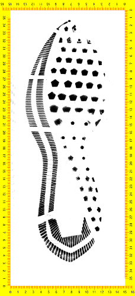
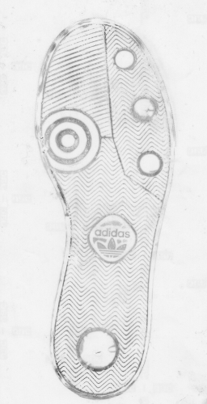
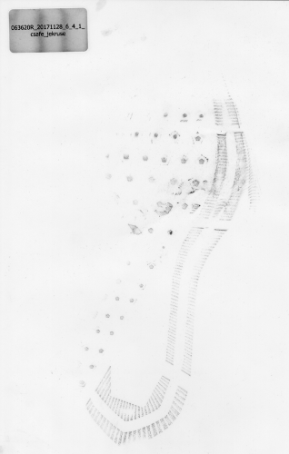

class: primary
## The Shoes

- 160 pairs of shoes
  - Nike Winflow, Adidas Seeley
  - 4 sizes per shoe

- Worn over a period of ~6 months

- Measured 3-4 times (Initial + additional visits at 6wk intervals)

- Pedometer measurements of cumulative steps

- Participant surveys - walking surfaces, activities, etc.

- Participant height and weight collected at the start of the experiment

---
class: primary
## Measurement Methods

1. Tekscan Mat Scanner (initial visit only)
2. 3D scanner (Einscan Pro+)
3. Digital photography
4. EverSpry EverOS scanner
5. Film + Fingerprint powder prints
6. Paper + Fingerprint powder prints
7. Vinyl flooring + Fingerprint powder prints (photographed)

1    |  2   |  3  |  4   |  5   | 6    | 7    
--- | --- | --- | --- | --- | --- | --- 
 |   |  |  |  |   | 

---
class: primary
## Additional Variables and Replicates

For some measurement methods, additional variables were considered, such as:

- Type of motion (walking, jumping, careful rollstep for full sole coverage)

- Equipment setup (turntable vs. handheld 3d scanning)

  

For most measurement methods, at least two replicates were recorded at each timepoint

---
class: primary
## Accessing the Data

Study collection procedures and data documentation: https://github.com/CSAFE-ISU/Longitudinal_Shoe_Study

CSAFE Study Description: https://forensicstats.org/shoeoutsoleimpressionstudy/

Direct link to Database: https://data.csafe.iastate.edu/DataPortal/

- Direct download links for all images from a particular measurement method

- Query construction: get only the images you want, with preview images in the browser

