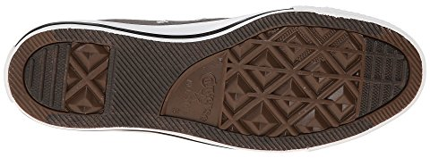
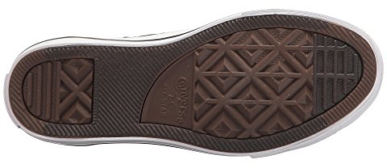
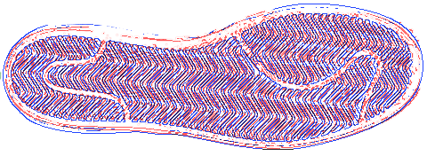
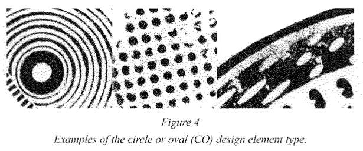
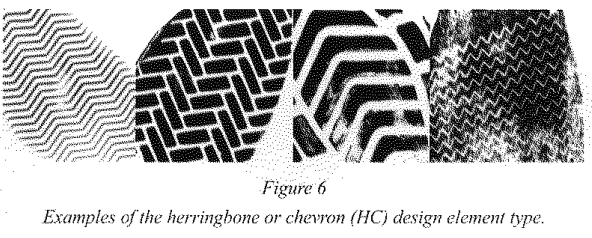
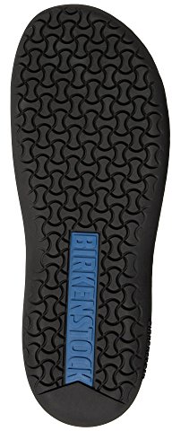
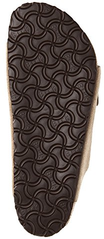
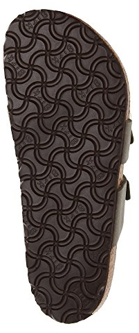
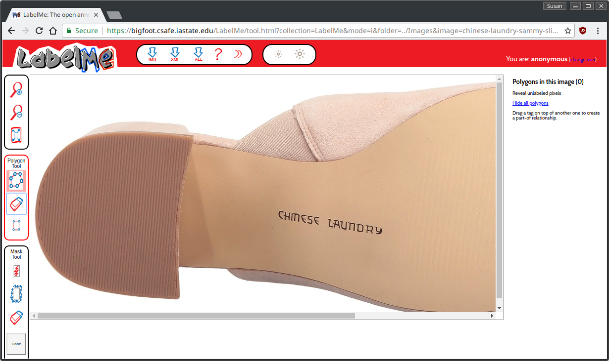

```{r setup, include=FALSE}
options(htmltools.dir.version = FALSE)
```

class:primary
# Identifying Characteristics

Goal: Reduce the population of people who could have left a certain print

- Class Characteristics: qualities shared by multiple shoes
    - Size, tread pattern, make, model

- Wear Characteristics - may not be unique to an individual, but are affected by individual features (weight, exercise practice, etc.)

- Individual characteristics (manufacturing defects, incidental damage) are often not assessed (~5% of cases)

---
class:primary
# Class Characteristics

- Size is hard: 




---
class:primary
# Class Characteristics

- Size is hard: 



---
class:primary
# Class Characteristics

Tread Pattern: Different molds




---
class:primary
# Design Elements




---
class:primary
# Brand and Design Elements






---
class:primary
# Use for Class Characteristics

- Characterize a shoe or print by the characteristics present
--

    - May also include spatial/size information
--

- Use this information to identify shoe make/model
--

- Speed up database searches by indexing using class characteristics
--

- (With spatial information) Modify methods for partial prints
--

    - e.g. Filter by "has concentric circles on the ball of the foot"
    
---
class:primary
# Problem

- New shoes are coming out all the time
--

- Can't lock someone up in a room and make them classify objects on shoes forever
--

    - Well, maybe we can...?
--

- It would be nice to generalize -    
e.g. high likelihood this is a Nike shoe, even if we can't say it's a specific model

--

Long Term Goal: Use tread elements to characterize the frequency of types of shoes in local populations. (Requires a way to get lots of pictures of shoe tread - future project)

---
class:secondary


---
class:primary
# Approach

- (By hand) Mark design elements on a bunch of shoe tread images
--


- Use the marked images to create folders of images with certain tread elements 
--


- Train a computer vision algorithm (convolutional neural network) to recognize common tread patterns using the images 
--

- Use the neural network to generate variables describing tread features that can be used in statistical models, shoe identification, etc. 

---
class:primary

# Data Collection

https://bigfoot.csafe.iastate.edu/LabelMe/tool.html?collection=LabelMe&mode=i

User: bigfoot    
Password: isreal!

---
class:primary
# Data Collection

<a href = "https://bigfoot.csafe.iastate.edu/LabelMe/tool.html?collection=LabelMe&mode=i"> </a>
--

Labeled images will be sliced up and sorted by feature

---
class:primary
# Neural Networks

Everything is a number:


---
class:primary
# Training Data

We can expand our data by taking different sized chunks of labeled features
--


---
class:primary
# Neural Networks


---
class:primary
# Neural Networks


---
class:primary
# Neural Networks


---
class:primary
# End Result

1. Probability that a NxN chunk of the shoe tread image contains each feature

2. Combine the chunks to assess the overall probability that the feature is part of the shoe tread image

3. Examine how unique the class characteristics are and whether they can be used to identify shoe make/model reasonably well

