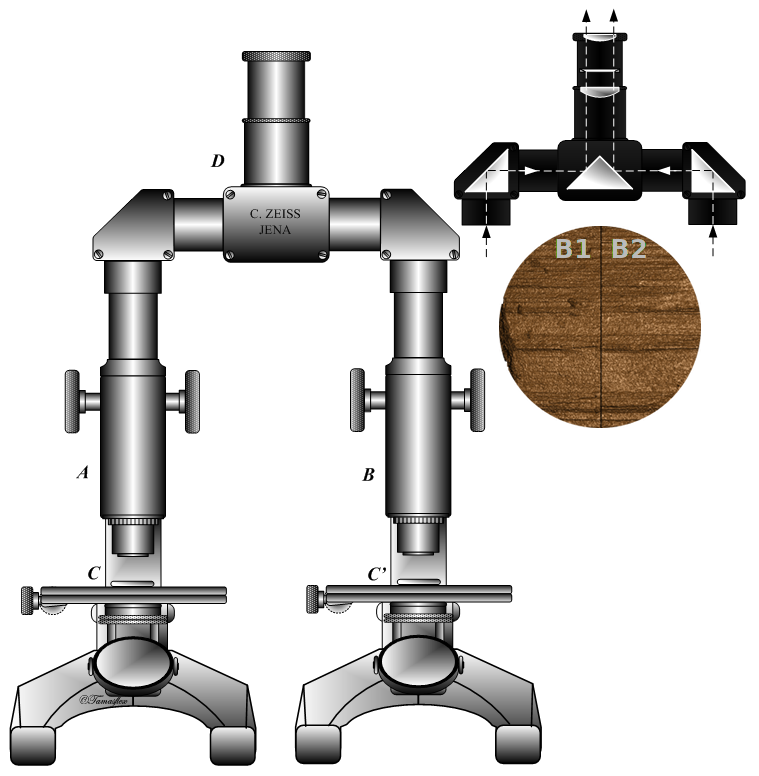
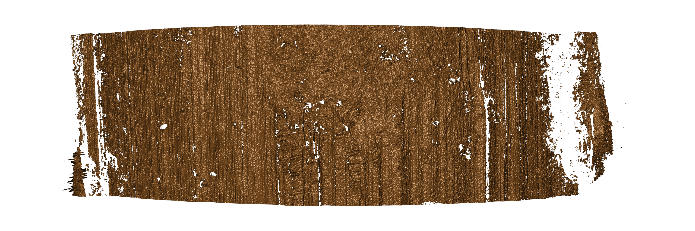
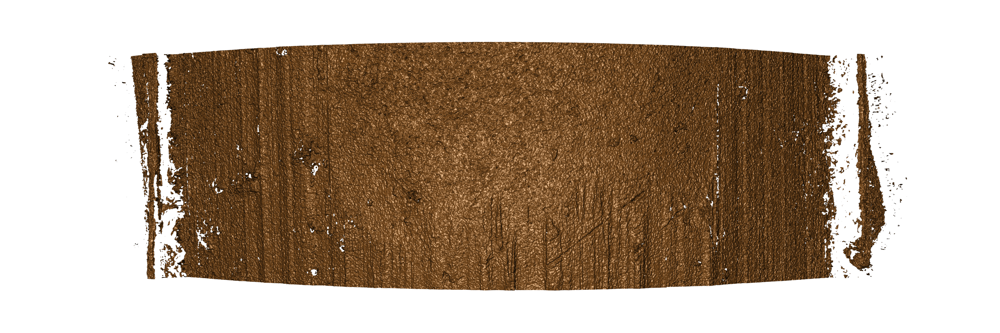

class: primary
## Bullets

.center[

Rifling in the barrel causes the bullet to spin, increasing accuracy.
]

.move-margin[
Marks are left on the fired bullet by the lands (raised areas) and grooves in the rifling.

These marks are used to identify which gun fired a bullet.]

---
class: primary
## Statistical methods for evaluating forensic evidence

.pull-left[]

.pull-right[
Currently: 
- Subjective visual alignment
- Match determined based on "similar enough"

Goal: Method is
- transparent
- objective
- automated
- reproducible

Process:
- Scan with 3d microscope
- Calculate features (statistics)
- Compare to other scans
- Assess match strength
]

.move-margin[<br/><br/><br/>]

---
class:primary
## Primary Problem

- Scanning is repetitive
- Hard to rapidly identify some issues with the scans
    - Wrong region scanned (Groove engraved area, not Land engraved area)
    
    - Too much breakoff
    
    - Pitting (physical bullet issue)
    
    - Tank Rash (physical bullet issue)
    
    - Too many missing values

### Goal: Create a rapid diagnostic tool to identify scan issues and important features

---
class:primary
## Scan Issues - <br/>Breakoff

__Breakoff__: Missing pieces of metal on the lower edge of the bullet due to the firing process

Not enough | Too much
---------- | --------
 | 
 | 


---
class:primary
## Scan Issues - <br/>GEA

__Wrong Area__: Groove engraved area scanned

Groove | Land 
------ | ----
 |  
 |  

--

Groove engraved areas are narrower than Land engraved areas

---
class:primary
## Scan Issues - <br/>Misalignment

__Misalignment__: Bullet tilted or angled on the scope

```{r, out.width = "49%", echo = F}
knitr::include_graphics(list.files("problem_scans/misaligned_on_scope/", "*.png", full.names = T))
```

---
class:primary
## Scan Issues - <br/>Damaged Bullet

__Damage__: The bullet was damaged by gunpowder explosions or collision with another object, making the striae hard to use.

```{r, out.width = "49%", echo = F}
knitr::include_graphics(list.files("problem_scans/tankrash_or_pitting/", "*.png", full.names = T))
```

---
class:inverse
# Goal: Create a rapid diagnostic tool to provide useful feedback to scanners in the microscopy lab