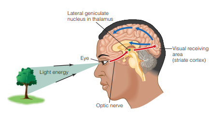
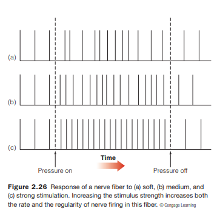
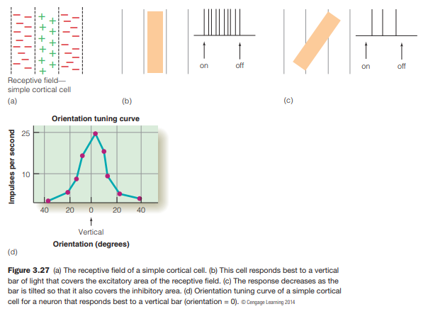
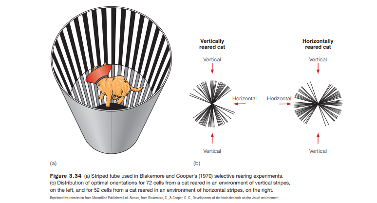
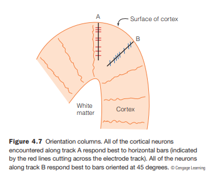
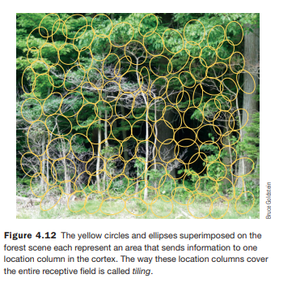
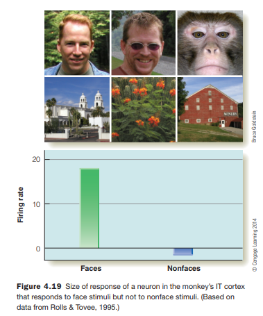
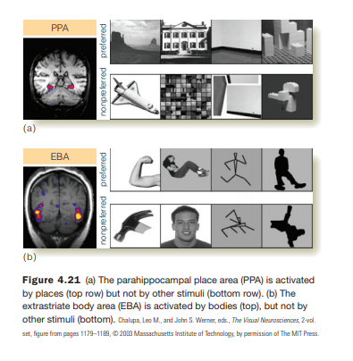
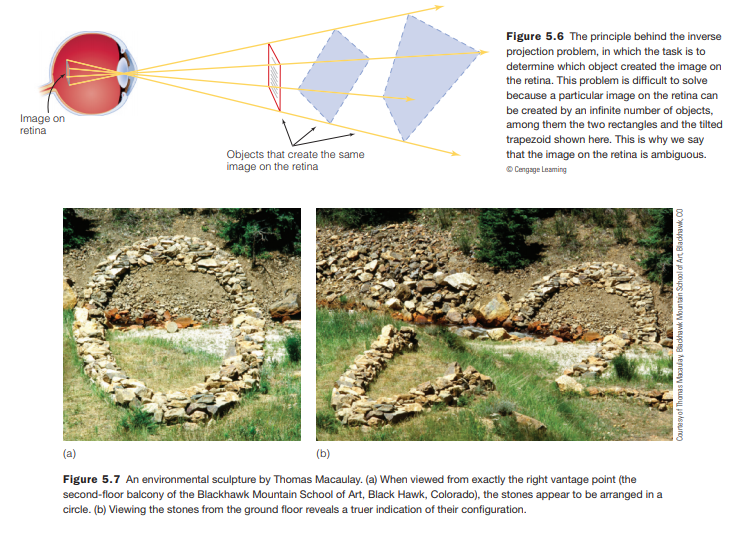
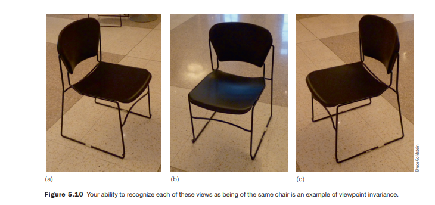

```{r setup, include=FALSE}
options(htmltools.dir.version = FALSE)
```

class:primary
# Visual System

---
class: secondary


.small[source: By Mads00 - Own work, CC BY-SA 4.0, https://commons.wikimedia.org/w/index.php?curid=49282011]

---
class: primary

## Lateral Geniculate Nucleus

<br>

- Input from: Retina (rods and cones)
- Outputs to: V1 visual cortex
- Both sides of the LGN receive input from each eye
- Correlates information in time and space
- Important in focusing attention





---
class:primary
## Neurons



- Time matters
- Neurons firing in sync = this is part of the same visual object


---
class:primary
## Visual Cortex

<br>

- Two streams of information:
    - ventral (bottom) stream - "What pathway"
        - V1, V2, V4, IT cortex
        - visual perception
        
    - dorsal (top) stream - " Where pathway" or "How pathway"
        - V1, V2, V6, V5, Posterior Parietal cortex
        - visual control of skilled actions


---
class:primary
## Primary Visual Cortex

### Simple cortical cells



---
class:primary
## Primary Visual Cortex

<br>
### Kitty Torture



"Use it or lose it"

---
class:primary
## Visual Cortex

<br>
### Orientation Columns



---
class:primary
## Visual Cortex

<br>
### Tiling



---
class:primary
## Specialization

<br>
In the Inferotemporal (IT) cortex, there are areas which specialize in certain classes of stimuli



---
class:primary
## Specialization

<br>
In the Inferotemporal (IT) cortex, there are areas which specialize in certain classes of stimuli



---
class:primary
## Perception Difficulties



---
class:primary
## Perception Difficulties



Need to train the neural network on a variety of orientations of stimuli


