```{r setup, include=FALSE}
knitr::opts_chunk$set(echo = FALSE)

library(tidyverse)
library(ggmosaic)
library(munsell)
library(USAboundaries)
library(RColorBrewer)
library(sf)
library(ggmapr)
```

```{r code, echo=FALSE}
theme_mosaic <- function (base_size = 11, base_family = "") {
    theme_grey(base_size = base_size, base_family = base_family) %+replace%
        theme(plot.background = element_blank(), plot.margin = grid::unit(c(0,
            0, 0, 0), unit = "cm"), panel.background = element_blank(),
            axis.line = element_blank(), axis.text = element_blank(),
            axis.ticks = element_blank(), axis.title.y = element_blank(),
            legend.key = element_rect(fill = NA, colour = "white"),
            panel.border = element_blank(), panel.grid = element_blank(),
            aspect.ratio = 1)
}

theme_spine <- function (base_size = 11, base_family = "") {
    theme_grey(base_size = base_size, base_family = base_family) %+replace%
        theme(plot.background = element_blank(), plot.margin = grid::unit(c(0,
            0, 0, 0), unit = "cm"), panel.background = element_blank(),
            axis.line = element_blank(), axis.text = element_blank(),
            axis.ticks = element_blank(), #axis.title = element_blank(),
            legend.key = element_rect(fill = NA, colour = "white"),
            panel.border = element_blank(), panel.grid = element_blank(),
            aspect.ratio = 1)
}

createMosaics <- function(data = occ3, state_name = "") {
  occ4 <- occ3 #%>% filter(State==Area.name) # Get only full states

  if (state_name == "") {
    occ4 <- occ4 %>%
      mutate(State = "United States")
  } else if (state_name == "all") {
    occ4 <- occ4
  } else {
    occ4 <- occ4 %>% filter(State == state_name)
  }

  if (nrow(occ4) == 0) return(NULL)

    getMosaic <- function(data) {
      data %>%
        ggplot() +
        geom_mosaic(aes(x = product(Sex, Occupation),
                        fill=Occupation, alpha = Sex, weight = Number),
                    offset = 0.00, colour="grey85", size=0.1) +
        scale_fill_manual(values=cols) + theme_bw() +
        scale_alpha_manual(values=c(0.8,1)) +
        coord_equal() +
        theme(axis.line=element_blank(), axis.text=element_blank(),
              axis.title.y = element_blank(), axis.ticks = element_blank()) +
        xlab(state_name) +
        theme_mosaic() +
        theme(legend.position = "none")
    }

  scalars <- occ4 %>%
    mutate(frame = Occupation=="Unaccounted") %>%
    group_by(State, frame) %>%
    summarize(
      Number = sum(Number)
    ) %>% mutate(
      weight = Number/sum(Number)
    ) %>%
    select(-Number) %>%
    mutate(frame = ifelse(frame, "Unaccommodated", "Accommodated")) %>%
    spread(key = frame, value = weight)

  scalarweight <- scalars %>%
    mutate(Accommodated = sqrt(Accommodated),
           Unaccommodated = 1 - Accommodated) %>%
    mutate(mosaicWt = Accommodated, frameWt = Unaccommodated/2) %>%
    select(-Accommodated, -Unaccommodated)

  getMultiMosaic <- function(data) { # Pass in a single state's data, get out the single state's built data frame
    getMosaic(data) %>%
      ggplot_build() %>%
      magrittr::extract2("data") %>%
      magrittr::extract2(1) %>%
      mutate(State = unique(data$State))
  }

  # make inside plot, then scale
  occ4 %>% filter(Occupation != "Unaccounted") %>%
    split(.$State) %>%
    map_df(getMultiMosaic)

  ggp <- occ4 %>% filter(Occupation != "Unaccounted") %>%
    split(.$State) %>%
    map_df(getMultiMosaic) %>%
    left_join(scalarweight)

  ggp_df <- ggp %>% mutate(
    xmin = xmin*mosaicWt + frameWt,
    xmax = xmax*mosaicWt + frameWt,
    ymin = ymin*mosaicWt + frameWt,
    ymax = ymax*mosaicWt + frameWt
  )

  plot1 <- ggp_df %>%
    ggplot() +
    geom_rect(xmin=0, xmax=1, ymin=0, ymax=1, fill="grey70", colour="grey40", size=.25) +
    geom_rect(aes(xmin=frameWt, xmax=1-frameWt, ymin=frameWt, ymax=1-frameWt), fill="white") +
    geom_rect(aes(xmin=xmin, xmax=xmax, ymin=ymin, ymax=ymax, fill=fill, alpha=alpha),
              colour="grey85", size=0.1) +
    scale_fill_identity() +
    scale_alpha_identity() +
    xlim(c(0,1)) +
    ylim(c(0,1)) +
    theme_mosaic()

  plot2 <- getMosaic(occ4)

  if (state_name == "all") {
    plot1 <- plot1 + facet_wrap(~State, ncol = 6)
    plot2 <- plot2 + facet_wrap(~State, ncol = 6)
  } else {
    plot1 <- plot1 + xlab(state_name)
    plot2 <- plot2 + xlab(state_name)
  }

  list(plot1=plot1, plot2=plot2)
}


createSpines <- function(data, state_name) {
  spine_df <- data %>% filter(STATEICP == state_name)

  if (nrow(spine_df) == 0) return()

  get_plots <- function(sub_data) {
    sub_data <- sub_data %>% mutate(
      group = factor(group),
      group = reorder(group, -Number)
    )
    lvls <- levels(sub_data$group)
    sub_data$group <- factor(sub_data$group,
                             levels=c(c("Unaccommodated", "Other"),
                                      rev(setdiff(lvls, c("Other", "Unaccommodated")))))

    sub_data <- sub_data %>% arrange(group)
    sub_data %>%
      ggplot() +
      geom_bar(aes(weight = Number,  x = STATEICP, fill = group),
               position = "fill", colour="white", size=0.1) +
      scale_fill_manual("Denomination", values=sub_data$colour) + coord_flip() +
      theme_spine() +
      theme(legend.position = "none") + xlab("") +
      ylab(state_name)
  }

  plot2 <- spine_df %>% get_plots()

  scalars <- spine_df %>% mutate(
    type = group=="Unaccommodated"
  ) %>% group_by(type) %>% summarize(
    Number = sum(Number, na.rm = TRUE)
  )

  if (nrow(scalars)==1) plot1 <- plot2
  else {
  scalars$weight <- scalars$Number/sum(scalars$Number)
  scalars$weight[1] <- sqrt(scalars$weight[1])
  scalars$weight[2] <- 1 - scalars$weight[1]
  spine <- spine_df %>% mutate(Number = replace(Number, group=="Unaccommodated", 0)) %>%
    get_plots()

  spine_wo_df <- ggplot_build(spine)$data[[1]] %>% mutate(
    xmin = scalars$weight[2]/2,
    xmax = scalars$weight[1] + scalars$weight[2]/2,
    ymin = ymin*scalars$weight[1] + scalars$weight[2]/2,
    ymax = ymax*scalars$weight[1] + scalars$weight[2]/2
  )
  plot1 <- spine_wo_df %>%
    ggplot(aes(xmin=xmin, xmax=xmax, ymin=ymin, ymax=ymax)) +
    geom_rect(aes(xmin=0, xmax=1, ymin=0, ymax=1), fill="grey60", colour="grey30", size=.5) +
    geom_rect(aes(fill=fill), colour="white", size=0.1) +
    scale_fill_identity() +
    coord_flip() +
    theme_spine() +
    ylab(state_name)
  }
  list(plot1=plot1, plot2=plot2)
}


createPie <- function(data, state_name) {
  spine_df <- data %>% filter(STATEICP == state_name)
  if (nrow(spine_df) == 0) return()

  get_plots <- function(sub_data) {
    sub_data <- sub_data %>% mutate(
      group = factor(group),
      group = reorder(group, -Number)
    )
    lvls <- levels(sub_data$group)
    sub_data$group <- factor(sub_data$group,
                             levels=c(c("Unaccommodated", "Other"),
                                      rev(setdiff(lvls, c("Other", "Unaccommodated")))))
    sub_data %>% arrange(desc(group)) %>%
      ggplot() +
      geom_bar(aes(weight = Number,  x = STATEICP, fill = group),
               position = "fill", colour="white", size=0.1,
               width=1) +
      scale_fill_manual("Denomination", values = rev(colHEX)[-c(2:4)]) +
      theme_mosaic() +
      theme(legend.position = "none") + ylab("") +
      ylab(state_name) + coord_polar(theta="y")
  }
  plot2 <- spine_df %>% get_plots()
  scalars <- spine_df %>% mutate(
    type = group=="Unaccommodated"
  ) %>% group_by(type) %>% summarize(
    Number = sum(Number, na.rm = TRUE)
  )
  if (nrow(scalars)==1) plot1 <- plot2
  else {
  scalars$weight <- scalars$Number/sum(scalars$Number)
  scalars$weight[1] <- sqrt(scalars$weight[1])
  scalars$weight[2] <- 1 - scalars$weight[1]
  spine <- spine_df %>% mutate(Number = replace(Number, group=="Unaccommodated", 0)) %>%
    get_plots()

  spine_wo_df <- ggplot_build(spine)$data[[1]] %>% mutate(
    xmin = 0,
    xmax = scalars$weight[1]
  )
  plot1 <- spine_wo_df %>%
    ggplot(aes(xmin=xmin, xmax=xmax, ymin=ymin, ymax=ymax)) +
    geom_rect(aes(xmin=0, xmax=1, ymin=0, ymax=1), fill="grey60") +
    geom_rect(aes(fill=fill),  colour="white", size=0.1) +
    coord_polar(theta="y") +
    scale_fill_identity() +
    theme_mosaic() +
    ylab(state_name)
  }
  list(plot1=plot1, plot2=plot2)
}
```

```{r data, cache=TRUE, message = F, warning = F}
datapath <- "data"
source(file.path(datapath, "Format_Data.R"))
load(file.path(datapath, "Processed_Data.Rdata"))
```


background-image: url(images/StatisticalAtlasCover.png)
background-position: 50% 50%
background-size: 100%
class: center, fullscale

---
class:center

# Slides

[http://srvanderplas.github.io/Presentations/JSM2018/Framed.html](http://srvanderplas.github.io/Presentations/JSM2018/Framed.html)

# Project Repository

[https://github.com/srvanderplas/Statistical_Atlas](https://github.com/srvanderplas/Statistical_Atlas)

---
layout:true
# Introduction

- Statistical Atlas published for the 9th, 10th, and 11th census    
(1870, 1880, 1890)

- Charts created by hand and reproduced using lithography


---

- Goal: Show the composition of the country
    - Maps
  
.center[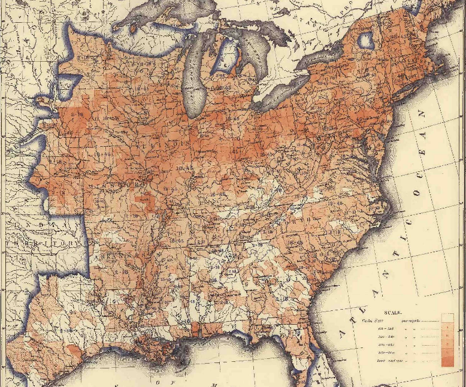]


---

- Goal: Show the composition of the country
    - Abstract Charts:
        - age pyramids
.center[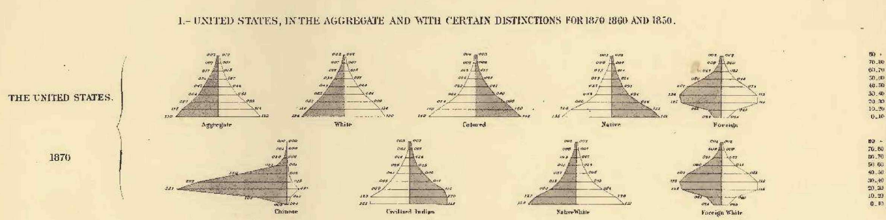]

---
- Goal: Show the composition of the country
    - Abstract Charts:
        - age pyramids
        - ring charts

.center[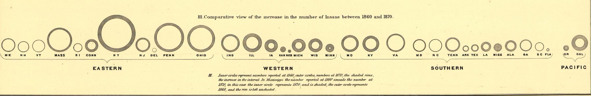]

---
- Goal: Show the composition of the country
    - Abstract Charts:
        - age pyramids
        - ring charts
        - framed mosaic and spine plots

---
layout: false
background-image: url(images/Church_Plate31.png)
background-position: 50% 0%
background-size: 100%
class: center, fullscale

---
background-image: url(images/ChurchAccommodations_USIntroLegend.png)
background-position: 50% 50%
background-size: 95%
class: center

???

- Spine plots
- Percent of religious sittings by denomination for each state
- Border: percent of unaccommodated population over the age of 10
- Shows top 4 denominations in each state, top 8 denominations overall (technical constraints)
- Denominations ordered from largest to smallest within states - comparisons are hard

---
background-image: url(images/Occupation_Plate32.png)
background-position: 50% 0%
background-size: 100%
class: center, fullscale

---
background-image: url(images/Occupation_USIntroLegend.png)
background-position: 50% 50%
background-size: 95%
class: center

???

- Mosaic plot - a novel type of plot in 1874
- Georg von Mayr didn't publish mosaic plots until 1877 (Friendly, 2002)
- Proportion of males and females in each occupation shown in the interior of the chart
- Proportion of unaccounted-for persons in the outer band (not separated by gender)

---
# Statistical Archaeology

### Reproduce the plots with modern methods

Data Sources:

- National Historical Geographic Information System 
- Original 1870 Census tables
- Unaccomodated population estimates using 1% microsample data from Integrated Public Use Microdata Series (IPUMS). 

- Pixel measurements (by hand) of the area of each chart (for comparison)

---
## Occupation

.center[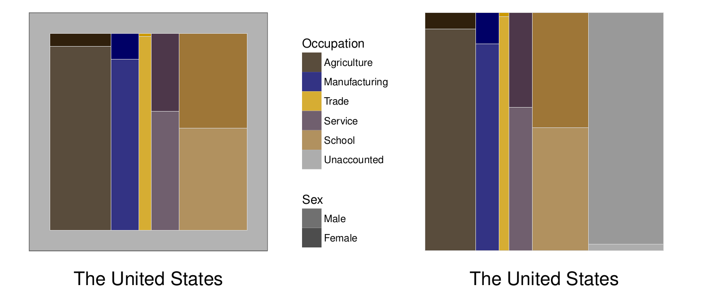]

- Frame cuts the uncounted population into quarters visually
- No segmentation of the uncounted population - 97% of uncounted population is female

---
## Occupation

```{r, fig.width = 6, fig.height = 4, out.width = "100%", message = F, warning = F, dpi = 300, fig.align = 'center'}
# only run this once
seframe = data.frame(x =seq(0,50))
seframe$p <- with(seframe, (x+3)/(100+3))
seframe$se <- with(seframe, sqrt(p*(1-p))*10)

sepolygon <- with(seframe, data.frame(x = c(x, rev(x)), y = c(x-1.96*se, rev(x+1.96*se))))


px2 %>% data.frame() %>%
  ggplot(aes(x = PixPercent, y = CensusPercent)) +
  geom_polygon(aes(x = x, y = y), fill="steelblue",
               alpha = 0.5, data = sepolygon) +
  geom_abline(colour="grey60") + geom_point() +
  facet_wrap(~Occupation) + theme_bw() +
  xlab("Percentages of occupation based on measurements in Plate #31") +
  ylab("Percentages based on Census Estimates")
```

---
class: bottom
## Church Accommodation

--

.center[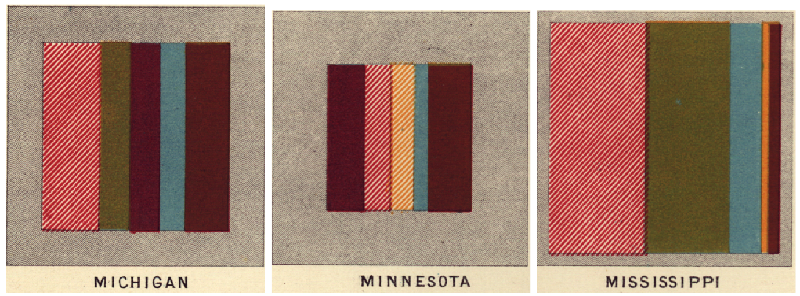]

--

.center[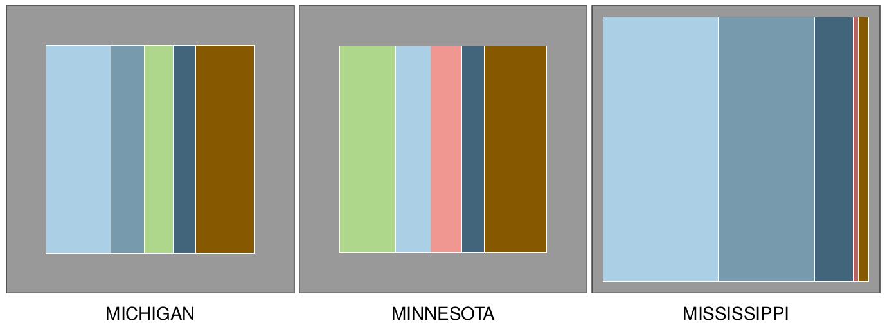]


---
## Church Accommodation

.center[]

.center[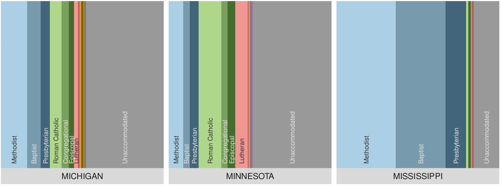]

---
## Church Accommodation

```{r religious-bias-plot, echo = FALSE, include=T, fig.width=4, fig.height=4, out.width = "60%", fig.align='center', dpi = 300}
church_noterritories <- churchPixel %>%
  filter(!(State.Territory %in% c("SW Territories", "NW Territories")))
church_noterritories %>%
  ggplot(aes(y = UAEstperc, x = UAPixperc)) +
  geom_abline() +
  geom_point() +
  theme_bw() +
  ggrepel::geom_label_repel(
    aes(label = State.Territory),
    data = church_noterritories %>%
      filter(UAPixperc - UAEstperc > 10)) +
  coord_equal() +
  geom_smooth(method = "lm", se = FALSE, linetype = 2, size = .5) +
  scale_x_continuous("Estimated based on 1% microsample") +
  scale_y_continuous("Estimate based on pixel values")
```

--

.center[Whoops. The lithographer screwed up.]

---
# Perception of Framed Plots

- Frame cuts the unaccommodated population into quarters - hard to estimate the size

--

- Difficult to compare between states, as there's no aligned axis due to the frame

--

- Estimation requires a two-stage process: 
    1. Area of the main plot that is accommodated
    2. Area of the center region devoted to a specific category

--

- Primary comparisons are on the x-axis; the frame disrupts the ease of these comparisons

---
# Frames in Practice

- 98 Participants (32 from reddit.com/r/samplesize, 63 from Amazon Mechanical Turk)

--

- Each participant evaluated 18 plots 
    - Region size: small, medium, large
    - Pie, Mosaic, Spine plots
    - Framed or Unframed charts

--

- 25 seconds per plot

---
# Frames in Practice

.center[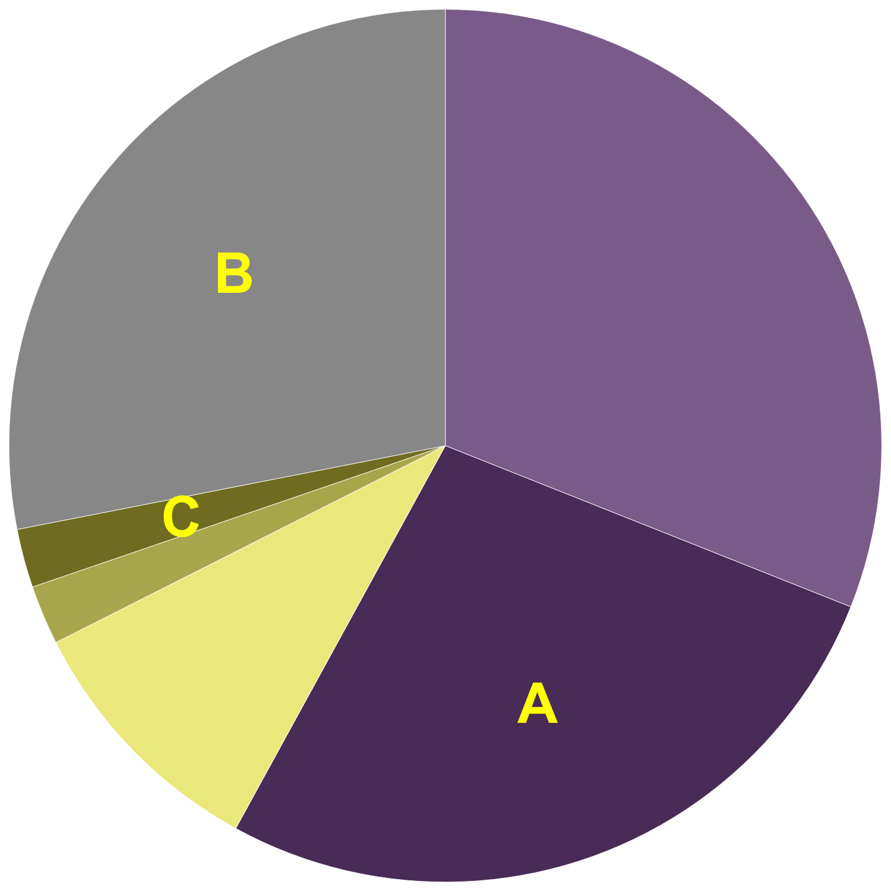
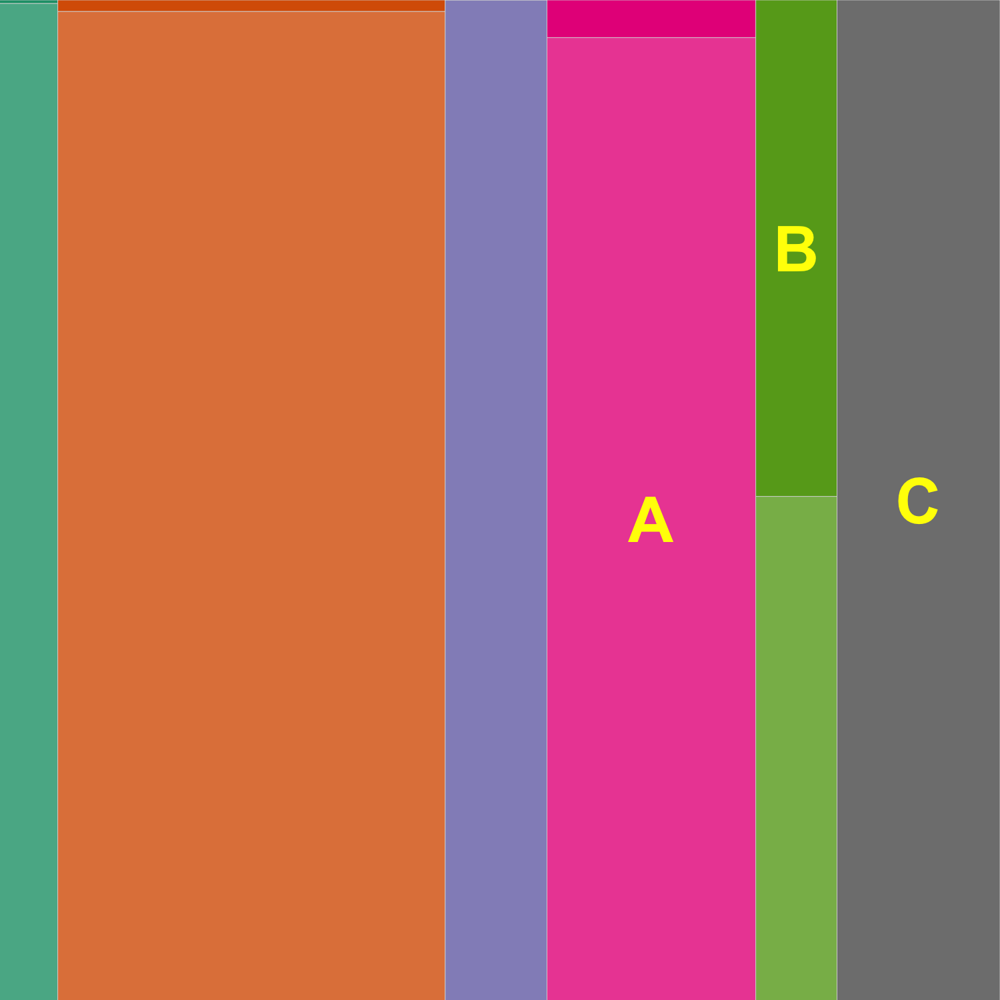
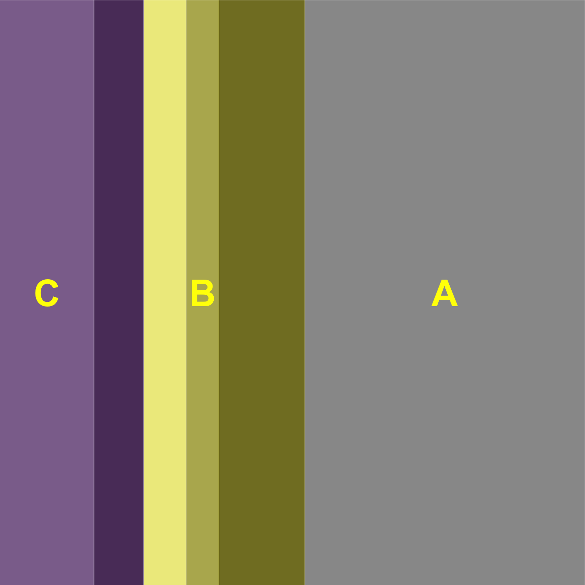]

.center[
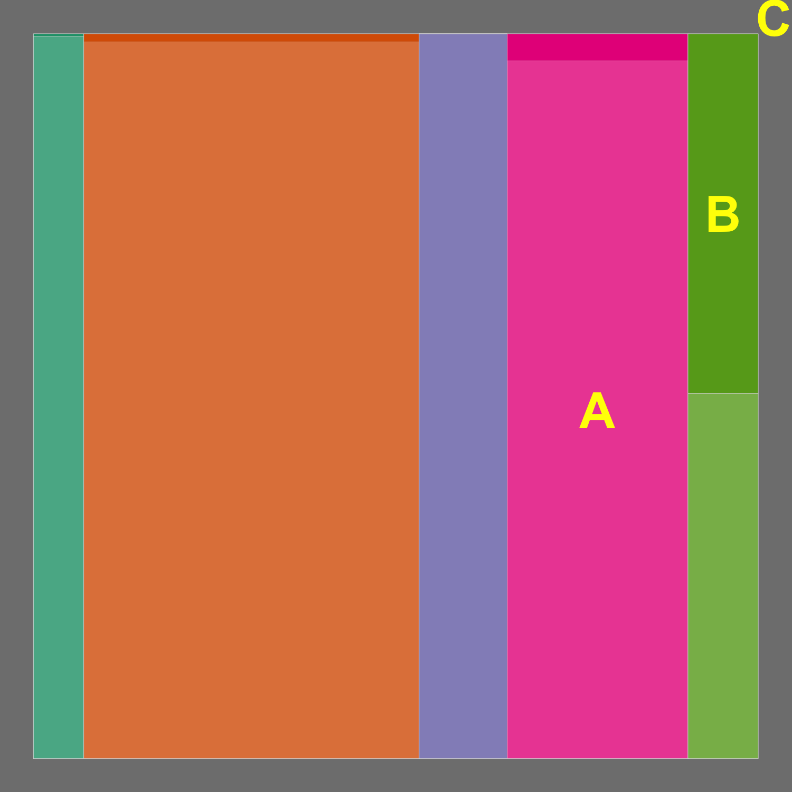
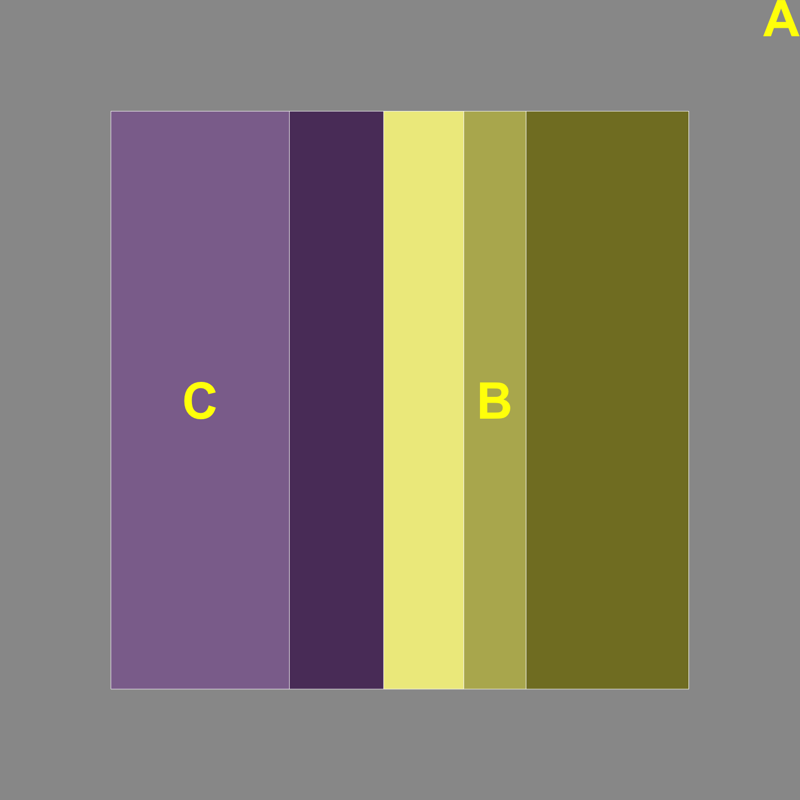]


---
# Results

```{r model, message = F, warning = F, echo=FALSE, fig.width=6, fig.height = 3.5, out.width = "100%", dpi = 300}
percentages <- percentages %>% mutate(
  frameframe = factor(frameframe,
                      levels=c("Unframed", "Framed-inside", "Framed-frame")),
  ratio = howmuch/perc
)

percentages %>% filter(abs(log(ratio)) < log(5)) %>%
  ggplot(aes(x = log(perc), y = log(howmuch),
             colour=frameframe, shape=frameframe)) +
  geom_abline(slope = 1, colour="grey50", size=0.5) +
  geom_point() +
  facet_grid(.~Type, labeller="label_both") +
  geom_smooth(method="lm", se=FALSE) +
  theme_bw() +
  coord_fixed() +
  theme(legend.position="bottom") +
  scale_colour_manual("Plot Area", values=c("grey50", "#FC8D62", "#66C2A5")) +
  xlab("(Log) Percent Actual Area") +
  ylab("(Log) Percent Estimated Area") +
  scale_shape_discrete("Plot Area", solid=F)
```


---
# Conclusions

- Estimation of the framed portion of plots is significantly worse than the same area in an unframed plot

--

<br>
- Framed plots are not great for accurately communicating the data
    - They don't appear in the 1880 or 1890 census
    - Pie charts largely replaced mosaic and spine plots

--

<br>
- The Census Bureau and assocciated institutions did a great job of preserving the data necessary to reproduce the results and identify flaws in the analysis process

<br>

---
# Conclusions

.center[## 150 years later, we can use completely different technology to get the same charts]

--

How's that for reproducibility?