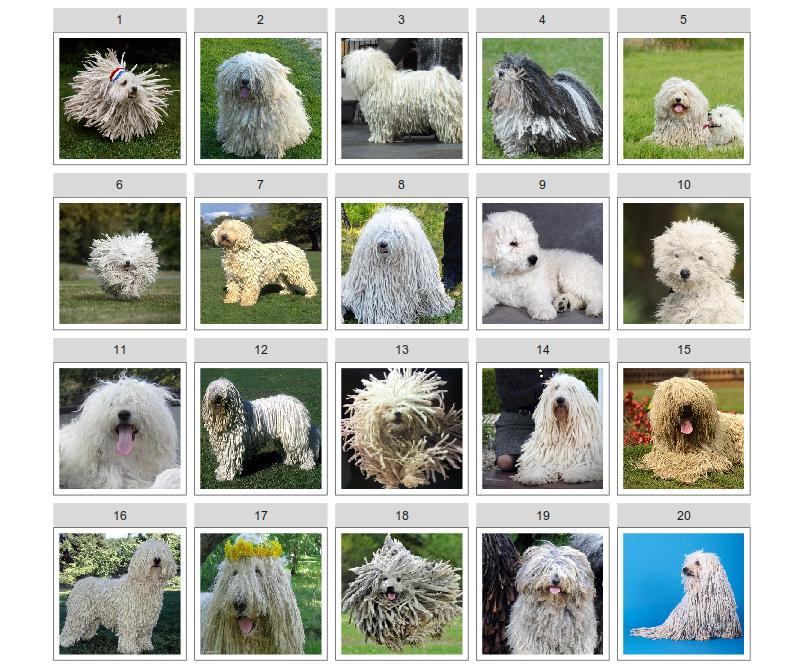
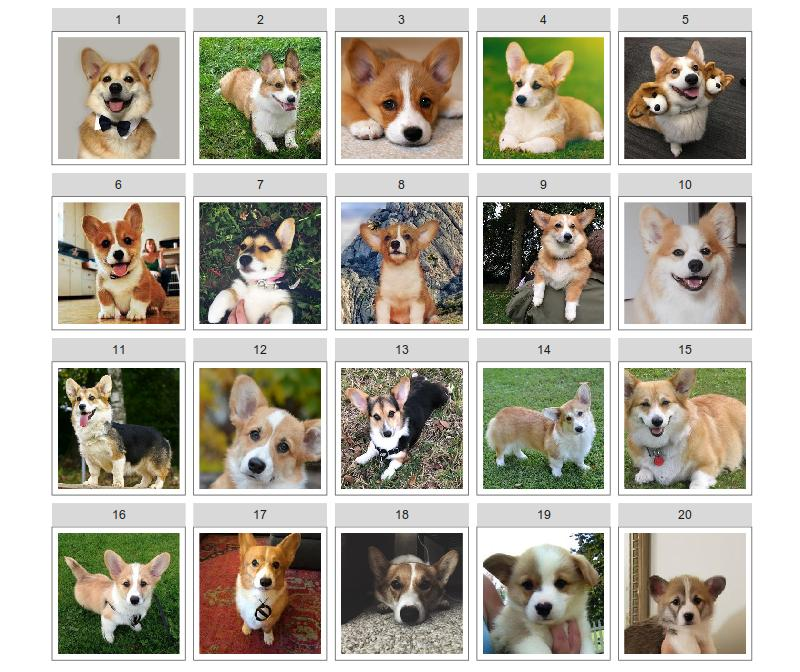
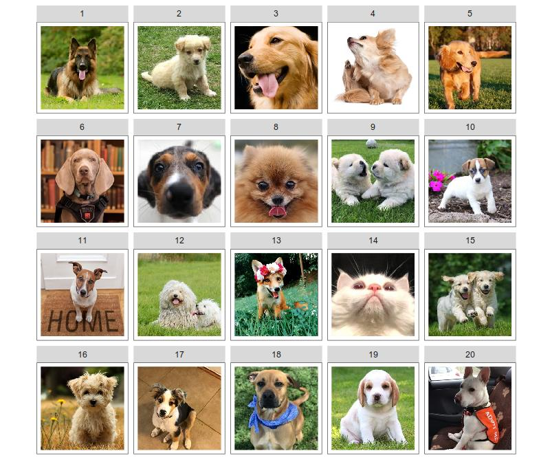
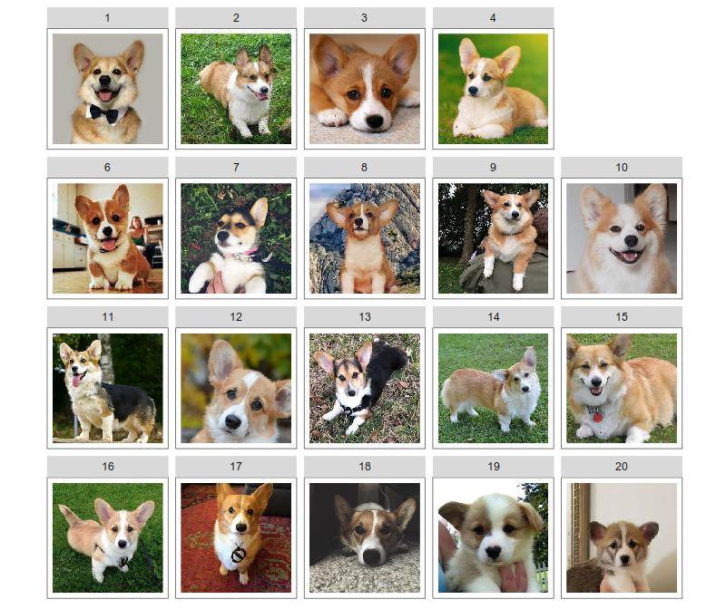
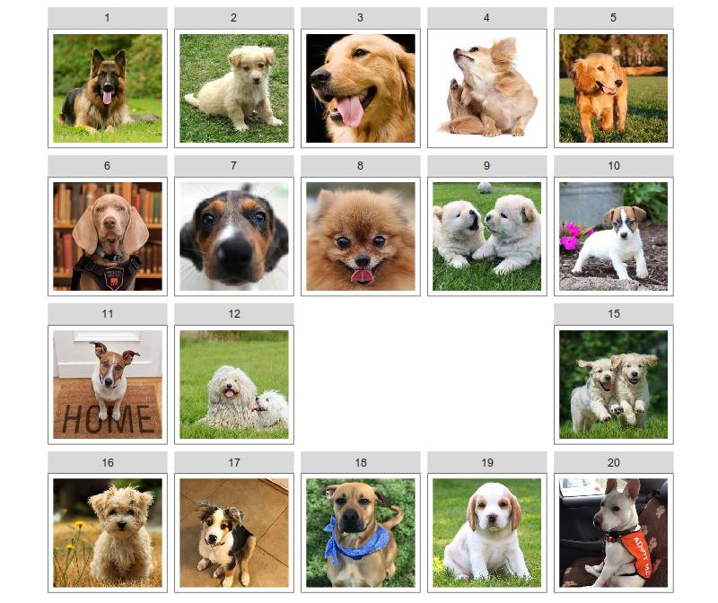
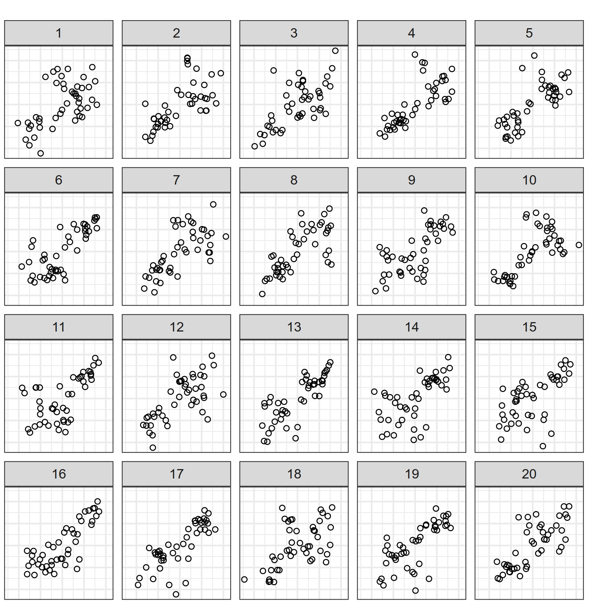
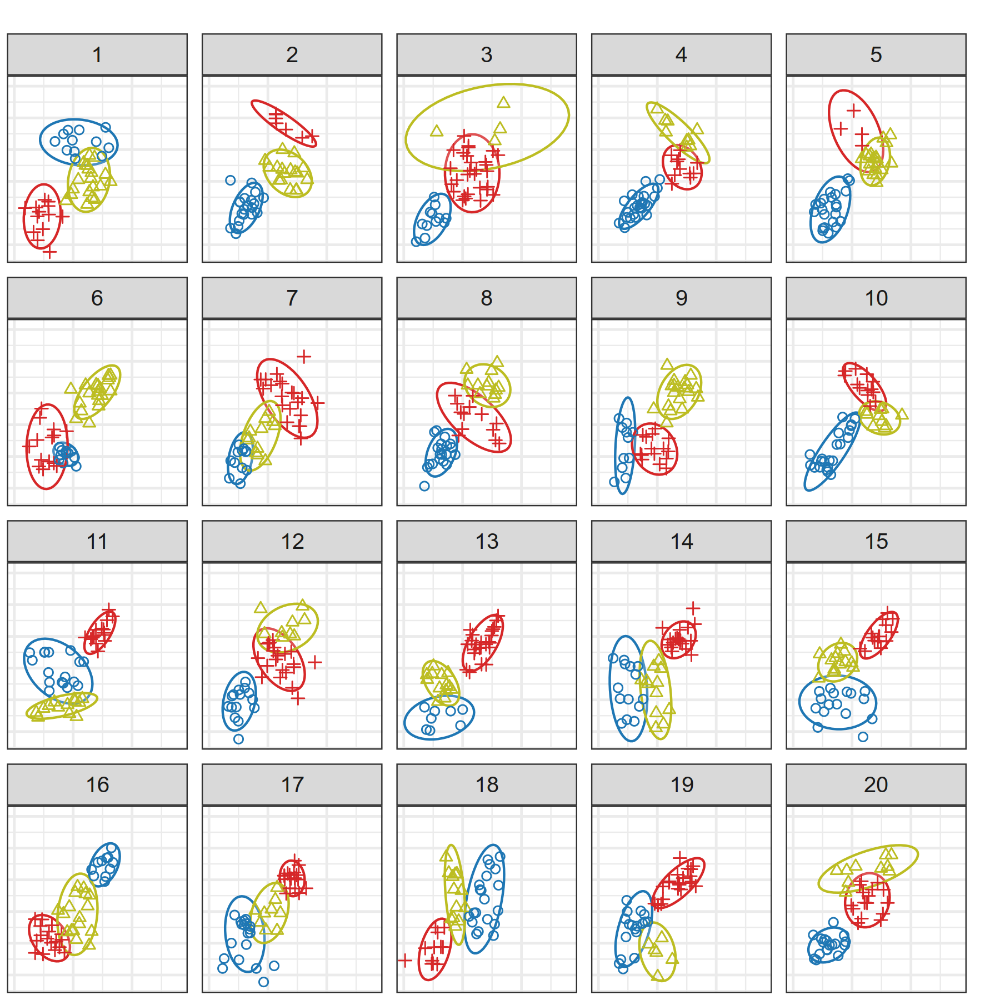
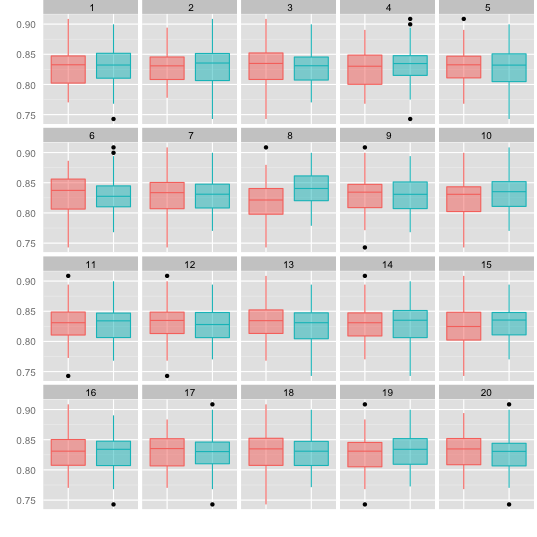
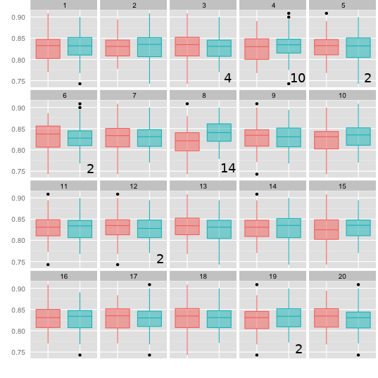

```{r setup, include=FALSE}
options(htmltools.dir.version = FALSE)
knitr::opts_chunk$set(echo = F, fig.width = 8, fig.height = 8, dpi = 300)
library(tidyverse)
source("code/photo_lineup.R")
```

class: inverse, middle,center
# Types of Lineups

???

Let's talk about types of lineups. 
Throughout this talk, I'm going to use lineups with animals when we're discussing concepts (and because who doesn't like puppies?). 

```{r lineup-puppy, eval = F, include = F, fig.height = 5, fig.width = 4.2, dpi = 300, out.width = "100%"}
set.seed(50293403)

corgs <- list.files("aww", pattern = "corg\\d{1,2}", full.names = T) %>% 
  purrr::map(imager::load.image)
corg_3h <- list.files("aww", pattern = "3headedcorg", full.names = T) %>% 
  purrr::map(imager::load.image)
dogs <- list.files("aww", pattern = "dog\\d{1,2}", full.names = T) %>% 
  purrr::map(imager::load.image)
fox <- list.files("aww", pattern = "fox", full.names = T) %>% 
  purrr::map(imager::load.image)
cat <- list.files("aww", pattern = "cat", full.names = T) %>% 
  purrr::map(imager::load.image)
puli <- list.files("aww", pattern = "puli\\d{1,2}", full.names = T) %>%
  purrr::map(imager::load.image)

# corg_stuffed <- c(list.files("aww", pattern = "corg1?\\d\\.", full.names = T), 
#                   list.files("aww", pattern = "3headedcorg", full.names = T))
lineup_corg_3h <- c(corgs[1:19], corg_3h)
lineup_corg_3h %>% photo_lineup_prep() #%>% image_lineup()
# ggsave("corg-lineup-3head_5.jpg", dpi = 100, width = 8, height = 8/5*4.2)


# corg_null <- c(list.files("aww", pattern = "corg\\d{1,2}\\.", full.names = T))
corgs %>% photo_lineup_prep() #%>% image_lineup()
# ggsave("corg-null_0.jpg", dpi = 100, width = 8, height = 8/5*4.2)


# dog_null <- c(list.files("aww", pattern = "dog\\d{1,2}\\.", full.names = T))
dogs %>% photo_lineup_prep() #%>% image_lineup()
# ggsave("dog-null_0.jpg", dpi = 100, width = 8, height = 8/5*4.2)


# dog_fox <- c(list.files("aww", pattern = "dog1?\\d\\.", full.names = T),
#              list.files("aww", pattern = "fox", full.names = T))
dog_fox <- c(dogs[1:19], fox)
dog_fox %>% photo_lineup_prep() #%>% image_lineup()
# ggsave("dog-fox_3.jpg", dpi = 100, width = 8, height = 8/5*4.2)


# dog_cat <- c(list.files("aww", pattern = "dog1?\\d\\.", full.names = T),
#              list.files("aww", pattern = "cat", full.names = T))
dog_cat <- c(dogs[1:19], cat)
dog_cat %>% photo_lineup_prep() #%>% image_lineup()
# ggsave("lineups/dog-cat_7.jpg", dpi = 100, width = 8, height = 8/5*4.2)

dog_2target <- c(dogs[1:18], cat, fox)
dog_2target %>% photo_lineup_prep() #%>% image_lineup()
# ggsave("lineups/dog-2-target_13_14.jpg", dpi = 100, width = 8, height = 8/5*4.2)

puli_cat <- c(puli[1:19], cat)
puli_cat %>% photo_lineup_prep() #%>% image_lineup()
# ggsave("lineups/puli-cat_1.jpg", dpi = 100, width = 8, height = 8/5*4.2)

puli %>% photo_lineup_prep() #%>% image_lineup()
# ggsave("lineups/puli-null_0.jpg", dpi = 100, width = 8, height = 8/5*4.2)
```

---

# Types of Lineups
.right-column[

]
--
.left-column[.middle[
<br/><br/>
<br/><br/>
__Null Lineup__     
(AKA Rorshach Lineup)    


Consists entirely of null plots
]]
 
???
Which panel is different?

In a null lineup, all of the plots are drawn from the same null distribution: in this case, we have a lineup consisting of 20 komondor pictures. The dogs aren't all the same, and we'd expect that one or two panels might be selected more frequently even though all of the panels are from the same distribution, because we're very good at picking out differences between sets of things. Our brains were optimized to separate "predator" from "nature scene", and we apply that same discriminative ability to less threatening stimuli. Notice that many of the plots in this lineup weren't mentioned at all - that's because even though the pictures are all from the same "distribution", they have different features, and some of those features are more salient than others.

---

# Types of Lineups
.right-column[

]
--
.left-column[.middle[
<br/><br/><br/><br/>
__Standard__    
Lineup

One target plot
]]

???
Which panel is different?

In a standard lineup, one of the panels shows real data and the rest of the panels show null data, that is, data generated from the null distribution. In this case, panel 5 - the corgi has an extra two (stuffed) heads. 


---

# Types of Lineups
.right-column[

]
--
.left-column[
<br/><br/><br/><br/>
__Two-Target__ Lineups

Head-to-head comparisons of two models

Null plots from a third and/or mixture distribution.
]

???
Which panel is different?

In a two-target lineup, the goal is to determine which target is more visually salient. Here, we have dogs for the null plots, and a fox and a cat for the two different "models". The cat is quite a bit more salient than the fox. 

In each of these types of lineups, we've seen that not all panels are equally likely to be selected, even when there are only null panels. Introduction of target panels produces even more inequality in panel selection, and the more complex the lineup design, the more opportunities there are to form alternate hypotheses than the ones actually being tested by the experimenter.

When we analyze statistical lineups, we usually assume that all panels are equally likely to be selected, but we know that that's not how things go in reality. I'm going to talk today about a framework that allows us to relax the assumption that all panels are equally likely to be selected. 

---
class:inverse,center,middle
# Modeling Lineup Panel Selection

---

# Modeling Lineup Panel Selection

- $m$ panel lineup with $m_0$ null plots<br><br>
- Panel selection probabilities $\displaystyle\theta_1, ..., \theta_m\;\;\text{and}\;\;\sum_{i=1}^m \theta_i = 1$
- $K$ evaluations resulting in panel selection counts $c_1, ..., c_m$,     
where $\displaystyle K = \sum_{i=1}^m c_i$

???


To start, let's define some notation Suppose we have an $m$ panel lineup, with $m_0$ null plots (usually, $m = 20$ and $m_0 = 19$, but in two target lineups, $m_0 = 18$). A participant would select panel $i$ with probability $\theta_i$, where $\sum\theta_i = 1$. The lineup is evaluated by $K$ participants, who select panels with frequency $c$. 

--
<br/><br/><br/><br/>
$$\Large\displaystyle\vec\theta \sim \text{Dirichlet}(\alpha) \;\;\;\text{  where  }\;\;\;\alpha = \alpha_1 = \cdots = \alpha_m$$

$$\Large\vec{c}\sim\text{Multinomial}(\vec{\theta}, K)$$
???

Using this notation, a natural model for $\theta$ is a symmetric Dirichlet distribution. Note that equal alphas doesn't imply that each panel is equally likely to be selected; it allows the $\theta$s to vary while not assuming that the location of the most interesting panel is known. 

Using $\theta$, we can model the panel selection vector $c$ as a multinomial distribution, with $K$ total evaluations. 

Mahbub's paper in 2013 used 1/m as the theta, which corresponds to a strict assumption that all panels are equally likely to be selected; this model is similar in structure but allows a bit more flexibility. It's compatible with bayesian inference, if you think of the dirichlet distribution as the prior, but it's also equivalent to an overdispersion model in Frequentist world, so you don't have to pick a side unless you want to. Either way, I think we can all agree that this additional flexibility would seem to align better with how we actually evaluate lineups.


---

# Modeling Lineup Panel Selection

### Joint Probability of Observed Results

$$\begin{align} \text{Pr}(\vec{c} | \alpha) &= \frac{(K)!\,\, \Gamma(m\alpha)}{\Gamma(K + m\alpha)\left(\Gamma(\alpha)\right)^m}
\prod_{i=1}^{m} \frac{\Gamma\left(c_i + \alpha\right)}{c_i!} \\ & \text{Dirichlet-multinomial distribution}\end{align}$$

???

To use this model, we could assess the joint probability of the observed counts, but we usually don't do that because usually we care about the target plot vs. the total number of null plot selections... that is, we want the marginal model.

We could conduct inference on the thetas directly, but we can also use this structure to come up with a visual p-value similar to that proposed in Majumder(2013), but that better reflects the reality of how lineups are evaluated. 
--

### Marginal Probability of Observed Results
$$P(c_i\geq x) = \sum_{x = c_i}^{K} \binom{K}{x} \frac{B\left(x+\alpha, K-x+m_0\alpha\right)}{B(\alpha, m_0\alpha)}$$

???

Working with the marginal distribution, we can come up with a p-value which represents the probability that the target plot was selected as many or more times under the model structure we're describing here. This is usually the quantity we're interested in when conducting visual inference.

So far, so good? This talk has more notation than it did when I'd imagined it in my head a few months ago...

To fully understand how this model is working, though, it might help to have some intuition about the meaning of alpha. 

---

# What does $\Large\alpha$ mean?

```{r prior-predictive, echo = F, fig.width = 7, fig.height = 3.5, out.width = "100%", dpi = 300}
sim_lineup_model <- function(alpha, m = 20, k = 20, N = 50) {
  theta <- gtools::rdirichlet(1, rep(alpha, m))
  sels <- rmultinom(N, size = k, prob = theta)
  sels
}

alphas <- c(.001, .02, .05, .1, .5, 1, 2, 10, 20, 1000)
prior_pred <- tibble(alpha = alphas,
                     plot_sels = purrr::map(alpha, sim_lineup_model, N = 100)) %>%
  mutate(
    sel_ordered = purrr::map(plot_sels, ~apply(., 2, sort, decreasing = T)),
    sel_ordered_long = purrr::map(
      sel_ordered,
      ~tibble(idx = rep(1:nrow(.x), times = ncol(.x)),
              rep = rep(1:ncol(.x), each = nrow(.x)),
              sels = as.vector(.x, mode = "numeric")))
  ) %>%
  select(-plot_sels, -sel_ordered) %>%
  unnest() %>%
  arrange(alpha) %>%
  mutate(label = sprintf("alpha == %f", alpha) %>% factor(levels = sprintf("alpha == %f", alphas), ordered = T))

ggplot(prior_pred) +
  geom_path(aes(x = idx, y = jitter(sels, amount = .4), group = interaction(rep, alpha)), alpha = .05) +
  facet_wrap(~label, labeller = label_parsed, nrow = 2) +
  scale_x_continuous("Ordered panel number") +
  scale_y_continuous("# Simulated Panel Selections (of 20 evaluations)") + 
  theme_bw()

```

???

To get that intuition, I simulated 20 evaluations of a lineup from the joint distribution shown on the last slide, using different values of alpha. I then sorted the resulting panel counts from largest to smallest (because panels are exchangeable) and plotted the counts (on the y axis) and the panel rank (on the x axis). You can see that when $\alpha$ is small, evaluations tend to be concentrated on one or two panels, while when $\alpha$ is large, evaluations are widely distributed across all panels. Note that even for $\alpha = 1000$, we do not get an exactly even distribution of panel selections as might be expected with Majumder(2013)'s $\theta = 1/m$ specification, which corresponds to an $\alpha$ of infinity.

---
class: middle,center,inverse
# Visual P-values

???

Let's compare the results from this method to the visual p-values computed under the strict 1/m probability model. 

---

# Visual P-values
```{r vis-p-val, include = F}
vis_p_value <- function(C, K, alpha = 1, m = 20){
  single_p <- function(cc, kk, aa, mm) {
    x <- cc:kk
    sum(exp(lchoose(kk, x) - lbeta(aa, (mm - 1) * aa) + lbeta(x + aa, kk - x + (mm - 1) * aa)))
  }

  df <- tibble(cc = C,
               kk = K,
               aa = alpha,
               mm = m) %>%
    unnest() %>%
    mutate(p = purrr::pmap_dbl(., single_p))
  df$p
}
vis_p_value_orig <- function(C, K, m = 20){
  single_p <- function(cc, kk, aa, mm) {
    x <- cc:kk
    sum(exp(lchoose(kk, x) - x*log(mm) + (kk-x)*log(1-1/mm)))
  }

  df <- tibble(cc = C,
               kk = K,
               mm = m) %>%
    unnest() %>%
    mutate(p = purrr::pmap_dbl(., single_p))
  df$p
}
```

Majumder (2013): 
$$P(c_i\geq x) = \sum_{x = c_i}^K \binom{K}{x} \left(\frac{1}{m}\right)^x\left(1-\frac{1}{m}\right)^{K-x}$$
???
Majumder (2013) used a strict 1/m for $\theta$, with no variation - that is, every panel is selected with 1/m probability. 

We know this is unreasonable, because even in Rorshach lineups, not all plots are equally likely to be selected - there's always one or two "weird" plots that stand out in some way. The calculation of the visual p-value using this approach is, however, fairly simple. 

If we relax the assumption that every null plot is precisely equally likely to be selected, we need the $\alpha$ hyperparameter and the Dirichlet Multinomial calculation shown here. 

--
Dirichlet-Multinomial version:

$$P(x \geq c_i) = \sum_{x = c_i}^{K} \binom{K}{x} \frac{B\left(x+\alpha, K-x+m_0\alpha\right)}{B(\alpha, m_0\alpha)}$$

--
<br/><br/>
.small[.center[`heike/vinference` package: Calculate via simulation where $\alpha = 1$ 
]]

???

The Dirichlet-Multinomial version allows for a lot more flexibility, but depends heavily on $\alpha$. Heike's vinference package used this model with $\alpha = 1$, which doesn't assume that each panel is equally likely to be selected, but assumes the probability of panel selection $\theta$ is uniformly distributed on the (m-1) simplex. You might remember from the plot a few slides ago that when $\alpha = 1$ the simulated panel selections are relatively diffuse. If we want to explore how $\alpha$ values affect the calculation of visual p-values, we can do that. 


```{r bayesfactorcode, include = F}
mvbeta <- function(alpha, log = F) {
  z <- sum(lgamma(alpha)) - lgamma(sum(alpha))
  if (!log) return(exp(z)) else return(z)
}

bf <- function(a1, a2, m = 20, c, k = sum(c)) {
  stopifnot(a1 > 0, a2 > 0, c <= k, m > 1)

  beta(a2, (m - 1)*a2) * beta(c + a1, k - c + (m - 1)*a1) /
    (beta(a1, (m - 1)*a1) * beta(c + a2, k - c + (m - 1)*a2))
}
bf_vec <- function(a1, a2, m = 20, c, k = sum(c)) {
  stopifnot(a1 > 0, a2 > 0, c <= k, m > 1)

 exp(mvbeta(rep(a2, length(c)), log = T) + mvbeta(a1 + c, log = T) -
   mvbeta(rep(a1, length(c)), log = T) - mvbeta(a2 + c, log = T))
}

```

---
# Visual p-values

```{r vis-p-val-sensitivity, fig.width = 8, fig.height = 5, out.width = "100%"}
alphas <- exp(seq(-6, 6, by = .01))
data_breaks <- c(1:5, 6, 8, 10, 15, 20)


pv <- tidyr::crossing(alpha = alphas, C = data_breaks, K = 20) %>%
  mutate(p = vis_p_value(C, K, alpha))
pv2 <- tidyr::crossing(C = data_breaks, K = 20) %>%
  mutate(p = vis_p_value_orig(C, K))

ggplot(pv, aes(x = alpha, y = p, color = factor(C), group = factor(C))) +
  geom_line(size = 1) +
  geom_point(aes(x = exp(6.25), y = p, color = factor(C), shape = "Binomial\np-value"), data = pv2) + 
  scale_y_continuous("Visual p-value") +
  scale_x_continuous(expression(alpha), trans = "log10", breaks = c(0.001, 0.01, .1, 1, 10, 100),
                     labels = c("0.001", "0.01", "0.1", "1", "10", "100")) +
  scale_color_brewer("# Data\nPanel\nIdentifications\n(K = 20)", palette = "Paired") +
  scale_shape_discrete("") + 
  geom_hline(yintercept = 0.05, color = "grey") +
  guides(color = guide_legend(override.aes = list(shape = NA))) +
  theme_bw()
```

???
So we can see that the effect of $\alpha$ on the visual p-value calculation is significant under this model. Depending on the value of alpha, you may need between 4 and 10 data identifications (out of 20) to achieve p<0.05. Note that as $\alpha \rightarrow\infty$ the p-value converges to the binomial calculation. 

Since alpha is related to the lineup difficulty (how many null panels have interesting characteristics), we might want to estimate alpha from the null panels in a lineup (or from an entirely null lineup)

---
class:middle,center,inverse
# Informative Null Panels

---
# Informative Null Panels




???
We can work with null panels in any of the three types of lineups I discussed earlier. Because we usually only get information from the target panels + the total number of nulls selected, we can use the distribution of selections within the nulls to estimate $\alpha$.

--

- Consider null panel selection counts:
$$c_{i^*}, i = 1, ..., m_0\;\;\;\sum_{i^*} c_{i^*} = K^*$$
- Rorshach lineups (ideal)
- Standard lineups will work (if there are enough null panel selections)

???

We can reindex c to only include the null panel selection counts. Rorshach lineups are the best way to go here, because we can control K and ensure that it's sufficient; when we use the nulls in standard or two-target lineups, we don't control K* anymore, so we can end up with very sparse null panel selection counts. 

Ideally, we can slip a couple of null lineups into the set of lineups users are evaluating to estimate alpha independently. 

---
# Informative Null Panels

For lineups $j=1, ..., n$ with null panels $i = 1, ..., m_0$,
$$\mathscr{L}(\alpha|\theta) = \prod_{j=1}^n \left(\frac{1}{B(\alpha)}\right)^{m_0} \prod_{i=1}^{m_0} \theta_{ij}^{\alpha - 1}$$

$$\frac{d}{d\alpha}\ln \mathscr{L}(\alpha|\theta) = nm_0\psi(\alpha m_0) - nm_0\psi(\alpha) + \sum_{ij} \ln \theta_{ij}$$
where $\psi(x) = \frac{d}{dx}\ln\Gamma(x)$ is the digamma function.


The MLE of $\hat\alpha$ is then the solution to:

$$\psi(\alpha) - \psi(\alpha m_0) = \frac{1}{nm_0}\sum_{ij} \ln \theta_{ij}$$

???

The MLE of $\alpha$ is the solution to this equation, and it's a lot easier to let the computer get the actual value of alpha that satisfies this. 

So now that we've found a way to offload the work onto the computer, what do estimated $\alpha$ values look like?

---

# Estimating $\Large\alpha$ - Null Lineup
```{r, include = F}
source("code/alpha_ml.R")

turk16_sum <- read_csv("data/turk16_results_summary.csv")
```
.pull-left[]

???

What do you think the most interesting panel is?

---

# Estimating $\Large\alpha$ - Null Lineup
.pull-left[]
.pull-right[Panel | 1 | 5 | 6 | 10 | 14 | 15 | 16
--- | -- | -- | -- | -- | -- | -- | -- 
Count | 2 | 1 | 1 | 2 | 1 | 2 | 5

$$\Large{\begin{align}\hat\alpha_\text{Rorshach} &= `r round(alpha.ml(c(2, 1, 1, 2, 1, 2, 5, rep(0, 13))), 4)`\\&(14 \text{ evaluations})\\
\hat\alpha_\text{Null panels} &= `r filter(turk16_sum, param_value == "k-3-sdline-0.25-sdgroup-0.30", test_param == "turk16-plain") %>% filter(!target) %>% group_by(pic_id) %>% mutate(response_null = 1:n()) %>% select(pic_id, response_null, n) %>% ungroup() %>% tidyr::spread(key = response_null, value = n) %>% ungroup() %>% select(-pic_id) %>% as.matrix() %>% alpha.ml(., rowSums(.)) %>% round(digits = 4)`\\&(7 \text{ evaluations})\end{align}}$$
]

???

I created a few null lineups to match the generation method in a two-target lineup study. Then, I estimated $\alpha$ using the rorshach lineup and compared it to the $\alpha$ estimated from the null panels. Notice that even though the original study was much larger than the null study I did for this presentation, which had 79 total evaluations, we got more data from the single null panel with 14 evaluations. In the grand scheme of things, though, the estimate of $\alpha$ from the normal lineup isn't that different from the estimate from the null lineups, which suggests that if there are enough null panel selections, we can estimate $\alpha$ from a normal lineup. It's still better to use a Rorshach lineup, though.

---

# Estimating $\Large\alpha$ - Null Lineup
.pull-left[]

---

# Estimating $\Large\alpha$ - Null Lineup
.pull-left[]
.pull-right[Panel | 2 | 3 | 10 | 16
--- | -- | -- | -- | -- 
Count | 1 | 11 | 1 | 1

$$\Large{\begin{align}\hat\alpha_{\text{Rorshach}} &= `r round(alpha.ml(c(1, 11, 1, 1, rep(0, 16))), 4)`\\&(14 \text{ evaluations})\\
\hat\alpha_\text{Null panels}&= `r filter(turk16_sum, param_value == "k-3-sdline-0.25-sdgroup-0.30", test_param == "turk16-colorEllipse") %>% filter(!target) %>% group_by(pic_id) %>% mutate(response_null = 1:n()) %>% select(pic_id, response_null, n) %>% ungroup() %>% tidyr::spread(key = response_null, value = n) %>% ungroup() %>% select(-pic_id) %>% as.matrix() %>% alpha.ml(., rowSums(.)) %>% round(digits = 4)`\\&(13 \text{ evaluations})\end{align}}$$
]

???

In this lineup, which incidentally is made up of the same data as the last lineup, we see that the estimate for alpha is a bit lower, but that the estimates are similar when there are similar numbers of evaluations. I originally thought that it might be necessary to estimate alpha separately for each aesthetic combination ... and it could be necessary, but so far I haven't found that many cases where there'd be a huge benefit to that approach. The next obvious thing to explore is whether alpha is similar across lineup studies, and under what conditions it might vary. 

---
# Estimating $\Large\alpha$ - Standard Lineup

```{r all-lineup-alpha, fig.width = 8, fig.height = 5, out.width = "100%", message = F, warning = F}
source("code/process_all_lineup_data.R")
plot_df %>%
  ggplot(aes(x = dataset2, y = alpha, color = type, group = presentation)) +
  facet_wrap(~study, scales = "free_x", ncol = 4) +
  scale_color_manual("Panel Selection Type", values = c("orange4", "purple")) +
  geom_point(position = position_dodge(width = .3), shape = 1) +
  theme_bw() +
  theme(legend.position = "bottom") +
  theme(axis.title.x = element_blank()) + 
  scale_y_continuous(expression(hat(alpha))) +
  ggtitle(expression(paste(hat(alpha), " for Single-Target Lineup Studies")), subtitle = "Estimated from 19 null plots")
```
???

Using the alpha estimation method I've shown, I combed through 8 past lineup studies with single-target lineups, and estimated alpha for each set of parameters used to generate data. What I found is that the alpha values are remarkably consistent across most studies; the exception, studies 5 and 6, were so difficult that when looking over the lineups, I thought they were null lineups - they're from Loy(2015), and the study showed that residual plots which violated normality were indistinguishable from those generated from a normal model. In those studies, we see higher $\alpha$ values, indicating that the selection probability for each null panel is more equal. Some of these studies allowed participants to select multiple panels; typically, when this happens, estimated alpha values are slightly higher, but most participants still only select a single response for most lineups. 

---
class:middle,inverse,center
# Implications for Visual Inference

---
# Implications for Visual Inference

```{r vis-p-val-sensitivity-redux, fig.width = 8, fig.height = 5, out.width = "100%", warning = F}
alphas <- exp(seq(-6, 6, by = .01))
data_breaks <- c(1:5, 6, 8, 10, 15, 20)


pv <- tidyr::crossing(alpha = alphas, C = data_breaks, K = 20) %>%
  mutate(p = vis_p_value(C, K, alpha))
pv2 <- tidyr::crossing(C = data_breaks, K = 20) %>%
  mutate(p = vis_p_value_orig(C, K))

ggplot(pv, aes(x = alpha, y = p, color = factor(C), group = factor(C))) + 
  annotate("segment", x = exp(6.25), xend = exp(6.25), y = -Inf, yend = .7, color = "grey", alpha = .5) +
  annotate("text", x = exp(6.25), y = 0.7, 
           label = "Majumder\n(2013)", vjust = -0.1) + 
  annotate("segment", x = 1, xend = 1, y = -Inf, yend = .7, color = "grey", alpha = .5) +
  annotate("text", x = 1, y = 0.7, 
           label = "vinference\npackage", vjust = 0-0.1) + 
  annotate("rect", xmin = quantile(plot_df$alpha, 0.025), xmax = quantile(plot_df$alpha, 0.975), ymin = -Inf, ymax = .7, color = NA, alpha = .25, fill = "grey75") +
  annotate("segment", x = quantile(plot_df$alpha, 0.5), 
           xend = quantile(plot_df$alpha, 0.5), y = -Inf, yend = .7, 
           color = "grey40", alpha = .5) +
  annotate("text", x = quantile(plot_df$alpha, 0.5), y = 0.7, 
           label = expression(hat(alpha)), vjust = -0.1) + 
  geom_line(size = 1) +
  geom_point(aes(x = exp(6.25), y = p, color = factor(C), shape = "Binomial\np-value"), data = pv2) + 
  scale_y_continuous("Visual p-value", limits = c(0, .8)) +
  scale_x_continuous(expression(alpha), trans = "log10", breaks = c(0.001, 0.01, .1, 1, 10, 100),
                     labels = c("0.001", "0.01", "0.1", "1", "10", "100"), limits = c(0.001, 650)) +
  scale_color_brewer("# Data\nPanel\nIdentifications\n(K = 20)", palette = "Paired") +
  scale_shape_discrete("") + 
  geom_hline(yintercept = 0.05, color = "grey") +
  guides(color = guide_legend(override.aes = list(shape = NA))) +
  theme_bw()
```

???

Returning to the plot showing the p-values calculated for lineups with 20 evaluations under different alpha values, what we see is that the estimated alphas are much smaller than those used by even the vinference package. While this does mean that we need more target hits and more data than we might have needed before, it allows us to get p-values which are much more reasonable than before. Visual inference is such a powerful tool that I think in most cases we won't see much of a practical difference in the results; most studies I'm familiar with would still have similar results because the initial p-values were so small that even with this adjustment they will still be significant. 


---
# Implications for Visual Inference

.pull-left[

]
---
# Implications for Visual Inference

```{r vispval-change}
exdf <- filter(studies_sum, pic_name =="file147f93f77aae9.png")
exdf_targetcount <- sum(filter(exdf, response_no == obs_plot_location)$n)
exdf_nullcount <- sum(filter(exdf, response_no != obs_plot_location)$n)
total_n <- exdf_targetcount+exdf_nullcount
old_vispval <- vis_p_value_orig(exdf_targetcount, total_n)
new_vispval <- vis_p_value(exdf_targetcount, total_n, alpha = .07)
```
.pull-left[

]
--
.pull-right[
.center[
Old p-value: <br> `r sprintf("%.4g", old_vispval)`


p-value with $\alpha = 0.07$: <br>`r sprintf("%.4f", new_vispval)`
]]

???

This plot is one where we have some support for the idea that the target plot (plot 8) is different from the nulls - it got the highest number of selections, but overall null plots got more selections than the target. Under the strict null hypothesis that all panels are equally likely, the p-value for this plot is tiny... much smaller than we would expect given that there are null panels that are selected almost as frequently. Under the mixture model, with alpha = 0.07 (selected because it's in the range that most alpha estimates are in, not based on null lineups at all), the p-value is 0.0476, which is much more in line with the gut check that says that the target plot is a bit more likely to be selected. 

---
# Implications for Visual Inference

- Estimate $\alpha$ for null plot generation models using 
    - Rorshach lineups evaluated by participants (better)
    - Null plot selections in standard lineups 
    
- When $\alpha$ is not known a priori, a value between 0.05 and 0.1 is consistent with most previous studies.
    
- Using estimated $\alpha$ to calculate visual p-values will produce more conservative results

- Accounting for null plot characteristics through $\alpha$ better models our experience with statistical lineups

???

To summarize, we can model lineup plot selection using hierarchical bayesian models (or if you prefer, overdispersed frequentist models). Using this framework, we can estimate the value of the hyperparameter alpha, producing results which are calibrated to the specific lineup task and null plot generation method. This produces more conservative results that better map to our experience of lineups. 

---
# References
.tiny[
```{r, results='asis'}
library(RefManageR)
bib <- ReadBib("refs.bib", check = "warn")
print(bib, .opts = list(style = "markdown"))
```
]
