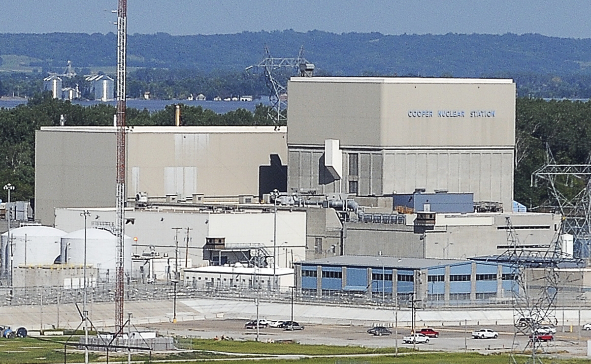
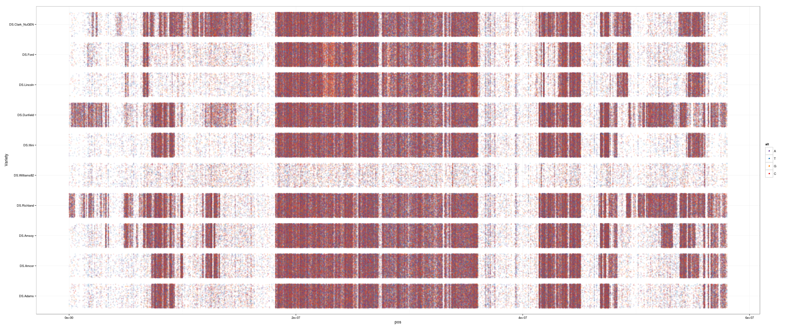
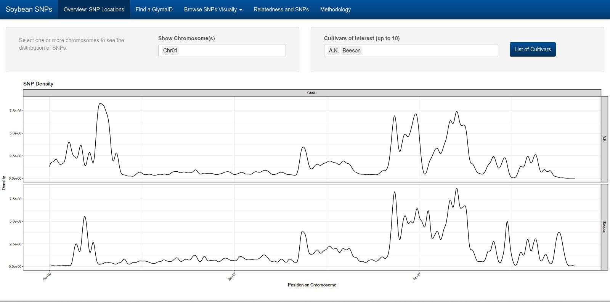
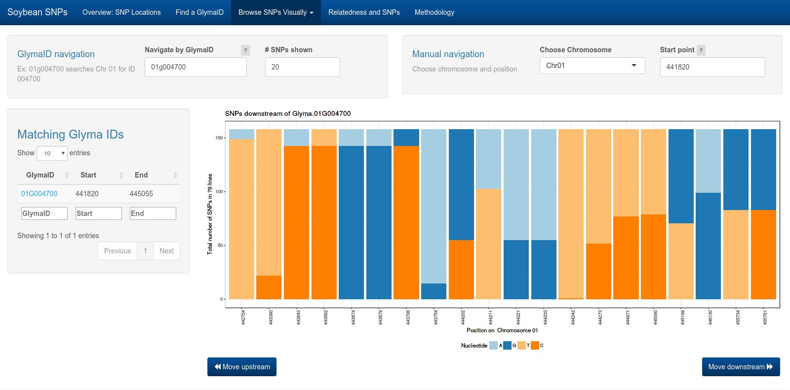
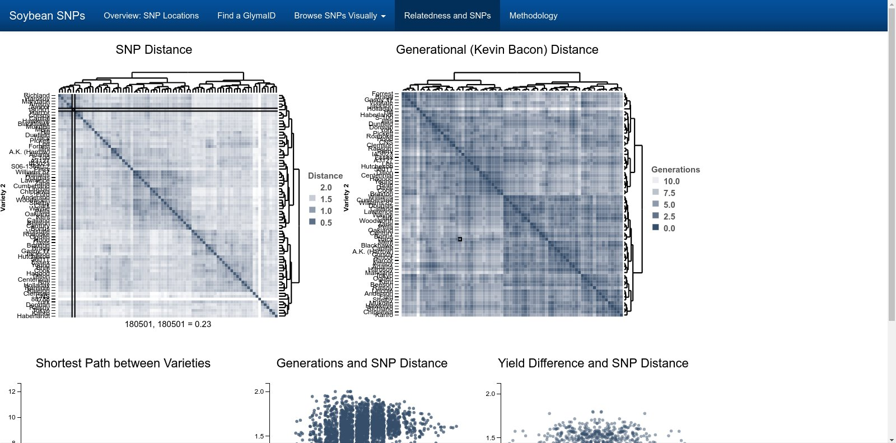

```{r setup, fig.keep='all',echo=FALSE, eval=TRUE, error=FALSE, warning=FALSE, message=FALSE}
# Get maps stuff first
options(replace.assign=TRUE,width=70)
library(knitr)
library(ggplot2)
library(dplyr)
library(tidyr)
library(magrittr)
library(gridExtra)

opts_chunk$set(fig.path='figure/fig-', cache.path='cache/', fig.align='center', fig.width=5, fig.height=5, fig.show='hold', par=TRUE, cache=TRUE, concordance=TRUE, autodep=TRUE, warning=FALSE, message=FALSE, echo=FALSE)


```


# Introduction <!-- .slide: class="center" -->

## Background Information

<ul>
<li class="fragment">
PhD from Iowa State in 2015
  <ul>
  <li>Dissertation: The Perception of Statistical Graphics</li>
  <li> RA with USDA - Soybean Genetics</li>
  </ul>
</li>
<li class="fragment">Postdoc: Office of the Vice President for Research<br>
Faculty startup packages and career success</li>
<li class="fragment">Statistical Analyst at Nebraska Public Power District
  <ul>
  <li>Started an internal data science training program</li>
  <li>Analytics projects</li>
  <li>Worked with IT to set up data science infrastructure</li>
  </ul>
</li>
<li class="fragment">Consultant - Made Shiny applications for Iowa Soybean Assoc. and an Agronomy lab at ISU. </li>
</ul>

## Outline

- NPPD Projects
    - Tornado Guided Missiles
    - Employee Turnover Prediction
    - Assessing Compensation
- USDA Soybean Genetics

# Tornado Guided Missiles <!-- .slide: class="center" -->

## Background

<div class = "right">



</div>

<div class = "left">

- Preventing "beyond design basis" accidents
- FLEX mods: standardized emergency equipment to power cooling systems
- Each plant needs to have two sets of FLEX equipment on site

</div>

## Tornado Guided Missiles

<ul>
<li class="fragment">
Reactor containment can withstand a direct hit from an airplane, tornado, or hurricane
</li>
<li class="fragment">Tornado resistant FLEX equipment 
  <ul>
  <li>NRC must be convinced that placement is safe</li>
  <li>Building distance (tornado width)</li>
  <li>Angle between buildings relative to tornado path</li>
  </ul>
</li>
</ul>
    
## FLEX Placement

```{r out.width = "80%", fig.width = 8, fig.height = 5}
buildings <- data.frame(
  xmin = c(-3.5, 2),
  xmax = c(-2.5, 3),
  ymin = c(1.25, -2.5),
  ymax = c(2, -1.75),
  labelx = c(-3, 2.5),
  labely = c(1.625, -2.125),
  label = c("FLEX\n#1", "FLEX\n#2")
)

axisLabs <- data.frame(
  x = c(0, Inf, 0, -Inf),
  y = c(Inf, 0, -Inf, 0),
  label = c("N", "E", "S", "W"),
  hjust = c(0.5, 1.5, 0.5, -0.5),
  vjust = c(1.5, 0.5, -0.5, 0.5)
)

axisLines <- data.frame(
  x = c(-4, 0),
  xend = c(4, 0),
  y = c(0, -2.5),
  yend = c(0, 2.5)
)

a <- 4
b <- 2.5

tornado <- data.frame(
  x = c(-Inf, -b*.3),
  xend = c(a, b*.3),
  y = c(-Inf, a*.3),
  yend = c(b, -a*.3),
  xlab = c(.6*a, -b*.15),
  ylab = c(.6*b, a*.15),
  label = c("\"Typical\"\nTornado\nPath", "\"Typical\"\nTornado\nWidth"),
  color = c("red", "blue")
)

ggplot() + 
  geom_rect(aes(xmin = xmin, xmax = xmax, ymin = ymin, ymax = ymax), data = buildings,
            fill = "white", color = "black") + 
  geom_text(aes(x = labelx, y = labely, label = label, hjust = hjust, vjust = vjust), data = buildings, hjust = .5, vjust = .5) + 
  coord_fixed(xlim = c(-4, 4), ylim = c(-2.5, 2.5), ratio = 1) +
  theme_void() + 
  geom_segment(aes(x = x, xend = xend, y = y, yend = yend), data = axisLines,
               color = "grey", arrow = arrow(length = unit(0.03, "npc"), ends = "both")) + 
  geom_text(aes(x = x, y = y, label = label, vjust = vjust, hjust = hjust), 
            color = "grey30", data = axisLabs) + 
  geom_segment(aes(x = x, xend = xend, y = y, yend = yend, color = color), data = tornado,
               arrow = arrow(length = unit(0.03, "npc"), ends = "both")) + 
  geom_label(aes(x = xlab, y = ylab, label = label, color = color), data = tornado) +
  scale_color_identity() + 
  geom_rect(aes(xmin = -Inf, ymin = -Inf, xmax = -4, ymax = -2.5), fill = "white", color = "white")
```

## FLEX Placement

```{r out.width = "80%", fig.width = 8, fig.height = 5}
buildings <- data.frame(
  xmin = c(4, -2),
  xmax = c(3, -3),
  ymin = c(1.25, -2),
  ymax = c(2, -1.25),
  labelx = c(3.5, -2.5),
  labely = c(1.625, -1.625),
  label = c("FLEX\n#1", "FLEX\n#2")
)

axisLabs <- data.frame(
  x = c(0, Inf, 0, -Inf),
  y = c(Inf, 0, -Inf, 0),
  label = c("N", "E", "S", "W"),
  hjust = c(0.5, 1.5, 0.5, -0.5),
  vjust = c(1.5, 0.5, -0.5, 0.5)
)

axisLines <- data.frame(
  x = c(-4, 0),
  xend = c(4, 0),
  y = c(0, -2.5),
  yend = c(0, 2.5)
)

a <- 4
b <- 2.5

tornado <- data.frame(
  x = c(-Inf, -b*.3),
  xend = c(a, b*.3),
  y = c(-Inf, a*.3),
  yend = c(b, -a*.3),
  xlab = c(.6*a, -b*.15),
  ylab = c(.6*b, a*.15),
  label = c("\"Typical\"\nTornado\nPath", "\"Typical\"\nTornado\nWidth"),
  color = c("red", "blue")
)

ggplot() + 
  geom_rect(aes(xmin = xmin, xmax = xmax, ymin = ymin, ymax = ymax), data = buildings,
            fill = "white", color = "black") + 
  geom_text(aes(x = labelx, y = labely, label = label, hjust = hjust, vjust = vjust), data = buildings, hjust = .5, vjust = .5) + 
  coord_fixed(xlim = c(-4, 4), ylim = c(-2.5, 2.5), ratio = 1) +
  theme_void() + 
  geom_segment(aes(x = x, xend = xend, y = y, yend = yend), data = axisLines,
               color = "grey", arrow = arrow(length = unit(0.03, "npc"), ends = "both")) + 
  geom_text(aes(x = x, y = y, label = label, vjust = vjust, hjust = hjust), 
            color = "grey30", data = axisLabs) + 
  geom_segment(aes(x = x, xend = xend, y = y, yend = yend, color = color), data = tornado,
               arrow = arrow(length = unit(0.03, "npc"), ends = "both")) + 
  geom_label(aes(x = xlab, y = ylab, label = label, color = color), data = tornado) +
  scale_color_identity() + 
  geom_rect(aes(xmin = -Inf, ymin = -Inf, xmax = -4, ymax = -2.5), fill = "white", color = "white")
```

## Tornado Characteristics in Nebraska

<ul>
<li class="fragment">Goal: Quantify characteristics of tornadoes within a certain distance of the plant
    <ul><li> help the engineers defend equipment placement to the NRC</li></ul>
</li>

<li> NRC used National Weather Service database of tornadoes used to create regulatory guidelines
  <ul><li> covers 1950-2003</li>
  <li> "probably available in PDF or microfilm form somewhere"</li>
  </ul>
</li>
<li class = "fragment">Need a report in the next 4 hours</li>
</ul>

```{r tornado-setup}
# --- Packages -----------------------------------------------------------------
library(maps)
library(readr)
library(fields) # rdist.earth() function
library(mapdata)
library(ggmapr)
# ------------------------------------------------------------------------------


data(states)
# states %>%
#   shift(NAME == "Hawaii", shift_by = c(52.5, 5.5)) %>%
#   scale(NAME == "Alaska", scale=0.3, set_to=c(-117, 27)) %>%
#   filter(lat > 20) %>%
#  ggplot(aes(long, lat)) + geom_path(aes(group=group)) +
#   ggthemes::theme_map() 

USpolygons <- states
USpolygons$state <- USpolygons$STUSPS

# --- Read in Data -------------------------------------------------------------
# Data source: http://www.spc.noaa.gov/wcm/#data
tornado.names <- c("ID", "year", "month", "day", "date", "time", "time zone",
                   "state", "fips", "state.number", "strength", "injuries",
                   "fatalities", "property.loss", "crop.loss",
                   "start.lat", "start.long", "end.lat", "end.long", "len",
                   "width", "num.states", "one.state", "segment",
                   "county.fips.1", "county.fips.2", "county.fips.3", "county.fips.4",
                   "estimated.f.scale")
tornadoes <- read_csv("Data/Actual_tornadoes.csv", col_names = tornado.names,
                      col_types = "iiiiDccccidddddddddddiiiccccd")
tornadoes.orig <- tornadoes
# ------------------------------------------------------------------------------

# --- Get tornadoes data formatted ---------------------------------------------
tornadoes %<>%
  mutate(
    both.points.missing = (end.lat == 0 & end.long == 0 & start.lat == 0 & start.long == 0),
    single.point = (end.lat == 0 & end.long == 0) | (start.lat == 0 & start.long == 0) | 
      (end.lat == start.lat & end.long == start.long),
    dist.cns.start = rdist.earth(matrix(c(-95.6547, 40.3597), ncol = 2),
                                 matrix(c(start.long, start.lat), ncol = 2)) %>%
      as.numeric(),

    dist.cns.end = rdist.earth(matrix(c(-95.6547, 40.3597), ncol = 2),
                               matrix(c(start.long, start.lat), ncol = 2)) %>%
      as.numeric()
  ) %>%
  mutate(
    xdir = (end.long - start.long)/sqrt(((end.long - start.long) ^ 2 +
                                           (end.lat - start.lat) ^ 2)),
    ydir = (end.lat - start.lat)/sqrt(((end.long - start.long) ^ 2 +
                                         (end.lat - start.lat) ^ 2))
  ) %>%
  mutate(
    # Compute angle between -pi and pi
    angle = atan2(ydir, xdir), 
    # If angle does not exist, it is either pi/2 or -pi/2
    # Use sign of y direction to determine which
    angle = ifelse(is.nan(angle), pi/2 * sign(ydir), angle),
    # If there's only a single set of coordinates, angle is NA
    angle = ifelse(single.point, NA, angle),
    # Adjust range so that the break is at pi instead of at 0
    angle = ifelse(angle > pi,  angle - 2*pi, angle)
  ) %>%
  mutate(
    year.id = paste(year, ID, sep = "-"),
    end.lat = ifelse(single.point, start.lat, end.lat),
    end.long = ifelse(single.point, start.long, end.long)) 

tornadoes.conus <- tornadoes %>%
  filter(!both.points.missing) %>%
  filter(!state %in% c("AK", "HI", "PR") )

limits.conus <- tornadoes.conus %>% select(start.long, start.lat, end.long, end.lat) %>%
  summarize(
    long.min = min(c(start.long, end.long)),
    long.max = max(c(start.long, end.long)),
    lat.min = min(c(start.lat, end.lat)),
    lat.max = max(c(start.lat, end.lat))
  )

tornado.qs <- filter(tornadoes.conus, state %in% c("NE", "MO", "IA", "KS")) %>%
  filter(!(year == 1964 & ID == 143), !(year == 1964 & ID == 144))
limits.qs <- tornado.qs %>% select(start.long, start.lat, end.long, end.lat) %>%
  summarize(
    long.min = min(c(start.long, end.long)),
    long.max = max(c(start.long, end.long)),
    lat.min = min(c(start.lat, end.lat)),
    lat.max = max(c(start.lat, end.lat))
  )

tornado.250 <- filter(tornadoes.conus, dist.cns.end <= 250 | dist.cns.start <= 250)

limits.250 <- tornado.250 %>% select(start.long, start.lat, end.long, end.lat) %>%
  summarize(
    long.min = min(c(start.long, end.long)),
    long.max = max(c(start.long, end.long)),
    lat.min = min(c(start.lat, end.lat)),
    lat.max = max(c(start.lat, end.lat))
  )

# ------------------------------------------------------------------------------

```


## Tornado Characteristics

NOAA Tornado dataset:      

  - all recorded tornadoes between 1950 and 2015  
  - `r nrow(tornadoes)` separate tornado segments
  - path width
  - start/end coordinates
  - intensity

<div class="fragment">
Assumption: Tornadoes travel in straight lines
</div>

## Tornado Characteristics

```{r qs-map, fig.width = 6, fig.height = 6}
ggplot() +
  geom_polygon(aes(x = long, y = lat, group = group),
               data = USpolygons, fill = "white", colour = "black") +
  geom_point(aes(x = -95.6547, y = 40.3597), size = 2, color = "red") +
  theme_void() +
  geom_segment(aes(x = start.long, y = start.lat, xend = end.long, yend = end.lat),
               colour = "#55B1F7", data = tornado.qs) +
  ggtitle("Recorded Tornadoes, 1950-2015") +
  coord_quickmap(xlim = c(limits.qs$long.min, limits.qs$long.max),
                 ylim = c(limits.qs$lat.min, limits.qs$lat.max-2))

```

## Tornado Characteristics

```{r qs-tornado-width}
ggplot(data = tornado.qs) +
  geom_histogram(aes(x = width), fill = "grey", color = "black", bins = 50) +
  scale_x_log10("Width (yards)", breaks = c(1, 10, 100, 1000)) +
  ylab("# Tornadoes") +
  ggtitle("Distribution of Tornado Width")
```

## Tornado Characteristics

```{r qs-tornado-strength}
tornado.qs$angle <- ifelse(tornado.qs$angle > pi, tornado.qs$angle - 2*pi, tornado.qs$angle)

ggplot(data = tornado.qs) +
  geom_bar(aes(x = strength), fill = "grey", color = "black") +
  xlab("Strength (F/EF scale)") +
  ylab("# Tornadoes") +
  ggtitle("Distribution of Tornado Strength")
```


## Tornado Characteristics
```{r qs-tornado-direction, warning = F, dpi = 300, fig.width = 4, fig.height = 4, out.width = "60%"}
# ggplot(data = tornado.qs) + 
#   geom_segment(aes(x = 0, y = 0, xend = xdir, yend = ydir), alpha = .1) + 
#   coord_fixed()

ggplot(data = tornado.qs) +
  geom_area(aes(x = angle), stat = "density") +
  coord_polar(start = pi/2, direction = -1) +
  scale_x_continuous(breaks = seq(-pi, 3*pi/4, by = pi/4), labels = c("W", "SW", "S", "SE", "E", "NE", "N", "NW"), limits = c(-pi, pi)) + 
  theme(axis.title.y = element_blank(), axis.text.y = element_blank(), axis.ticks.y = element_blank(), axis.title.x = element_blank()) +
  ggtitle("Tornado Trajectory")
```

## Lessons Learned

<ul>
<li class="fragment">
Visualizations are often more effective than tables, raw statistics, or other more complicated methods
  <ul>
  <li>Generally faster</li>
  <li>Less intimidating</li>
  </ul>
</li>
<li class="fragment">
In some contexts, polar charts may not be 100% awful
  <ul>
  <li>Utilize familiar contexts (map compass) to make data more relatable</li>
  <li>Remove extra details (e.g. y-axis) to draw attention to the important part of the graph</li>
  </ul>
</li>
<li class="fragment">
If the regulator isn't convinced, wait for a big windstorm to come along to prove your point.
</li>
</ul>


# HR Turnover Prediction <!-- .slide: class="center" -->

## Who's going to leave?

- NPPD has a very low turnover rate (usually < 8%/year)
- Most employees retire after 20+ years
- Training costs are high

<br><br>

### Goal: Predict which individuals are likely to leave/retire

## Why do people leave? {.left}

- Career advancement
- Dislike Nebraska/rural life
- Better opportunities elsewhere
- Problems with management/coworkers
- Retirement
- Two-body problem
- Family reasons

## Why do people leave? {.left}

- **Career advancement**
- Dislike Nebraska/rural life (maybe)
- Better opportunities elsewhere (maybe)
- Problems with management/coworkers (maybe)
- Retirement
- ~~Two-body problem~~
- ~~Family reasons~~

## Available Data

- Salary information, Years of service
- Race, Gender, Age
- Number of dependents
- Education level
- Work location
- Job description    
(security, engineering, operations, maintenance)
- Birthplace

---


## Model Errors

- Identify individuals with a high probability of leaving who have not yet left
- Perfect prediction isn't reasonable -     
too many factors that don't have corresponding data
- Failure to predict someone leaving is the only good metric to go on
  - How to prove that someone with a 90% prob of leaving won't quit tomorrow?

## Method

3 Random Forest Models

  1. Resignation probability (ignore retirement)
  2. Probability of leaving (resignation or retirement)
  3. Predict resignation, retirement, or stay in a single model

If any model predicts someone has $p > 0.5$ of leaving, examine more closely

  - HR can intervene and possibly resolve any issues
  - Succession planning - prepare to hire/train replacements for key positions
  
## Outcome

- Uncanny predictions
- Currently missing some highly trained individuals who leave for better opportunities
- Approximately 67% accuracy rate over the past 6 months (67% of people who left were predicted to leave by at least one model)
  - Early retirement program influence

## Lessons

<ul>
<li class="fragment">Databases never have all of the information you want for problems like this
  <ul>
  <li>Some of it would probably be illegal to use</li>
  </ul>
</li>
<li class="fragment">Spelling is the bane of my existence
  <ul>
  <li>26 ways to spell "Columbus, NE"</li>
  </ul>
</li>
<li class="fragment">Not all model errors are bad
  <ul>
  <li>We're depending on errors to identify individuals likely to leave</li>
  <li>Changing interpretation of model errors does make model validation interesting</li>
  </ul>
</li>
</ul>

## Lessons

<ul>
<li class="fragment">Cost/benefit:
  <ul>
  <li>Surprise resignation: very bad</li>
  <li>Talking to someone who has no intention of leaving: slightly awkward?</li>
  </ul>
</li>
</ul>


# Assessing Compensation <!-- .slide: class="center" -->

## Lilly Ledbetter Act & Equal Pay Act

- Require employers to make a good faith effort to detect & address discrepancies in pay based on race or gender
- "Similarly Situated Employee Groups" (SSEG) - ensure like jobs are compared
- Goal: Regularly audit compensation records and address any discrepancies that are discovered
  - Significant results -> manual review

## NPPD's workforce

<h3 class = "fragment"> 80% male, > 97% white </h3>

<h3 class = "fragment"> Most potential SSEGs have one or two minority members (at best) </h3>

## Approach

<ul>
<li class = "fragment">2016 total compensation    
(base pay + overtime, shift differentials, bonuses)    
<ul>
<li> Lagging indicator</li>
<li> Job changes mid-year</li>
</ul>
</li>
<li class = "fragment">Current base pay 
<ul>
<li>Instantaneous indicator</li>
<li>Overtime availability may vary by gender/race</li>
</ul>
</li>
</ul>

## Approach

<ul>
<li>Methods:
  <ul>
  <li class="fragment">Overall regression (all SSEGs) with gender*SSEG interaction + other covariates</li>
  <li class="fragment">Individual regressions for SSEGs flagged by overall regression, using significant covariates</li>
  <li class="fragment">Randomization tests for all SSEGs by gender and ethnicity
  <ul>
  <li>no covariates</li>
  <li>can detect effects with small #s of women or minorities</li>
  </ul>
  </li>
  </ul>
</li>
</ul>

## Results

\<Censored\>


## Issues

<ul>
<li class="fragment">Compensation changes + position changes
  <ul>
  <li>Comparing previous position's compensation based on new position SSEG</li>
  </ul>
</li>
<li class="fragment">Not everyone is salaried; some individuals may request more overtime
  <ul>
  <li>Potential gender bias/self-selection</li>
  </ul>
</li>
<li class="fragment">Linear Regression - unestimable coefficients
  <ul>
  <li>Not using the regression for prediction</li>
  <li>Follow up overall regression with individual regressions that aren't rank-deficient</li>
  </ul>
</li>
<li class="fragment">Multiple testing
  <ul>
  <li>Goal is to identify any potential problems</li>
  <li>More work for HR</li>
  </ul>
</li>
</ul>


# Interactive Visualization of Soybean Population Genetic Data {.title}

## Big Data Problems

<div class="left">

- "Needle in a Haystack"     
Finding one interesting thing in 100+ GB of data

- "Needle in a stack of needles"     
100 interesting things - how to investigate them all?

</div>

<div class = "right">


</div>

## Big Data

Visualization is an important tool for working with big data  
<br></br>

Adaptations must be made:  

- Overplotting (large $n$)
- High-dimensional data (large $p$)
- Distributed/multi-source data, hierarchical data
- No solution (binning, dimension reduction, tours) works for every situation

## Interactive Graphics  
  
- Provide additional information in response to user action  
<br>
- Simultaneously show more than 2-3 variables and their relationship (multiple linked plots)  
<br>
- Accommodate complex data structures  
<br>

BUT...  
<br>  
Web-based interactive graphics may be even more size-sensitive than static graphics. 

## Interactive Visualization of Soybean Population Genetic Data {.title}

---


---

## Overall Project Goals: 
- Understand historical yield increases  
<small>100% increase in past 100 years; additional 70% increase by 2050 to meet food needs (World Bank)</small>  
- Associate genetic features with phenotypic traits 
<small>Disease resistance, yield, nutritional content, time to maturity</small>  

- Communicate analysis results intuitively:
    - Target: Soybean farmers, plant geneticists
    - Provide full results (tables) and graphical summaries
    - Interface with existing databases and web resources

## Data
<br>  

- Sequencing Data    
(79 varieties, 75GB processed and compressed)  
  <br>
- Field Trials    
(168 varieties, 30 varieties with genetic data)  
  <br>
- New crosses with highest yield varieties  
<small>(sequencing + field trials)</small>  
  <br>
- Genealogy as reported in the breeding literature    
(1600 varieties)  

## Visualizing SNPs

<ul>
<li style="margin:.5em"> SNP: Single Nucleotide Polymorphism<br/>
a single basepair mutation (A -> T, G -> A, C -> G)</li>
<li class="fragment" style="margin:.5em"> [Shiny](www.shiny.rstudio.com) applet: Responsive applet for user-directed data subsets</li>
<li class="fragment" style="margin:.5em"> Show multiple levels of detail (less detail = lower computational load)</li>
<li class="fragment" style="margin:.5em"> Provide resources in the applet for user exploration (not just a reference tool)</li>
</ul>

## Visualizing SNPs:  
<ul>
<li class="fragment" style="margin:.5em"> Huge number of interesting genes (70 million ID'd SNPs)  
</li>
</ul>

## Visualizing SNPs:  
<ul>
<li style="margin:.5em"> Huge number of interesting genes (70 million ID'd SNPs)</li>
<li style="margin:.5em"> 79 varieties, 20 chromosomes</li>
<li class="fragment" style="margin:.5em"> Phenotype and genealogy information</li>
<li class="fragment" style="margin:.5em"> Researchers tend to work on gene subsets:<br>
Must be able to zoom and filter</li>
<li class="fragment" style="margin:.5em"> Optimized files for SNP results are still large (10 GB) and require significant computational resources</li>
</ul>  

<p class="fragment" style="margin-top:1em;">Above all, need an interface to allow people to pull new discoveries from the data systematically. </p>


## Applet Design

<a href="http://localhost:3838/USDAsoybeans/Shiny/SNP/"></a>

---

### SNP Population Distribution 




---

### Density of SNPs: Chromosome Level



---

### Individual SNPs: Comparing Varieties


---

### Genealogy and Phenotypes

<a href="/storage/Rprojects/USDAsoybeans/Shiny/SNP/www/animint/index.html">
  
</a>

# Conclusion

## Conclusion

- Analyses are never as simple as they were in class
- It's important to be grounded in theory, but willing to adapt to a specific situation
- Visualizations are critical for communication
- Communicating statistical results without technical details is very important
- Messy data will get you every time
