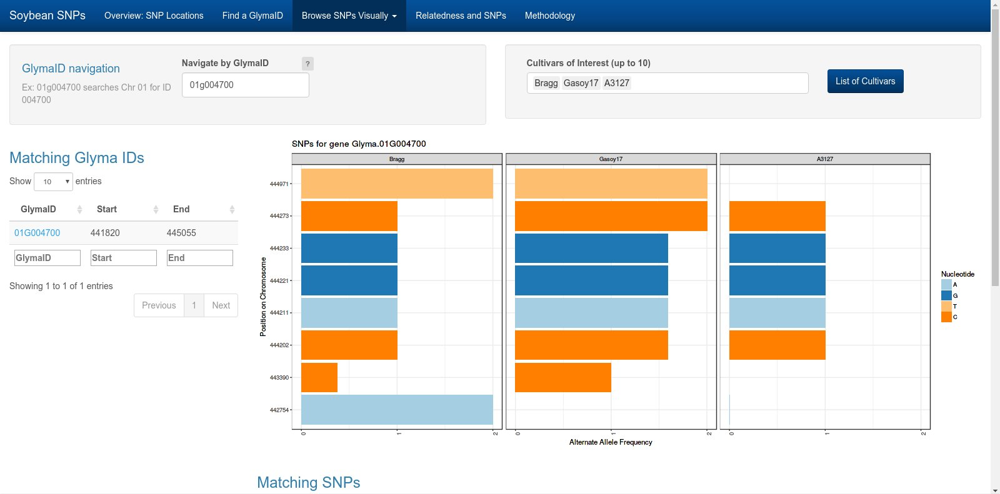

```{r setup, fig.keep='all',echo=FALSE, eval=TRUE, error=FALSE, warning=FALSE, message=FALSE}
options(replace.assign=TRUE,width=70)
library(knitr)
library(ggplot2)
library(reshape2)
library(plyr)
library(gridExtra)

opts_chunk$set(fig.path='figure/fig-', cache.path='cache/', fig.align='center', fig.width=5, fig.height=5, fig.show='hold', par=TRUE, cache=TRUE, concordance=TRUE, autodep=TRUE, warning=FALSE, message=FALSE, echo=FALSE)


```

# Outline


## Applied Statistics "In Theory"

- Design the experiment
- Collect the data
    - Neat, perfectly clean data
- Analyze the data
- Write the report
- Act on the conclusions

---

### That probably never happens


## Applied Statistics in Practice

- Messy data
- Fundamental misunderstandings
- Vague expectations
- The curse of "Big Data"

# Messy Data {.title}

## What I expected

<div class = "left">
 
</div>

<div class = "right">

- Poorly coded variables
- misspellings
- lack of documentation
- appalling Excel spreadsheets

</div>
 
## What I got

<div class = "left">
 
</div>

<div class = "right">

- databases with tables that didn't have matching keys
- soooo many misspellings
- data stored as PDF scans or microfiche
- internal inconsistency in variable coding
- just about no documentation other than individual memory

</div>

# Fundamental misunderstandings

## Actual email

"If we were to enhance and then plug our safety data on near misses and minor to more serious injuries over the last five years (more or less) into a predictive program of some sort, could the computer program come close to predicting when where and what the next injury might be?"


# Big Data Problems {.title}

## Big Data Problems

- "Needle in a Haystack"     
Finding one interesting thing in 100+ GB of data

- "Needle in a stack of needles"     
100 interesting things - how to investigate them all?

<br></br>

<h3 class = "fragment">Limited bandwidth </h3>

## Big Data

Visualization is an important tool for working with big data  
<br></br>

Adaptations must be made:  

- Overplotting (large $n$)
- High-dimensional data (large $p$)
- Distributed/multi-source data, hierarchical data
- No solution (binning, dimension reduction, tours) works for every situation

## Interactive Graphics  
  
- Provide additional information in response to user action  
<br>
- Simultaneously show more than 2-3 variables and their relationship (multiple linked plots)  
<br>
- Accommodate complex data structures  
<br>

BUT...  
<br>  
Web-based interactive graphics may be even more size-sensitive than static graphics. 


# Interactive Visualization of Soybean Population Genetic Data {.title}

---


---

## Overall Project Goals: 
- Understand historical yield increases  
<small>100% increase in past 100 years; additional 70% increase by 2050 to meet food needs (World Bank)</small>  
- Associate genetic features with phenotypic traits 
<small>Disease resistance, yield, nutritional content, time to maturity</small>  

- Communicate analysis results intuitively:
    - Target: Soybean farmers, plant geneticists
    - Provide full results (tables) and graphical summaries
    - Interface with existing databases and web resources

## Data
<br>  

- Sequencing Data    
(79 varieties, 75GB processed and compressed)  
  <br>
- Field Trials    
(168 varieties, 30 varieties with genetic data)  
  <br>
- New crosses with highest yield varieties  
<small>(sequencing + field trials)</small>  
  <br>
- Genealogy as reported in the breeding literature (1600 varieties)  

## Visualizing SNPs

<ul>
<li style="margin:.5em"> SNP: Single Nucleotide Polymorphism, a single basepair mutation  
(A -> T, G -> A, C -> G)</li>
<li class="fragment" style="margin:.5em"> [Shiny](www.shiny.rstudio.com) applet: Responsive applet for user-directed data subsets</li>
<li class="fragment" style="margin:.5em"> Show multiple levels of detail (less detail = lower computational load)</li>
<li class="fragment" style="margin:.5em"> Provide resources in the applet for user exploration (not just a reference tool)</li>
</ul>

## Visualizing SNPs:  
<ul>
<li class="fragment" style="margin:.5em"> Huge number of interesting genes (70 million ID'd SNPs)  
</li>
</ul>

## Visualizing SNPs:  
<ul>
<li style="margin:.5em"> Huge number of interesting genes (70 million ID'd SNPs)</li>
<li style="margin:.5em"> 79 varieties, 20 chromosomes</li>
<li class="fragment" style="margin:.5em"> Phenotype and genealogy information</li>
<li class="fragment" style="margin:.5em"> Researchers tend to work on gene subsets:<br>
Must be able to zoom and filter</li>
<li class="fragment" style="margin:.5em"> Optimized files for SNP results are still large (10 GB) and require significant computational resources</li>
</ul>  

<p class="fragment" style="margin-top:1em;">Above all, need an interface to allow people to pull new discoveries from the data systematically. </p>


## Applet Design

<a href="http://localhost:3838/USDAsoybeans/Shiny/SNP/"></a>

---

### SNP Population Distribution 


---

### Density of SNPs: Chromosome Level


---

### Individual SNPs: Comparing Varieties



---

### Genealogy and Phenotypes

<a href="/storage/Rprojects/USDAsoybeans/Shiny/SNP/www/animint/index.html">Link</a>


---

## Interactive Plot Design


## Good Statistical Graphics

<div style="color:#808080;text-align:left;margin-left:20%;">

**Function:**  

- Show the data
- Don't distort the data  
<br>  

**Form:**  

- Show a consistent story
- Provide several levels of detail
</div><div style="text-align:left;margin-left:20%;">

<div align="center" style="padding:10px">(Ideally)</div>  

**Elegance:**  
How do I best communicate the data?  

- Perceptual Awareness
- Visual Bandwidth (information overload)
</div>
 
