class: primary
```{r setup, echo = F, cache = F, include = F}
library(magrittr)
library(tidyverse)
library(ggplot2)
library(keras)
library(furrr)
plan(multicore)
mytheme <- theme_bw() + 
  theme(panel.grid.major = element_line(color = "grey50"),
        panel.grid.minor = element_line(color = "grey60"))

theme_set(mytheme)
knitr::opts_chunk$set(echo = FALSE, message = F, warning = F, cache = T, dpi = 300, dev = 'png')

source("~/models/shoe_nn/Generate_Model_Images.R")
```

```{r load_refs, echo=FALSE, cache=FALSE, include = F}
library(RefManageR)
BibOptions(check.entries = FALSE, 
           bib.style = "numeric", 
           cite.style = 'authoryear', 
           style = "html",
           hyperlink = FALSE, 
           no.print.fields = c("isbn", "urldate"),
           dashed = FALSE)

bb <- ReadBib("./refs.bib", check = T)
```

```{r unicode}
# Unicode symbols for classes
unicode_symbols <- c(bowtie = "",
  star = "\u2605",
  polygon = "\u2B23",
  chevron = "\uFE3D",
  triangle = "\u25BC",
  other = "\u003F",
  circle =  "\u23FA",
  text = "a",
  quad = "\u25A0",
  line = "\u2225"
  )
unicode_symbols <- tibble(labels = names(unicode_symbols),
                              shape = as.character(unicode_symbols))
classes <- c("bowtie", "chevron", "circle", "line", "polygon", "quad", "star", 
             "text", "triangle")
```

```{r labeled-data}
model_path <- "~/models/shoe_nn/TrainedModels/"

newest_model <- get_newest(dir = model_path, pattern = "weights.h5")
newest_data_file <- file.path("~/models/shoe_nn/RProcessedImages/", newest_model$process_dir, "cropped_photos.Rdata")

load(newest_data_file)

label_fixes <- c("triangles" = "triangle",
                 "trianglee" = "triangle",
                 "circlemtraignle" = "circle_triangle",
                 "circle triangle" = "circle_triangle",
                 "circleline" = "circle_line",
                 "circle text" = "circle_text",
                 "circle_elongated" = "circle",
                 "cricle|cirle" = "circle",
                 "chrevron" = "chevron",
                 "lie" = "line",
                 "texxt" = "text",
                 "star quad" = "star_quad",
                 "exc_idd" = "exclude",
                 "quad?" = "quad",
                 "qaud|qud" = "quad", 
                 "stars|start" = "star", 
                 "exlude" = "exclude",
                 "rounded" = "",
                 "smooth_texture" = "other",
                 "octagon" = "polygon",
                 "crepe" = "other",
                 "hex" = "polygon",
                 "smooth|hatching" = "other"
                 )
# Merge doesn't work, wtf???
annotated_imgs <- select(dfunion, image, name) %>%
  mutate(base_image = basename(image)) %>%
  mutate(num_labels = str_count(name, "_") + 1, 
         annot_num = 1:n()) %>%
  mutate(labels = str_remove_all(name, "\\(.{1,2}\\)") %>% 
           str_replace_all(label_fixes) %>% 
           str_split("_")) %>%
  unnest(labels) %>%
  mutate(labels = str_replace_all(labels, label_fixes)) %>%
  mutate(label_type = ifelse(num_labels == 1, "single", "multi")) %>%
  filter(labels != "") %>%
  filter(labels != "exclude") %>%
  filter(labels != "ribbon" & labels != "logo") %>%
  filter(labels %in% c(default_classes, "other"))

fix_annotation <- function(annot) {
  useful_vars <- c("name", "deleted", "date", "id", "username")
  new_vars <- set_names(useful_vars, c("name", "deleted", "date", "objID", "username"))
  
  get_vars <- new_vars[new_vars %in% names(annot)]
  
  if (!is.null(annot)) select(annot, !!get_vars) %>% as_tibble() else tibble()
}

authors <- df %>%
  filter(!is.null(fullannot)) %>%
  mutate(base_image = basename(image)) %>%
  select(id, base_image, image, fullannot) %>%
  filter(!is.null(date)) %>%
  mutate(miniannot = map(fullannot, fix_annotation)) %>%
  select(-fullannot) %>%
  unnest(miniannot)
```

```{r img-setup}
new_img_dir <- dirname(newest_data_file)

ann_df <- select(annotated_imgs, base_image, name, num_labels, annot_num, labels, label_type) %>%
  group_by(base_image, name) %>%
  arrange(annot_num) %>%
  mutate(ln = 1:n())

img_df <- tibble(img = list.files(file.path(new_img_dir, c("test", "train", "validation")), full.names = T)) %>%
  mutate(type = str_extract(img, "(test|train|validation)"),
         image = basename(img),
         aug = grepl("^aug", image),
         name = str_extract(image, "^([a-z\\(\\)RE]*?_?){1,}-\\d{1,}-"),
         ln = str_extract(name, "-\\d{1,}-$") %>% gsub(pattern = "-", replacement = "") %>% as.numeric(),
         name = gsub(pattern = "-\\d{1,}-$", "", name),
         name = gsub(pattern = "aug_", "", name),
         name = gsub(pattern = "logo|ribbon|logo\\(R\\)|ribbon\\(R\\)", replacement = "other", name),
         base_image = gsub(image, pattern = "^([a-z\\(\\)RE]*?_?){1,}-\\d{1,}-", replacement = "") %>%
           gsub(., pattern = "_\\d_\\d{1,}.jpg", replacement = ".jpg")) %>%
  select(type, base_image, name, ln, aug, img_path = image) %>%
  mutate(num_labels = str_count(name, "_") + 1, 
         annot_num = 1:n()) %>%
  mutate(labels = str_remove_all(name, "\\(.{1,2}\\)") %>% 
           str_replace_all(label_fixes) %>% 
           str_split("_")) %>%
  unnest(labels) %>%
  mutate(labels = str_replace_all(labels, label_fixes)) %>%
  mutate(label_type = ifelse(num_labels == 1, "single", "multi")) %>%
  filter(labels != "" & labels != "hatching" & labels != "exclude" & !is.na(labels))
```

```{r load-keras-model}
library(keras)
model_dir <- newest_model$path
load(list.files(model_dir, "-history.Rdata", full.names = T)[1])
load(file.path(get_newest()$path, get_newest(pattern = "\\d.Rdata")$base_file))
```

## About Me

- PhD from Iowa State in 2015

- Statistician at Nebraska Public Power District (2015 - 2018)

- Research Faculty at Iowa State's Center for Statistics and Applications in Forensic Evidence since March 2018

- Research Areas: Visualization and Statistical Computing, Forensics

???

Thank you for inviting me to interview for this position. As a student at Iowa State, I did research into graphics, visualization, and computing; I also collaborated with researchers in engineering, bioinformatics, and agronomy. I left Iowa State to work at Nebraska Public Power District, where I helped to build a data science group and teach data analysis and computing skills internally. Last March, I returned to Iowa State to work at the Center for Statistics and Applications in Forensic Evidence, or CSAFE. During that time, I've worked on projects involving human factors, shoes, and bullets. 

I'll start by giving you a brief overview of my past research, and then I'll talk about one of the problems I've been working on more recently. 

---
class:primary

## Graphics and Computing Publications

.smaller[
```{r graphics-pubs, results='asis', echo=FALSE, cache = F}
mypubs <- ReadBib("./mypubs.bib", check = T)
NoCite(mypubs)
PrintBibliography(mypubs[-2], .opts = list(sorting = "ydnt", no.print.fields = c("note", "file", "url", "issn", "url-date"), bib.style = "numeric"))
```

]

???

I've published several papers in JCGS, an R package in JSS, and a paper at InfoVis that was published in TVCG (Transactions on Visualization and Computer Graphics); almost all of these papers address graphics and visualization and most of them explore how people perceive graphics. 

---
class:primary
## Forensics
.smaller[
#### Papers
```{r forensics-pubs, results='asis', echo=FALSE, cache = F}
PrintBibliography(mypubs[2], .opts = list(sorting = "ydnt", no.print.fields = c("note", "file", "url", "issn", "url-date", "eprint"), bib.style = "numeric"))
```

<p>[In Progress]<cite>
M. Tilton and S. VanderPlas
&ldquo;CoNNOR: A Convolutional Neural Network for Outsole Recognition.&rdquo; To be submitted to Forensic Science International Summer 2019.<cite></p>

<p>[In Progress]<cite>
S. VanderPlas, T. Klep, M. Nally, C. Cadeval, and H. Hofmann.
&ldquo;Case study validations of automatic bullet matching; To be submitted to Forensic Science International Summer 2019.&rdquo;</cite></p>

<p>[In Progress]<cite>
S. VanderPlas.
&ldquo;BulletsamplR: Resampling Bullet Cross Sections&rdquo;</cite></p>


#### Grants

<p> <cite>NIJ R&D in Forensic Science. &ldquo;Statistical Infrastructure for the Use of Error Rate Studies in the Interpretation of Forensic Evidence.&rdquo; Collaborator. Funded for FY 2019</cite></p>

<p> [Under Review] <cite>NIJ R&D in Forensic Science. &ldquo;Passive Acquisition of Footwear Class Characteristics in Local Populations&rdquo; PI. Submitted April 2019 for FY 2020</cite></p>

<!-- No idea where to put this... -->
<!-- <p> [In Preparation] <cite>NSF. &ldquo;Smart Shrinkage: Characteristics of Rural Towns Which Maintain Quality of Life With Declining Populations&rdquo; Collaborator. To be submitted Sept 2019.</cite></p> -->
]

???

I started at CSAFE in March 2018, and since then I've worked on several projects that are nearing completion. Today, I'm going to talk about a Convolutional Neural Network for Outsole recognition, or CoNNOR for short. The statistical methods I'll discuss can be applied to domains far outside of forensics, from astronomy to zoology, but the forensics problem is particularly fun because there is not currently any foundation or infrastructure for the statistical analysis of the weight of shoeprint evidence. 

It might seem like there's not much statistics until the very end of this talk, but that's because this project is laying the foundation for the future, so I've had to think very carefully about both the ideal statistical analysis years down the road and also about factors which would influence the adoption of this method by the wider forensics community. 

---
class:primary
## Outline

- [Forensics Context](#6)

- [Image Analysis](#16)

- [Convolutional Neural Networks](#21)

- [CoNNOR](#41)

- [Future Work](#58)


???

I'm going to start with the forensics context of this problem. I'll talk briefly about image analysis methods, provide some background information about convolutional neural networks and how these models are fit, and then talk specifically about CoNNOR and some advances we've made in visual diagnostic plots for CNNs. I'll then return to the forensics context briefly and discuss future work on this project. 


---
class:primary
## What is the probability of<br>a coincidental match?

<!-- 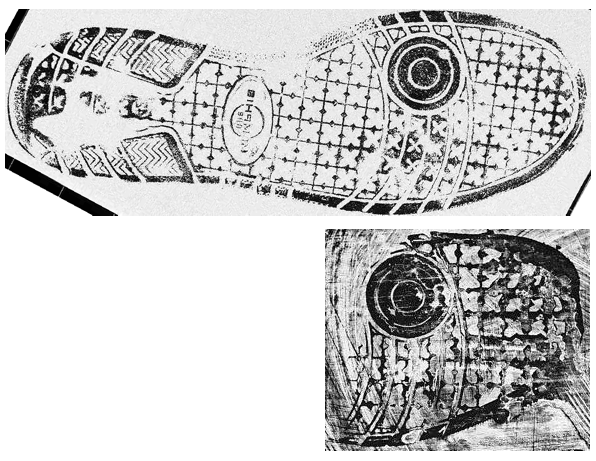 -->
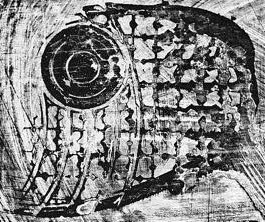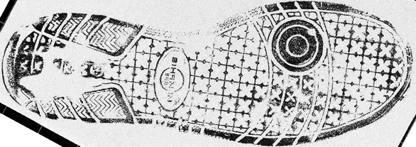


???

After a crime is committed, investigators must reconcile the evidence found at the scene with a narrative of the crime. For instance, shoeprints at the scene might be linked to shoes in the suspect's possession, which would suggest the suspect's shoes were at the scene. During this process, the shoes are examined and the two prints are compared. In court, the prosecution must then describe the value of that evidence - how much information should it provide to the jury concerning the suspect's guilt or innocence?

Part of the calculation of that information is to determine what the probability of a coincidental match is, that is, what's the probability that some random individual would also have a shoe with a tread pattern similar to the print at the crime scene? If that probability is high, the evidence is less valuable, but if it's low, then the jury should treat the evidence with much more weight.

---
class:primary
## What is the probability of<br>a coincidental match?

1. Define the comparison population

2. Sample from the comparison population    
$N$ total shoes

3. Identify similar shoes from the comparison population    
$S$ similar shoes in the $N$ shoe sample

4. Estimate the probability of a coincidental match: $$\hat{p} = \frac{S}{N}$$

???

Probability would tell us that this is a fairly simple calculation. 
We first define the comparison population, that is, the population of people who could have made the print - say, individuals in Lincoln.  
Then, we would sample from that comparison population to see what shoes the people in the comparison set have.
We would then identify similar shoes - shoes which could have made the print at the crime scene, and estimate the probability of a coincidental match as the number of similar shoes divided by the size of the comparison population sample. 

--
<br/>

> .large[Quantifying the frequency of shoes in a local population is an unsolveable problem]<br/> - Leslie Hammer, [Hammer Forensics](https://hammerforensics.com/), March 2018


???

It's generally not that easy. Shortly after I started working at CSAFE, we brought in Leslie Hammer, who is a well-known forensic footwear examiner to give a seminar. During a discussion later that day, I was somewhat shocked to hear her say that the community considers the problem of local population characterization impossible. I've since heard the same sentiment from several other practitioners.

The fastest way to get me to do something is to tell me it's not allowed or impossible. 

I will concede that there are a few good reasons this problem hasn't been tractable in the past.

---
class:primary
## Obstacles: Characterizing Comparison Populations

- No 100% complete database of all shoes 
    - manufacturer, model, size, tread style, manufacturing molds
    
- Shoe purchases vs. frequency of wear (temperature, weather dependence)

- Local populations may differ wildly .small[`r Citep(bb, "benedict_geographical_2014", .opts = list(max.names = 1, longnamesfirst = F))`]

<br/><br/>
.center[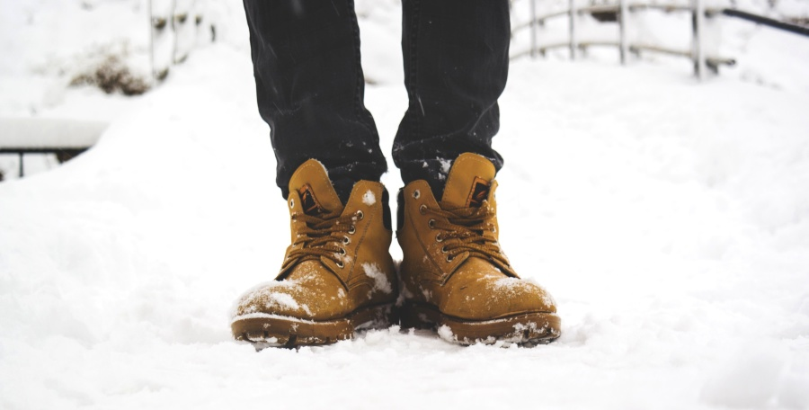]
<!-- https://pixnio.com/free-images/2017/05/03/2017-05-03-07-35-18-900x456.jpg -->

???

For starters, while there are databases for other pattern match evidence, like tire tread patterns, there is not a complete database of all shoes sold in the US. Tires have to be certified; shoes do not. There are also many more manufacturers for shoes, new models are released all the time. A single model may have multiple tread patterns, a single tread pattern may be used on multiple shoe models. The tread pattern may change depending on the style of shoe; there are also different molds for a single size/tread combination, and these molds may have different characteristics. 

You may think about instead tracking sales data - surely, we could get a database of shoe preferences that way? How many of you have shoes in your closet that you've never worn? That you've worn once? Or less than once a year? Purchase data doesn't provide a realistic picture of the shoes people wear day to day - most of us have one or two "favorites". In addition, that provides us no information about how the match probability changes with season and weather. Obviously, most people aren't wearing sandals in the middle of winter, but there aren't any studies of footwear frequency to back that up with data.

In addition, we know that local populations differ wildly in footwear choices. The footwear worn on campus might not be all that similar to the footwear worn near the capitol building, because the populations that frequent them are different and the dress codes are different. This is another problem with sales data - it doesn't generalize well to the hyper-local regions that we might want to consider when characterizing coincidental match probability.

So how do we solve this problem? How do we collect this data at a (potentially) neighborhood level?

---
class:primary
## Comparison Population

.move-margin[.Large[.center[Goal: 
$$\hat{p} = \frac{S}{N}$$
]]]
How to collect data from the comparison population? 

1. Build a low profile scanner, place in a high traffic area

2. Scan shoes of those walking past

3. Create a local-area database of relevant scans

--

#### .center[This is an engineering problem]

Prototype Scanner | Shoe sole
----------------- | ----------
 | 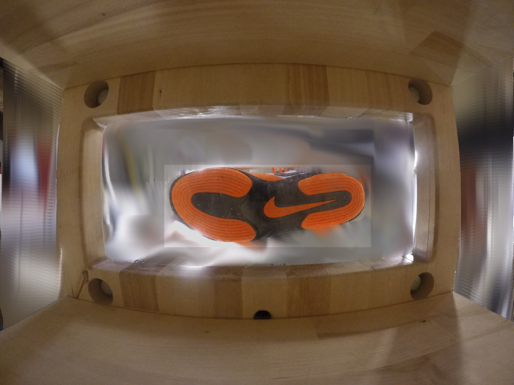

???

We could build a scanner that would fit into a pedestrian pathway and would scan the shoes of passers-by. After some data collection in one or more very local areas over a period of time, we might be able to generalize our spatial sample to the population of interest.

I've been working with a manufacturing engineering professor to build a prototype, and if we get grant funding, we'll build a much more robust, weatherized version of this that has privacy protections. There are a number of interesting engineering problems here, but I'm not an engineer, so I'm going to instead assume that the engineering problems are solvable and work on the statistical problems. 

---
class:primary
## Comparison Population

Assume a machine exists that can scan shoe outsoles of pedestrians

--

1. Identify relevant features within the scans
.center[<br/>]
 
---
class:primary
## Comparison Population

Assume a machine exists that can scan shoe outsoles of pedestrians

1. Identify relevant features within the scans
.move-margin[<br/><br/>]

2. Define similarity for shoe images

.center[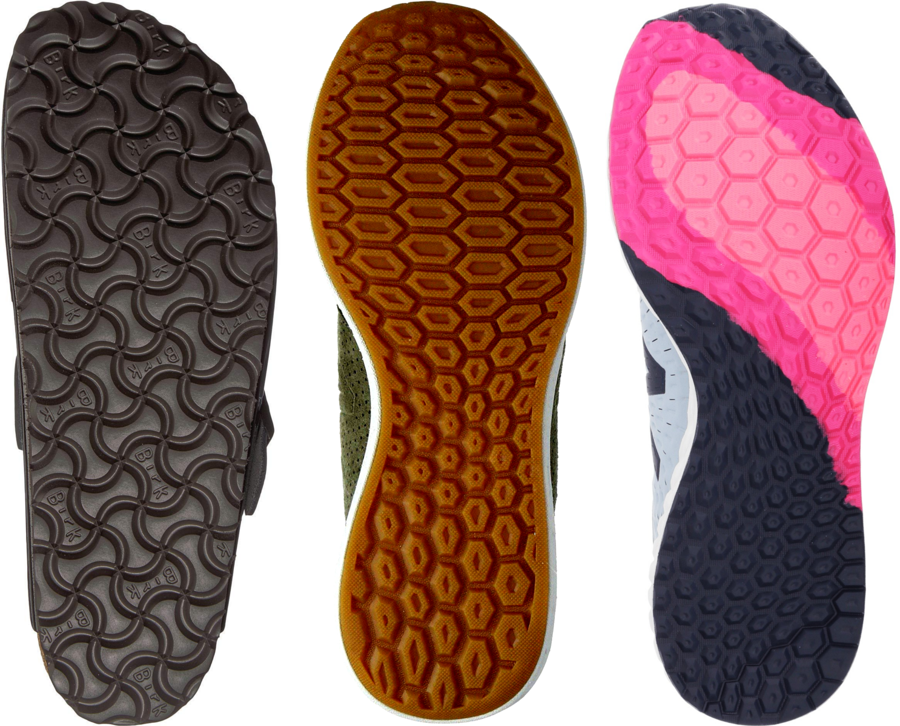]

---
class:primary
## Comparison Population

Assume a machine exists that can scan shoe outsoles of pedestrians

1. Identify relevant features within the scans

2. Define similarity for shoe images
.move-margin[<br/><br/><br/><br/>]

3. Assess the frequency of similar shoes in the sampled data


???

Let's assume that this machine exists and that it's producing image-quality data. 

From that point, we still need to identify relevant features within the scans - these features will be "data" used in comparisons. The feature identification problem occurs in any pattern-matching problem. To recognize flowers, you would also have to determine what characteristics (color, number of petals, flower shape) matter.

Then, we have to define a similarity metric used for comparing two samples

Finally, we would search our database (indexed by the relevant features previously identified) and determine how many shoes were similar enough, compared to the shoes in the database. That proportion would be our estimated coincidental match probability. 

All of these issues are within the realm of statistics and machine learning. 

The next question is then... What's considered a relevant feature?

---
class:primary
## Relevant Features

Footwear Class Characteristics

- Make, Model, Tread pattern, Size, Type of shoe

- Cannot be used to identify an individual match

- Used for exclusion


???

In forensics, class characteristics are broad descriptors shared by many different individual objects. In shoes, class characteristics refer to make, model, tread pattern, size, type of shoe, and even wear patterns. Examiners will say that a suspect's shoe "is consistent with" prints left at the scene, but if the match is made on class characteristics alone (95% of the time), they cannot explicitly connect the shoe and the print at the crime scene.

Randomly acquired characteristics, which occur due to random damage as the shoe is worn or during the manufacturing process, can be used to make an individualized match.

We've already discussed why make and model are difficult to work with - there's no indexed data set to use. Similarly, shoe size isn't as related to tread size as you'd expect, so that's off the list too. Working with tread pattern seems like a better option. 

---
class:primary
## Relevant Features

Use features other than make/model and size to characterize shoes

- Knockoffs often have very similar tread patterns
- Similar styles have similar tread patterns across brands
- Unknown shoes can still be classified and assessed

| Dr. Martens | Eastland | Timberland |
| --- | --- | --- |
| 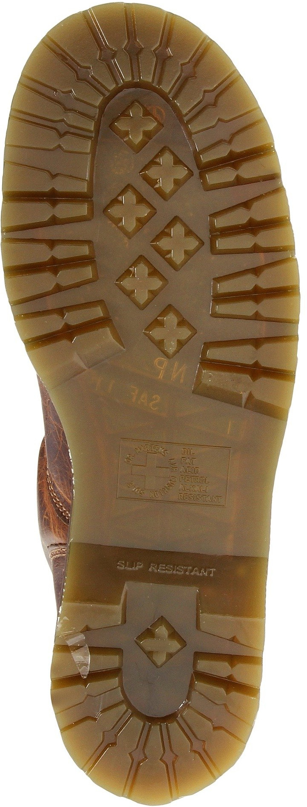 | 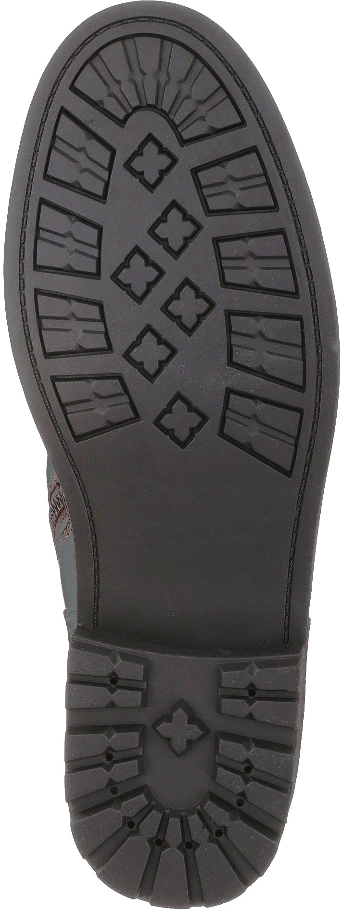 | 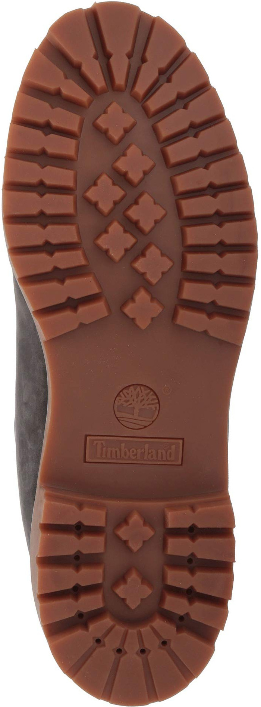 |
| Work 2295 Rigger | 1955 Edition Jett | 6" Premium Boot |

???

If we work off of features within the shoe tread, we get some additional benefits. 

First, similar tread patterns are found in shoes of similar style - knockoffs specifically try to emulate a tread pattern, but even across well known brands, shoes that serve a similar function often have similar tread patterns - here are 3 different models of work boots, from different manufacturers, each with the same tread pattern. The number of design elements may differ slightly, but that variation happens even within shoe make and model - different sizes have different tread elements in some cases. These shoes would all leave a similar print, so working with the entire set of shoes with these features makes more sense than specifically identifying the make and model.

An additional benefit is that unknown shoes can still be classified and addressed. If we define our feature set as "Shoes with quadrilaterals around the edge that have triangle cutouts, and diamond-shaped plus signs in the middle", we can start off by estimating the probability that a shoe like these 3 exists, and then can increase the specificty of the query from there as data quality and amount allows. It's definitely not a perfect solution, but crime scene prints are typically degraded, so this is a level of detail that matches the practical problem fairly well. It's an abstraction, but at a level that makes sense both statistically and pragmatically. 

After some deliberation and attempts to manually identify features, we settled on 9 geometric features. 

---
class:primary
## Relevant Features

<table class="featuretable">
<thead><tr><th style = "width:33%"> Bowtie </th><th style = "width:33%"> Chevron </th><th style = "width:33%"> Circle </th></tr></thead>
<tr><td></td><td></td><td></td></tr>
<tr><th> Line </th><th> Polygon </th><th> Quadrilateral </th></tr>
<tr><td></td><td></td><td></td></tr>
<tr><th> Star </th><th> Text </th><th> Triangle </th></tr>
<tr><td></td><td></td><td></td></tr>
</table>

Used to separate shoes by make/model in (small) local samples `r Citep(bb, 'gross_variability_2013', .opts = list(max.names = 1, longnamesfirst = F))`

???

There is some precedent for separating shoes in this way - Gross et al (2013) used a similar system with a different set of features, and managed to separate a local sample of shoes into make/model piles using this classification scheme. 

Some of these categories include interesting variations: bowties, for example, are defined as roughly quadrilateral, but with two opposite concave features; thus, butterflies have been included in the bowtie category.  Polygons, Quadrilaterals, and Triangles are allowed to have rounded corners; not all rubber materials handle sharp corners well. Polygons include anything with more than 4 sides - as of now, pentagons, hexagons, and octagons. Circles include ovals and ellipses as well. 

These 9 features will be used throughout the rest of the talk. 

---
class: inv-center
# <br/>Image Analysis and Feature Detection

???

Now that we've decided which features to use, we have to figure out how to identify them automatically from image data. Images are, after all, matrices of data; in color, they are N x M x 3 matrices, where N x M is the image dimension in pixels. 

---
class: primary
## Image Analysis

.move-margin[
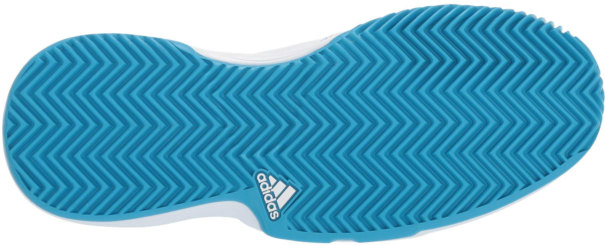
<br/>
<br/>
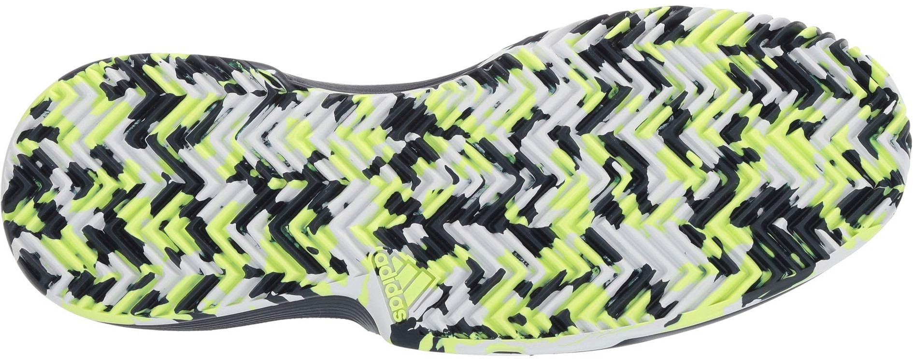
<br/>
<br/>
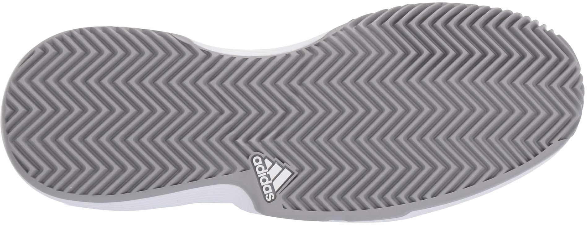
<br/>
<br/>
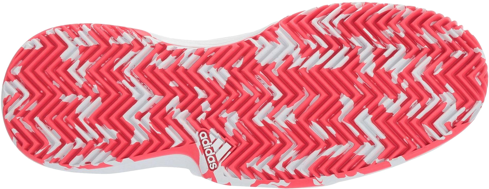
]

### Goal: Identify geometric tread features in images of shoe outsoles

- Robust to different lighting conditions, rotation, image quality

- Fast processing of new images

- Identify features that are explainable to practitioners

???

The detection method should be able to handle different lighting conditions, rotation and image quality - if we plan to use this method on real-world images, we have to be able to handle degraded image quality. Even working with images of shoe soles found online used for marketing purposes, there's a huge variation in image quality and lighting.

In addition, we need new images to be processed quickly. It's tolerable if the algorithm takes a while to train, but the production model needs to be able to process new data efficiently. 

Finally, we need to be able to explain what this algorithm is doing to practitioners, which means that the features that are identified should be explainable and fairly consistent with how humans would label things.

I started this project with the intention to use various computer vision algorithms to detect very basic image features, then potentially try to reconstruct those into higher-level geometric features using a random forest. I very quickly realized that some of the classic image analysis techniques were fragile, worked with very small regions of the image (and thus didn't use context), and were generally not well suited for this problem.

Convolutional neural networks are a newer approach that has dominated the image recognition field; they are currently used in self-driving cars, automatic license plate readers, automatic photo tagging, and more. When I gave up on the classic image analysis techniques, I turned to CNNs. They're a black box model, which is problematic, but a model that is hard to interpret but works is better than an easy-to-interpret model that doesn't work. 

---
class:inv-center
# <br>Convolutional Neural Networks

???

During this portion of the talk, I'm going to walk through a convolutional neural network, discuss the components, and describe the process of model fitting. One of my interests is in perception, and the structure of these models are built to mimic our understanding of the structure of the human visual system. I don't like black box models, so my goal for the next few minutes is to look under the hood. This type of deep neural network model became popular in computer science, so I'm going to start by laying out the statistical framework for this problem. 

---
class:primary
## Modeling Approach

Let $CNN(x)$ describe a convolutional neural network acting upon an input image $x$ with labels ${Y_1}, ..., {Y_z} \in \{0,1\}^z$ 
<br/><br/>


$\displaystyle CNN(x) \rightarrow [{P_1}, ..., {P_z}] \in [0,1]^z$ 

- $z$ is the number of output classes 

- ${P_1}, ..., {P_z}$ are output class probabilities

<br/>

The model has errors $[{\epsilon_1}, ..., {\epsilon_z}] = [{Y_1} - {P_1}, ..., {Y_z} - {P_z}]$

???

Starting from the beginning, we'll describe a CNN as a function that acts on an input image x that has z binary labels Y. 

The CNN maps input x and produces z output probabilities between 0 and 1; one probability for each class. Depending on the CNN structure, additional constraints on these P can be added, but by default, we'll assume this is unconstrained and thus, that the Ps do not necessarily sum to 1. 

Then we can define epsilon, the errors made by CNN(x) during classification. 

Let's look at the structure of a convolutional neural network. 


---
class:primary
## CNN Architecture

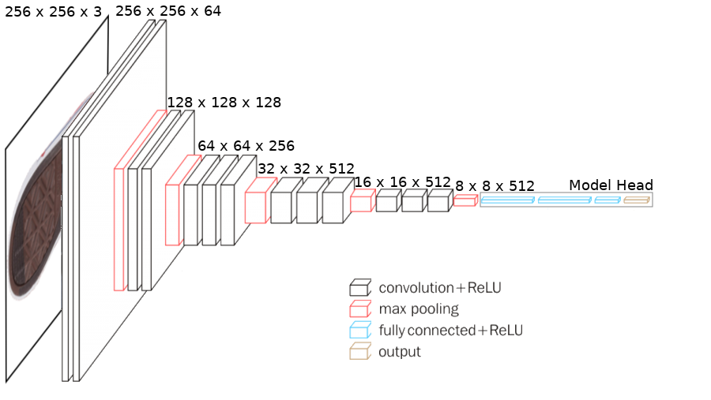

???

This is one example of a very deep convolutional neural network, where very deep is a reference to the number of convolutional layers. 

The input image is 256 pixels square, with 3 color channels. The initial convolutional layers produce an output matrix that is 256 by 256 by 64, where 64 is the number of filters applied at that layer. A pooling layer reduces the input size to 128 by 128, and then subsequent convolutional layers apply another 128 filters to that reduced-dimension matrix. 

At each stage of the model, the spatial dimensionality decreases and the number of filters increases, as more complicated patterns are incorporated into the model. At the end of all of these convolutional and pooling layers, there is a model head, which takes the spatial filters and combines them into a unified whole; the very last layer is a softmax activation layer that produces the output probabilities. 

I will talk about each of these layer types in turn, starting with convolutional layers.

---
class: primary
## Image Convolution

Let $x$ be an image represented as a numerical matrix, indexed by $i, j$, and $\beta$ be a filter of dimension $(2a + 1) \times (2b + 1)$

The convolution of image $x$ and filter $\beta$ is $$(\beta \ast x)(i, j) = \sum_{s = -a}^a\sum_{t = -b}^b \beta(s, t) x(i-s, j-t)$$

???

Let's start with the convolution part of CNNs. Image convolution is the application of a filter that is smaller than the image to every possible "tile" of the image, where each filter application results in a single value. 

The math is relatively simple, but it's much easier to see what's going on using pictures. Throughout this exercise, we'll refer to the image $x$ and filter $\beta$; note that the dimension of $\beta$ is odd. The convolution operation is what makes these networks a bit different from the classical artificial neural networks that have been around for much longer.

---
class: primary
## Convolutional Layers


.pull-left[.center[Input image 
$\displaystyle x$
]]
.pull-right[.center[
Weight matrix
$\displaystyle \mathbf{\beta}$
]]

.footer[Image source: https://towardsdatascience.com/applied-deep-learning-part-4-convolutional-neural-networks-584bc134c1e2]

???

Suppose we have a 5 by 5 input matrix and a 3 by 3 spatial filter. We'd start by applying that filter to each possible 3x3 portion of the input, which produces a 3x3 output matrix. 

---
class: primary
## Convolutional Layers

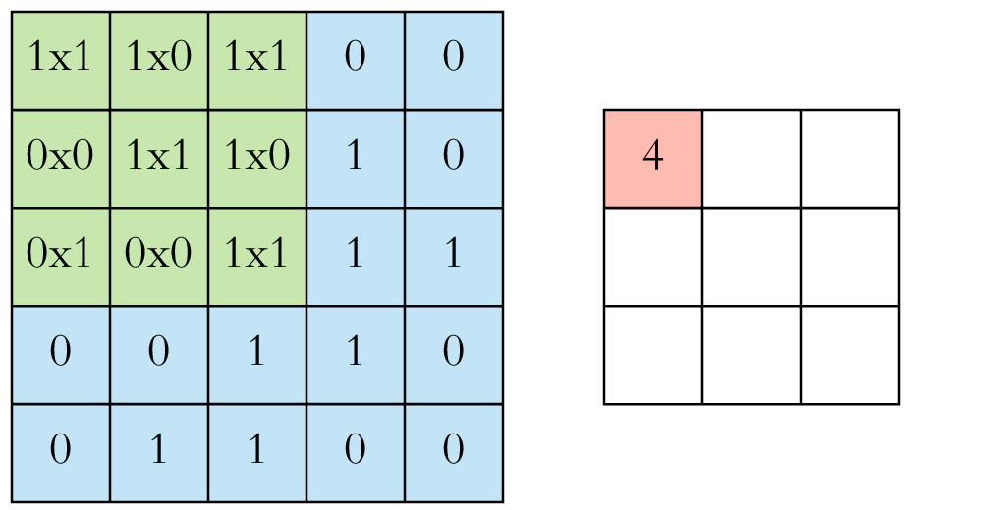

.pull-left[.center[Convolution: 
$\displaystyle \beta\ast x$
]]
.pull-right[.center[
Feature Map
$(\beta \ast x)(i, j)$
]]

.footer[Image source: https://towardsdatascience.com/applied-deep-learning-part-4-convolutional-neural-networks-584bc134c1e2]

???

We start in the upper left corner of $x$, applying $\beta$ cell-wise to each overlapping cell of $x$. We then move over by one and do the same thing.

---
class: primary
## Convolutional Layers


.pull-left[.center[Convolution: 
$\displaystyle \beta\ast x$
]]
.pull-right[.center[
Feature Map
$(\beta \ast x)(i, j)$
]]

.footer[Image source: https://towardsdatascience.com/applied-deep-learning-part-4-convolutional-neural-networks-584bc134c1e2]


???

Some CNNs pad the input image so that the resulting feature map is the same dimension as the input image. That's why the dimensions were so neat in the diagram I showed a few slides ago - image padding was used to ensure similar size output. 

---
class: primary
## Convolutional Layers - <br/>Forward Propagation

- $x^{0}$ is an input image

- $x^\ell$, $\ell = 1, ..., n$ are convolutional layers in the network.

- $\beta^\ell_{k}$ is an $m \times m$ filter matrix in layer $\ell$, $k = 1, ..., p^\ell$

- $\gamma^\ell$ is the bias matrix for layer $\ell$, with the same dimension as $\beta^\ell\ast x^{(\ell-1)}$

The $\ell$th layer, $x^{(\ell)}$, is indexed by $i$, $j$, and $k$:

$$x^{(\ell)}_k = \sigma\left({\beta^\ell_k}\ast x^{(\ell - 1)} + \gamma^\ell\right)$$

where $\sigma(\cdot)$ is a nonlinear activation function. 


ReLU (Rectified Linear Unit), $\sigma(\cdot) = \max\{0, \cdot\}$ is a common nonlinear activation function


???

Now that the convolutional part is explained, we need to understand how values pass from layer to layer through the network. Forward propagation is the numerical calculation that transitions from image to layer output (and then to the next layer, and so on until the model class probabilities are the output)

We're going to refer to $x^0$ more formally at this point as the input image, and $x^\ell$ as successive layers in the network. We have filters $\beta^\ell_k$, sometimes called model weights, and biases for each layer, $\gamma^\ell$. Our output layer is a three-dimensional matrix, where i and j index the spatial information and k indexes the filters. A nonlinear function is applied to the convolution of the layer and the filter added to the bias matrix. One common function is called ReLU, which truncates any negative output at 0. 


---
class:primary
## CNN Architecture


???

We've discussed the convolutional layer operations; we'll now talk briefly about the max pooling layers. 

---
class: primary
## Max Pooling Layers


.footer[Image source: https://towardsdatascience.com/applied-deep-learning-part-4-convolutional-neural-networks-584bc134c1e2]

???

Max pooling layers take a specified region and take the maximum over all cells. Stride is the offset between pooling regions. With a 2x2 window and stride of 2, the output layer is 1/4 the size of the input layer. 

---
class:primary
## CNN Architecture


???

We've made it through what's called the model base - the convolutional and pooling layers that aggregate spatial information locally. The model head takes that information and provides a more global integration, culminating in the output of class probabilities after the softmax layer. Different models have different numbers of fully connected layers in the head; the number of layers here has a large influence on the number of parameters that have to be optimized during the fitting process. 

---
class: primary
## Fully Connected Layers
.move-margin[<br>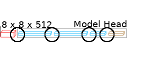]
```{r fully-connected, out.width = "75%", fig.width = 6, fig.height = 4, fig.align = "center"}
plot_deepviz_arrows(c(6,6,3)) 
```
- Connect every cell of previous layer to every cell of new layer
- Used for spatial pattern integration

???

A fully connected (or dense) layer connects every node in the input to every node in the output; each of these connections has a weight associated with it. Some models use "dropout", where a pre-specified proportion of the nodes are removed, reducing the number of parameters and forcing the network to be robust. 

---
class: primary
## Dropout Layers
.move-margin[<br>]
```{r dropout-layers, out.width = "75%", fig.width = 6, fig.height = 4, fig.align = "center"}
plot_deepviz_dropout(c(6,6,3), rm_nodes = c(3,4,6,8,10,11), cross_out = T) +
  theme(legend.position = c(1, 0), legend.justification = c(1, 0))
```
- Reduces number of parameters
- Reduces node dependence and overfitting

???

Here's a representation of a layer with 50% dropout. All of the layers in the model head have this type of structure; different models use different dropout rates. In the final layer, a nonlinear function is applied to the weights; usually the sigmoid or logistic function, so that the model outputs probabilities between 0 and 1. In models where each image has only one output class, the softmax function is used. 

---
class: primary
## Fitting Mechanism

- Forward Propagation: Input -> Filters -> Pooling -> Result

- Backward Propagation: Errors -> Pooling -> Filters
    - Goal is to update the filter weights
    - Loss function $L$ describing the prediction errors
    - Gradient descent using $$\frac{\partial L}{\partial \beta}$$
    at iteration $t$, with learning rate $\lambda$, 
    $${\beta_k}(t) = \beta_k(t-1) - \lambda \frac{\partial L}{\partial {\beta_k}}$$
    
???

During forward propagation, we begin with an input image and, for each layer, use the filters and pooling operators to compute a series of features that contribute to the resulting output probability. 

To fit the model to the training data, we must be able to move backwards, adjusting the filter weights and biases in order to produce better estimates. Backward propagation, or backpropagation, is how this adjustment occurs. In essence, CNN backpropagation employs gradient descent, applied to each cell of each layer. The learning rate parameter, lambda, is used to control how quickly the model converges. 

Common loss functions are squared error loss and cross-entropy, depending on the constraints placed on the output probabilities.

So how is the gradient computed? 

---
class: primary
## Backward Propagation

$$\begin{align}\left(\frac{\partial L}{\partial \beta^\ell_k}\right) &= \underbrace{\frac{\partial L}{\partial \left(\beta^\ell_k \ast x^{\ell - 1}\right)}}_\text{gradient} x^{\ell-1}\\\\\frac{\partial L}{\partial \left(\beta^\ell_k \ast x^{\ell - 1}\right)}&=\frac{\partial L}{\partial x^\ell} \left[\sigma'\left(\beta^\ell_k \ast x^{\ell - 1}\right)\right] \end{align}$$

The gradient can be computed with the derivative of the activation function $\sigma(\cdot)$

<br/>
.slightly-small[Note: ReLU is not differentiable at 0; common practice is to set 0, 0.5, or 1 as the derivative's value at 0.]

???

I'm going to talk about the backpropagation of the weights and ignore the biases for the time being; the process is even simpler for the biases because they are not convolved with the previous layer. 

Very simply, the gradient used to update the weights can be computed using the derivative of the activation function and the loss at the current layer. This works for a single layer, but we have to update weights at every layer in the model, so we need to be able to calculate the gradient for layer ell - 1 using values at layer ell. 

---
class: primary
## Backward Propagation

To propagate errors to the previous layer, 


$$\begin{align}\frac{\partial L}{\partial \left(\beta^{\ell - 1}_k \ast x^{\ell - 2}\right)} = &\frac{\partial L}{\partial x^{\ell - 1}} \left[\sigma'\left(\beta^{\ell - 1}_k \ast x^{\ell - 2}\right)\right]\\\\ \text{where }&\frac{\partial L}{\partial x^{\ell -1}} = \frac{\partial L}{\partial \left(\beta_k^\ell \ast x^{\ell - 1}\right)} \beta_k^\ell \end{align}$$

.center[]

.center[<b>13 convolutional layers = a lot of backpropagation</b>]

???

The gradient at the previous layer can be computed using the recurrence relationship shown.

With 13 convolutional layers, and a 256x256 image, this process is repeated a lot. It's only relatively recently that the computational power required to fit neural networks with this complexity became available, even though the process was described and used for smaller networks in the 1980s.

---
class: primary
## Parameter Space

.move-margin[<br/>]
- Convolutional base: ~14.5 million parameters

- Simple model head (9 output classes): ~8.4 million parameters

- Total parameter space: ~22.9 million

- Estimated model optimization time: 2-3 weeks with 4 GPUs

- Data requirements: > 1 million labeled images

--

<br/><br/>

.large[.center[We have <28k labeled images]]

???

These networks are so powerful in part because they have so many parameters; a total of 22.8 million for a model with the convolutional structure we've been working with and a very simple model head. Tuning all of those weights with a learning rate that's slow enough to allow for convergence would take 2-3 weeks and more GPU power than we have easy access to. It would also take more than a million labeled images to train that type of model successfully. 

We have 25 thousand labeled images, so we can either spend a long time labeling images to fit a model, or we can find another option.

---
class: primary
## Transfer learning

.move-margin[<br/>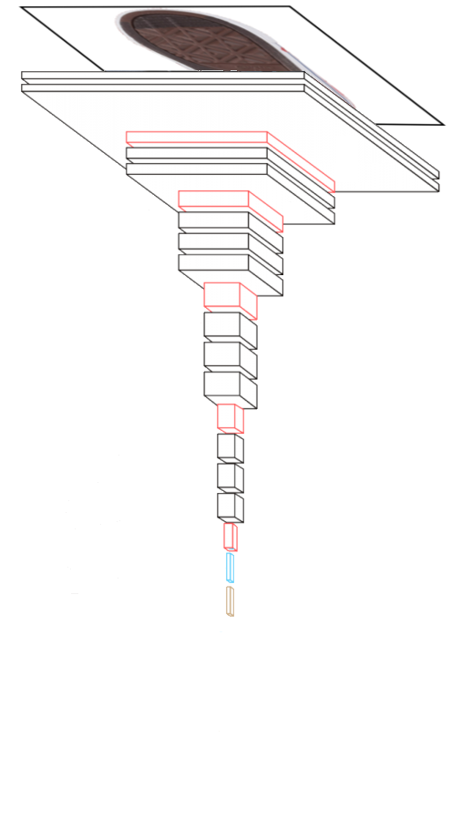]

- Use weights from a model trained on different input data

- Freeze the weights in the convolutional base

- Train a new model head

- Total parameter space: 8.4 million

- Model optimization time: <3 hours

???

We can use transfer learning to take advantage of the fact that there are pre-trained models available: we use the convolutional base (and the weights) from the pre-trained model and fit a new model head using the data we do have. This saves a huge amount of computational time and takes advantage of the fact that visual features generalize fairly well; the same set of filters that can recognize cats and dogs can also recognize circles and squares if the dense layers are properly calibrated. Using this approach, the model takes less than 3 hours to fit (we run model updates every night). 

--

#### VGG16
- Pre-trained CNN `r Citep(bb, 'simonyan_very_2014', .opts = list(max.names = 1, longnamesfirst = F))`
    - Trained on 1.3 million images from ImageNet    
    `r Citep(bb, 'krizhevsky_imagenet_2012', .opts = list(max.names = 1, longnamesfirst=F))`
    
    - Simple structure

???

VGG16 is a pre-trained CNN that conveniently has the structure we've been using as an example during this talk. Its structure is relatively straightforward, compared to ResNet and AlexNet. There are more complicated pre-trained networks with higher accuracy rates, but the simplicity of VGG16's structure makes it a good compromise for our purposes. We want to be able to explain this process to practitioners if necessary, and we want to be able to go back and understand what's happening with each filter and layer. 


---
class: inv-center
# Fitting CoNNOR: Convolutional Neural Network for Outsole Recognition

???

Now that you have an idea of what's happening inside the computer, let's talk about data collection and the human side of the model fitting process. 

---
class:primary
## Acquire Data


.move-margin[
<br/><br/>[`ShoeScrapeR` package](https://github.com/srvanderplas/ShoeScrapeR)<br/><br/>

<!-- `r system("tree /home/srvander/Projects/CSAFE/ShoeScrapeR/extra/photos/ | tail -1", intern = T) %>% str_extract("\\d{1,} files") %>% str_replace("files", "images")`  -->
80710 images scraped since April 2018
]

???

Shortly after Leslie Hammer's visit, I started writing a web scraper to pull shoe images from Zappos.com. In April, I started aggregating shoe data; the script runs several times a week and automatically downloads new shoes. As of earlier today, we have over 50 thousand distinct images scraped from Zappos, including men, women, and children's shoes. 

We have all of these images, but they're not useful unless we also have labels assigned to regions of each image. 

---
class:primary
## Label Data


- [LabelMe Annotation Tool](https://github.com/CSAILVision/LabelMeAnnotationTool) used as a web interface - creates XML files with labels and coordinates. `r Citep(bb, 'russell_labelme_2008', .opts = list(max.names = 1, longnamesfirst = F))`

- `r prettyNum(length(unique(annotated_imgs$annot_num)), big.mark =  ",")` regions labeled with one or more geometric objects
- `r prettyNum(length(annotated_imgs$image), big.mark =  ",")` labels

.small[.move-margin[
<br/><br/>Labeling courtesy of 
- Jenny Kim
- Ben Wonderlin
- Mya Fisher
- Holden Jud
- Miranda Tilton
- Charlotte Roiger
- Joe Zemmels
- and others
]]

???

I set up LabelMe Annotation tool, provided by a lab at MIT, to serve up images of the shoes and track labels applied to regions of each shoe. LabelMe provides an xml file for each image that contians the labeled region coordinates; this information is then processed by a series of R scripts I wrote. 

Last summer, we had two high school students, Ben, and Jenny, who spend the better part of 6 weeks labeling features in shoes. We've also had a couple of undergraduate students working over the past semester to label new images and clean up the labels. As we've refined our approach, some of the labeling guidelines have changed; this has meant we've had to go back and fix shoes that were labeled before the new guidelines. 

---
class:primary
## Label Data
```{r label-data-barchart, fig.width = 6, fig.height = 4, out.width = "90%", dpi = 300, fig.cap = "Distribution of classes in all labeled images. Quadrilaterals, lines, circles, text, and chevrons are relatively common; stars, polygons, and bowties are relatively uncommon."}
annotated_imgs %>%
  mutate(label_type = str_replace(label_type, "multi", "multiple")) %>%
  mutate(labels = str_to_title(labels)) %>%
  mutate(labels = factor(labels, levels = c("Quad", "Line", "Text", "Circle", "Chevron", "Triangle", "Polygon", "Star", "Bowtie", "Other"))) %>%
  ggplot() + 
  geom_bar(aes(x = labels, fill = label_type), color = "black") + 
  scale_fill_manual("Labels", values = c("single" = "#6ba2b9", "multiple" = "#2e5597")) + 
  coord_flip() + 
  ylab("# Labeled Images") + 
  xlab("")  + 
  ggtitle("Current Class Distribution (All Labeled Images)") + 
  mytheme + 
  theme(legend.position = c(1, 1), legend.justification = c(1.03, 1.03), legend.background = element_rect(fill = "white"))
```

???

This graph reflects the current state of class labels. There are far more quadrilaterals, lines, and text than any other category; quads in particular are more likely to appear alone than in multiple groups. Stars, polygons, and bowties are much less likely to occur; this large discrepancy in class frequency does make modeling more interesting. 

---
class:primary
## Model Specification
Multiple classes, multiple labels: "One-hot" encoding

Statistically: 

- Model output: $(P_1, ..., P_9) \in [0,1]^9$
    - Each geometric feature assigned a probability
    - An image can be labeled with multiple features

- Output probabilities $P_i$ are not independent
    - Dependencies due to CNN structure
    - Dependencies due to input data
    - Dependencies due to geometric similarity -     
    Polygons vs. Quadrilaterals
    
- Covariance structure is ?

???

We talked previously about the model structure in a generic sense; now let's talk about the specifics. We're going to be using what's called "one hot" encoding, that is, indicator variables, and we're going to allow our model to output a separate probability for each of the 9 labeled classes; these probabilities won't sum to one, but they're not independent either. The dependency structure is complicated - output probabilities depend on the model structure, but there are also dependencies based on the geometric similarity - a quadrilateral is likely more similar to a polygon than to a line.  We don't have any real way to describe the complicated dependency structure - this is one of the downsides to using a model that's this complicated. The upside is that the model is actually capable of doing what we're asking of it; less complicated models didn't really succeed at that. 

---
class:primary
## Model Training

- 256 x 256 pixel images

- Training data (60%):
    - 1x Augmented images (rotation, skew, zoom, crop) to prevent overfitting
    - Class weights used to counteract uneven class sizes
    
- Validation and test data (20% each)

- Fit using the `keras` package in R, which provides a high-level API for the `tensorflow` library `r Citep(bb, c('chollet_deep_2018', 'tensorflow2015-whitepaper', .opts = list(max.names = 1, longnamesfirst = F)))`

.move-margin[
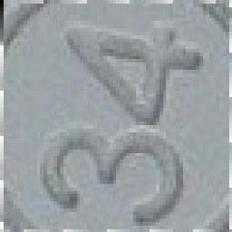 
 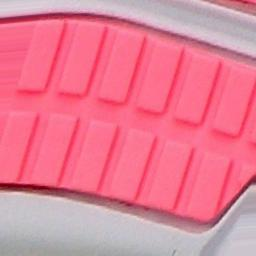
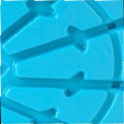 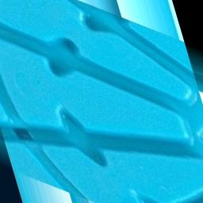
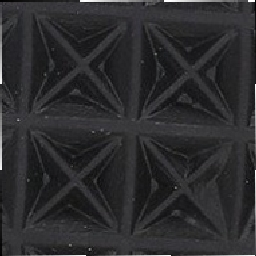 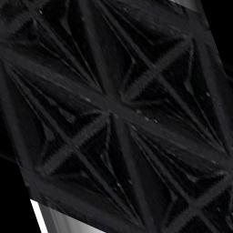
]

???

We scaled all of the labeled images to 256 x 256; aspect ratio was not preserved, though some steps have been taken to ensure that the labeled regions are at least square-ish where possible to prevent extreme distortion. 

60% of the labeled images were used as training data; these images were augmented once by zooming, skewing, cropping, and rotating the images. This step is recommended to prevent over-fitting. Examples of original and augmented images are shown on the right side of the slide.

Validation data, which is used within each fitting iteration to calculate the loss function, accounted for 20% of the images, and test data, which is used to evaluate the model at the end of the fitting process, accounted for the remaining 20%. 

We used the keras package in R to fit the model using the tensorflow toolkit. Tensorflow is an extremely efficient implementation that can use either the CPU or GPU to fit the neural network. It was originally developed by Google's Machine Intelligence team. Keras makes it easy to use VGG16, remove the model head, freeze the weights on the base, and add a new head, using only a few lines of code. 

---
class:primary
## Model Training

```{r training-accuracy, fig.width = 7.5, fig.height = 5, out.width = "99%", fig.cap = "Training and Validation accuracy and loss for each epoch of the fitting process. Training and validation accuracy reach 90% around epoch 14. After that point, validation loss remains about the same and training loss decreases slightly, while validation accuracy increases more slowly than training accuracy."}
data.frame(history$metrics) %>%
  mutate(epoch = 1:n()) %>%
  gather(key = "measure", value = "value", -epoch) %>%
  mutate(Type = ifelse(str_detect(measure, "val"), "Validation", "Training"),
         measure = ifelse(str_detect(measure, "acc"), "Accuracy", "Loss")) %>%
  # bind_rows(tibble(epoch = NA, value =  .6, measure = "Accuracy", Type = "Validation")) %>%
  # bind_rows(tibble(epoch = NA, value =  .33, measure = "Loss", Type = "Validation")) %>%
  ggplot(aes(x = epoch, y = value, color = Type)) + 
  geom_point() + 
  geom_smooth(se = F) + 
  facet_grid(measure~., scales = "free_y", switch = "both") + 
  theme_bw() + 
  scale_y_continuous("") + 
  scale_x_continuous("Epoch") + 
  ggtitle("CoNNOR Training Performance") + mytheme + 
  theme(axis.title.y = element_blank(), legend.position = c(1, .5), legend.justification = c(1.03, -0.05), legend.background = element_rect(fill = "white"))
```

.move-margin[<br/><br/><br/><br/><br/><br/><br/><br/>.small[Binary Cross-entropy Loss: 
$$-y\log(p)\\\\-\\!(1\\!-\\!y)\log(1\\!-\\!p)$$
]]
???

This chart shows model performance relative to the loss and accuracy rate during each epoch (backpropagation occurs after each epoch of fitting). The loss function used to fit the model is the cross-entropy function. 

Validation loss levels off after 15 epochs, but hasn't yet begun to increase. Training loss is still decreasing as well. One concern with retraining the head of a CNN is that with relatively little data (e.g. 20 thousand data points instead of 150K) it is easy to over-fit models; what we see is that this hasn't yet happened for this model. Overfitting would be evident if the loss in the training set had beun to increase. 

---
class:primary
## Evaluating the Model
```{r overall-roc, out.width = "100%", fig.width = 7, fig.height = 4.375}
library(pROC)
pred_df <- as_tibble(preds) %>% gather(key = feature, value = value)
test_labs_df <- as_tibble(test_labs) %>% gather(key = feature, value = value)
whole_model_roc <- roc(test_labs_df$value, pred_df$value)

whole_model_roc_df <- tibble(tpr = whole_model_roc$sensitivities, 
                             fpr = 1 - whole_model_roc$specificities,
                             thresholds = whole_model_roc$thresholds,
                             auc = whole_model_roc$auc[1]) %>%
  nest(tpr, fpr, thresholds, .key =  "roc_plot") %>%
  mutate(eer = purrr::map(roc_plot, eer))
ggplot() + 
  geom_line(aes(x = fpr, y = tpr), data = unnest(whole_model_roc_df, roc_plot), size = 1.25) + 
  geom_label(aes(x = 1, y = .07, label = sprintf("AUC: %0.2f", auc)), hjust = 1, vjust = -0.2, data = whole_model_roc_df) +
  geom_point(aes(x = fpr, y = tpr, color = "Equal Error Rate"), data = unnest(whole_model_roc_df, eer), size = 2) +
  scale_color_manual("", values = "black") +
  scale_x_continuous("False Positive Rate", breaks = c(0, .25, .5, .75, 1), labels = c("0.0", "", "0.5", "", "1.0")) +
  scale_y_continuous("True Positive Rate", breaks = c(0, .25, .5, .75, 1), labels = c("0.0", "", "0.5", "", "1.0")) + 
  ggtitle("CoNNOR Test Set Performance (All Classes)") + 
  coord_fixed() + mytheme + 
  theme(legend.position = c(1, 0), legend.justification = c(1.01, -0.01), legend.title = element_blank(), legend.background = element_rect(fill = "white")) 

```

???

We can compute an aggregate ROC curve that treats all classes the same. Under this, we see that performance is generally fairly good, though there is obviously room for improvement. The more interesting evaluation is to look at prediction accuracy for each label...

---
class:primary
## Evaluating the Model
<!-- Add in model overall AUC -->
<!-- Describe the multi-class version as splitting out model performance by class --> 

```{r class-roc, fig.width = 7.5, fig.height = 5, out.width = "99%", fig.cap = "Receiver Operating Characteristic curves for the 9 classes used to fit CoNNOR, generated individually for each class."}
aucs <- plot_onehot_roc(preds, test_labs, str_to_title(classes))
thresholds <- purrr::map_dbl(aucs$data$eer, ~.$thresholds)
aucs$data$thresholds <- thresholds

ggplot() +
  geom_line(aes(x = fpr, y = tpr), data = unnest(aucs$data, roc_plot), size = 1.25) +
  geom_label(aes(x = 1, y = 0, label = sprintf("AUC: %0.2f\nEER: %0.2f", auc, thresholds)), hjust = 1, vjust = -0.02, data = aucs$data) +
  geom_point(aes(x = fpr, y = tpr, color = "Equal Error\nRate (EER)"), data = unnest(aucs$data, eer), size = 2.5) +
  scale_color_manual("", values = "black") +
  facet_wrap(~class) +
  scale_x_continuous("False Positive Rate", breaks = c(0, .25, .5, .75, 1), labels = c("0.0", "", "0.5", "", "1.0")) +
  scale_y_continuous("True Positive Rate", breaks = c(0, .25, .5, .75, 1), labels = c("0.0", "", "0.5", "", "1.0")) +
  ggtitle("CoNNOR Test Set Performance") + 
  facet_wrap(~class, nrow = 2) + 
  coord_fixed() + 
  theme(legend.position = c(1, 0), legend.justification = c(1, 0))
```

???

These plots show ROC curves for each class, computed separately. Equal error rates are marked with a dot, and show the point at which it is equally likely for the model to miss a classification or wrongly classify an image. These EERs are used as an optimized cutoff value for diagnostics which require a hard threshold, like a confusion matrix. Most cutoff rates are around .1, though for classes with less data, such as stars and polygons, the cutoff rate is typically smaller. 

---
class:primary
## Evaluating the Model
```{r ConfMatrix, message = F, warning = F, fig.width = 7.5, fig.height = 6.5, out.width = "80%", fig.cap = "Multi-class confusion matrix for CoNNOR. When an image has multiple labels, it is considered separately for each label; additional labels associated with the image are excluded from the calculation of incorrect predictions. The equal-error rate for each class (computed from the ROC curve on the previous slide) is used as a cutoff threshold (e.g. different classes have different thresholds. Most classes achieve greater than 75% prediction accuracy. The model predicts quadrilaterals with higher frequency than supported by the data for all classes."}


get_confusion_matrix(preds, test_labs, str_to_title(classes), threshold = thresholds) %>%
  set_names(str_to_title(classes)) %>%
  ggcorrplot(., hc.order = F, outline.col = "white", lab = T) +
  scale_fill_gradient("Classification\nRate", low = "white", high = "cornflowerblue", limits = c(0, 1)) +
  scale_x_discrete("Image Label") + scale_y_discrete("Prediction") +
  theme(axis.title.x = element_text(size = 14), axis.title.y = element_text(size = 14, angle = 90, vjust = 1)) +
  ggtitle("CoNNOR Multi-Class Confusion Matrix: Test Set Performance") + 
  mytheme +
  theme(plot.margin = grid::unit(c(0,0,0,0), "mm"), plot.background = element_rect(fill = "transparent", color = NA),
        plot.subtitle = element_blank(), plot.caption = element_blank(), panel.spacing = unit(c(0, 0, 0, 0), "mm"))
```

.move-margin[

<br/>
For multi-label images, only incorrect predictions contribute to off-diagonal probabilities

$EER_i$ used as the cutoff
<br/>

]

???

This confusion matrix shows, for each label, the probability that the image is classified as that label as well as other possible labels. One modification we made to the standard confusion matrix was to exclude any additional "correct" labels from these calculations: If an image was labeled with a circle and a line, but the model assigned circle and triangle as labels, then in the circle column that image would register as a true positive for circle and a false positive for triangle; line would be excluded from calculations in that column.

An important point to make at this juncture is that while we're operating as if our labeled data were "ground truth", that isn't an accurate assumption. People make mistakes, labeling is monotonous, and the criteria for certain classes have changed over time. In some cases, the model is correct, and the labels are wrong. We're working on correcting the labeling, but even in a situation where the labeling is done in accordance with the guidelines, some of the criteria can get fuzzy in practice. 

---
class:primary
## Definitions matter
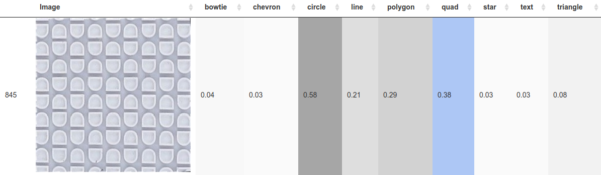

.move-margin[<br/><br/>Blue: Prediction matches image label <br/><br/>Grey: Prediction does not match image label]


???

We created a shiny application to see the images and the model's predictions. Blue means that the image had that label, grey means it does not. I've selected two images that show both correct and incorrect model classifications. 

In the first image, the design is labeled as a quadrilateral and the model identifies that, but also identifies image as containing a circle very strongly. When we look at the image, the confusion is understandable. One half of the shape is angular, the other is rounded, so the shape has features of both a quadrilateral and a circle. We've decided to label these images as both (owing to the ambiguity), but that means we have to correct all of the previously labeled images. We're working on that. 

In the second image, the model predicts circles, quadrilaterals, and text, but the image is labeled as having quadrilaterals and text. The circles happen to be part of the text (and the letters aren't even Os), and our brains pick up on the text but ignore the circles because we perceive things wholistically; the model does not. We're also in the process of updating these labels, because again, the data is not correct; the model absolutely is. 

We're trying to ensure that the data used to train the model is of very high quality, while not spending millions of dollars to hire workers online to label things. Because we determined the guidelines for labeling the data, labeled the data (or oversaw the labeling), and trained the model ourselves, we have the advantage of knowing the flaws at every point in the process; that means we have the responsibility to fix those flaws where possible. 

We're not doing inference on the model results at this point (nor planning to use the data we're training the model with during the operational stage) so the data -> model -> fix data loop is less of a validity concern. 

When the model is sufficiently well-calibrated, we can then work with engineers to build the device, collect some initial data, and tweak the model weights with new data that better represents what we'll actually see from the collection equipment. By that point, hopefully we'll also have narrowed down the geometric classification scheme so that categories that are now somewhat fuzzy are more clearly operationalized.


---
class:primary
## Interpreting the model<br>Class Activation Maps

<br/>
<br/>

<br/>
<br/>
Heatmaps are scaled by class. Yellow = high activation

.move-margin[<br/><br/>Blue: Prediction matches image label <br/><br/>Grey: Prediction does not match image label]

???

Class activation maps use the gradient with respect to each class label, back propagated to the last convolutional layer to maintain spatial information. Here, we can see that the D shape discussed previously is activating both circle and quad; the round part is activating the circle class and the straight part is activating the quad class. I've included only the relevant classes plus one comparison heatmap from a class that wasn't activated to cut down on the amount of clutter here, but heatmaps can be generated for each category.

---
class:primary
## Interpreting the model<br>Class Activation Maps

<br/>
<br/>

<br/>
<br/>
Heatmaps are scaled by class. Yellow = high activation

.move-margin[<br/><br/>Blue: Prediction matches image label <br/><br/>Grey: Prediction does not match image label]

???

Here's an image similar to the one I showed you earlier, with adidas text; the heatmap is easier to see using a slightly different color. You can see that the top and bottom of the "d" are most important in determing text, but that the model is clearly cuing in to the circles inside of the a and d. It's doing exactly what we asked it to do - it just might not have been what we meant originally. 


---
class:primary
## Interpreting the model<br>Class Activation Maps

<br/>
<br/>
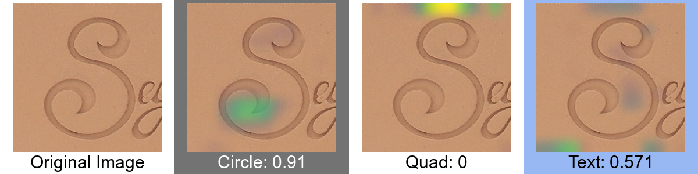
<br/>
<br/>
Heatmaps are scaled by class. Yellow = high activation

.move-margin[<br/><br/>Blue: Prediction matches image label <br/><br/>Grey: Prediction does not match image label]

???

Here's an example of an image where the model is strongly suggesting there are circles, but where we would not agree. It's not hard to see why the model thinks circles would be here, but if it isn't a closed loop, I can't in good conscience suggest it's a circle. Just because the model says something with confidence doesn't mean we change the labels on the original image. It's a screening tool, but we don't want to inflate the model's accuracy at the expense of the actual accuracy.


---
class:primary
## Project Summary

- Geometric shapes provide a convenient feature space for assessing shoe similarity
    - Comparisons between shoes take place within that feature space

- Transfer learning allows application of CNNs to much smaller datasets

- CoNNOR performance
    - Reduction in feature space: 256 x 256 x 3 -> 9
    
    - 88% accuracy; many errors attributable to data labeling

- This model provides a foundation for future automatic data collection and statistical inferences about footwear forensics.

???

In summary, the use of geometric shapes provides a convenient feature space to assess similarity of shoes. By using transfer learning, we can use powerful neural networks to identify features in images with the small amount of training data we have. CoNNOR performs well; it reduces a 256 x 256 x 3 image to a 9-dimensional vector of probabilities and has about 88% accuracy. We expect the accuracy will improve as we get better at consistently labeling the input images. 

```{r setup-demo-distance, eval = F}

source_dir <- "~/Projects/CSAFE/ShoeScrapeR/extra/talk_demo_shoes"
output_dir <- "demo_square"

# # --- Libraries ----------------------------------------------------------------
# library(tidyverse)
# library(keras)
# library(furrr)
# # ------------------------------------------------------------------------------

# # --- Set up parallel env ------------------------------------------------------
# plan(multicore)
# # ------------------------------------------------------------------------------

# --- Sourced files ------------------------------------------------------------
# source("~/models/shoe_nn/Generate_Model_Images.R")
source("~/models/shoe_nn/Image_Feature_Functions.R")
# ------------------------------------------------------------------------------

# # --- Load model details -------------------------------------------------------
# model_path <- "~/models/shoe_nn/TrainedModels/"
# 
# newest_model <- get_newest(dir = model_path, pattern = "weights.h5")
# model_dir <- newest_model$path
# load(list.files(model_dir, "-history.Rdata", full.names = T)[1])
# load(file.path(get_newest()$path, get_newest(pattern = "\\d.Rdata")$base_file))
# 
# model_wts_file <- file.path(newest_model$path, newest_model$base_file)
# loaded_model <- set_weights(model_wts_file)
# # ------------------------------------------------------------------------------

# --- Work with images ---------------------------------------------------------
# Ensure output directory exists
if (!dir.exists(output_dir)) {
  dir.create(output_dir)
}

# Crop nicely
crop_images(source_dir, output_dir)

unlink(file.path(output_dir, "temp"), recursive = T)

# Get image statistics
img_stats <- debug_image(dir = output_dir)

# Get features
features <- map_df(get_folder_files(output_dir, pattern = "*.jpg"), extract_features, model = loaded_model)

features <- features %>%
  mutate(partial_split = basename(img) %>% 
           str_remove_all("_(product|color)_\\d{1,}") %>% 
           str_remove_all("\\.jpg") %>%
           fix_brands(),
         brand = str_extract(partial_split, "[\\w]{1,}"),
         model_approx = str_remove(partial_split, paste0(brand, "-")) %>% 
           str_extract("[\\w]{1,}"))

save(img_stats, features, file = file.path(output_dir, "features.Rdata"))
```
---
class:primary
## Applying the Model

```{r demo-distance, fig.width = 10, fig.height = 7, dpi = 500, fig.cap = "Distance matrix for 7 Nike shoes, using CoNNOR's features and euclidean distance."}
load(file.path("demo_square", "features.Rdata"))

features <- features %>%
  arrange(img) %>%
  mutate(idx = 1:n())

features_mat <- features[,default_classes] %>% as.matrix()

features_dist <- dist(features_mat)
features_clust <- hclust(features_dist)

features_dist <- features_dist %>%
  as.matrix() %>%
  as.data.frame() %>%
  mutate(i = rownames(.)) %>%
  tidyr::gather(key = "j", value = "dist", -i) %>%
  mutate(i = as.numeric(i), j = as.numeric(j)) %>%
  left_join(nest(features, -idx, -img, .key = 'shoe1data') %>% 
              set_names(c("shoe1", "i", "shoe1data"))) %>%
  left_join(nest(features, -idx, -img, .key = 'shoe2data') %>% 
              set_names(c("shoe2", "j", "shoe2data"))) %>%
  bind_rows(tibble(i = 0, j = 1:nrow(features), dist = NA),
            tibble(j = 0, i = 1:nrow(features), dist = NA))


features <- features %>%
  arrange(img) %>%
  mutate(order = c(2, 5, 3, 4, 1, 6, 7)) %>% #features_clust$order) %>%
  arrange(order)

features_dist <- features_dist %>%
  left_join(select(features, i = idx, io = order)) %>%
  left_join(select(features, j = idx, jo = order)) %>%
  mutate(pval = sprintf("%.02f", dist))

features_xraster <- map2(file.path(features$file_path, features$img), features$order,
                             ~annotation_custom(grid::rasterGrob(readJPEG(.x), interpolate = T), 
                                                xmin = .y - .5, xmax = .y + .5, 
                                                ymin = -0.5, ymax = 0.5))
features_yraster <- map2(file.path(features$file_path, features$img), features$order,
                             ~annotation_custom(grid::rasterGrob(readJPEG(.x), interpolate = T), 
                                                ymin = .y - .5, ymax = .y + .5, 
                                                xmin = -0.5, xmax = 0.5))
ggplot() + 
  geom_tile(aes(x = io, y = jo, fill = dist), data = features_dist, color = "grey50") + 
  geom_text(aes(x = io, y = jo, label = pval), data = features_dist) + 
  scale_fill_gradient("Euclidean\nDistance", low = "white", high = "cornflowerblue", na.value = "transparent") + 
  coord_fixed() + 
  scale_x_continuous(limits = c(-0.5, 7.75), expand = c(0,0)) + 
  scale_y_continuous(limits = c(-1, 7.6), expand = c(0,0)) + 
  features_xraster + features_yraster + 
  ggtitle("Pairwise Distance") + 
  theme_void() + 
  theme(plot.background = element_rect(fill = "transparent", color = NA), panel.grid = element_blank(),
        axis.text = element_blank(), axis.ticks = element_blank(), axis.title = element_blank(), 
        panel.background = element_blank(), plot.title = element_text(size = 18, margin = unit(c(0, 0, 0, 0), "mm")),
        plot.subtitle = element_blank())
```

.move-margin[
<br/>
.Large[Goal: 
$$\hat{p} = \frac{S}{N}$$
]
<br/><br/>
]

???

Using Euclidean distance, we can take the feature vectors and come up with a numerical description of the distance between any two shoe outsole images. Here, I've chosen 7 different Nike shoe outsoles (because 80000 choose 2 is a bit hard to display) and computed the distance between each pair. You can see that the two images with chevrons are more similar to each other than to the other images; this even extends to a sole with chevrons and polygons. From here, we need to define a cutoff for "similar enough", then compare the number of similar shoes in our sample to the total number of shoes, yielding an estimated coincidental match probability. There is obviously still work to be done at this point in the project, but this serves as an excellent demonstration that the model is producing sensible output that meets the requirements we set out initially. Once we can collect real-world data, we know that the computational methods are in place to make the coincidental match probability problem tractable for local populations. 

---
class:primary
## Contribution Summary

- Identified the feature set and labeling criteria
- Acquired data (`ShoeScrapeR`)
- Pipeline for labeled images (LabelMe, R scripts)
- Modeling automation     
(model updates at 5pm if there is new data)
<br/><br/>
- Diagnostics for multi-class multi-label models (with M. Tilton)
- Heatmap code and `KerasVis` bindings for R    
(with M. Tilton and J. Seo)
- Distance calculations for output features
<br/><br/>
- Specifications for equipment design

???

This is a fairly complicated project, with a fair number of people and moving parts, so here's a different summary, showing the contributions I've made to the project along the way. By using a feature set that makes sense to practitioners, identifying how the machine needs to be built, and setting up a data pipeline to automatically process those images, I've tried to lay a strong foundation that will allow us to eventually calculate the coincidental match probability for shoes; with this calculation, we can then use likelihood ratios to represent the strength of evidence. There are a whole host of spatial sampling problems, explorations of sources of variation due to season, weather, and other effects... but all of these things depend on the ability to collect and automatically label data for future use. 

---
class:inv-center
# <br/><br/>What's Next?

???

I'd like to give you a preview of the next few months

---
class: primary
## What's Next?

- Publications
    - CNNs for shoeprint examiners
    - Model Diagnostics for multiclass multilabel problems

- NIJ Grant - Build the scanner, collect local population data
    - Analyze spatial and temporal patterns in shoe selection
    - Examine sub-feature frequency - e.g. types of stars

- Explore truncating VGG16 earlier or pruning using "brain surgery"

- Extend feature set with spatial information: whole-shoe predictions

???

The student I've worked on this project with finished her masters this semester, so we're now working on turning her creative component into two different papers. 

I submitted an NIJ grant in April for funding to build the scanner and collect a whole year's worth of data

We're building a package for visualizing these models in R. I'm hoping to add new diagnostics to the package once we have the python/R bindings worked out. 

One area we're exploring this summer is whether we can get better results by truncating VGG16 at an earlier convolutional block. That allows us to use lower-level features, which might match our simple geometric features better. There are also approaches in python that use a surgical approach to remove filters that aren't useful from the model - I am hoping to get some time to explore that soon too. 

I'd also like to add a spatial component to Connor by predicting features for small chunks of the shoe sole and integrating those predictions back into the entire shoe. 


---
class: primary
## References
<div class="small">

```{r print-bib, results='asis', echo=FALSE, cache = F}
PrintBibliography(bb)
```

---
class: primary
## Tools

- R Packages and Toolkits: 
    - Modeling: `keras`, `tensorflow`
    - Data Wrangling: `magrittr`, `dplyr`, `lubridate`, `stringr`, `tidyr`, `purrr`, `furrr`
    - Image Processing: `jpeg`, `imager`, `magick`
    - Annotation Manipulation: `sf`, `sp`
    - Visualization: `ggplot2`, `viridis`, `ggcorrplot`, `deepviz`, `tidygraph`, `ggraph`, `shiny`
    - XML/Web Scraping: `xml2`, `XML`, `rvest`, `RSelenium`
    - Slides/Documentation: `rmarkdown`, `xaringan`, `knitr`

- Other Software: Docker, Selenium, LabelMe Annotation Tool (w/ Matlab toolbox), gimp image editor

???

This project wouldn't have been even remotely feasible without the amazing package infrastructure R provides. I went through and tried to tally up all of the packages used in various parts of the project; here's a list of most of them (I can't actually guarantee I caught them all). Outside of the R infrastructure, I'm also using docker to host the labelme and selenium containers, and I've used gimp extensively to edit and label the images of the VGG16 layers and model structure. 

---
class: inv-center
# Questions?

???

I'd be happy to answer your questions now. 

---
class: primary
## Outline

- [Forensics Context](#6)

- [Image Analysis](#16)

- [Convolutional Neural Networks](#21)

- [CoNNOR](#41)

- [Future Work](#58)


---
class:primary
## Feature Detection

.move-margin[

<br/>
<br/>

<br/>
<br/>

<br/>
<br/>

]

#### Classic computer vision feature detection methods: 

- Edge, Corner, Blob, Ridge detection

- Template matching: Hough transforms
    - line, circle, ellipse detection
    - provide location and orientation

.pull-left[
Pros
- No training data necessary

- Relatively simple algorithm
]

.pull-right[
Cons
- Fragile
- Computationally intensive
- Features lack face validity
]

???

I started out using standard image processing methods for identifying features. There are edge, corner, blob, and ridge detectors that are used to automatically process microscope and telescope data in many different fields. There are also more complicated template-matching algorithms, including hough transforms, that can find more complicated features like lines, circles, and ellipses and provide location and orientation information. These methods are relatively simple and don't require training data, but they're also very fragile, they can be computationally intensive, and the features they select make sense when you look at a small area of pixels, but aren't globally relevant - they don't match with what you or I would pick out as an edge or a corner. After playing with these methods for a while, I decided to take out the big guns and use convolutional neural networks, which have been responsible for huge improvements in image recognition tasks over the past 7-10 years. 
---
class:primary
## Feature Detection

.move-margin[

<br/>
<br/>

<br/>
<br/>

<br/>
<br/>

]

#### Convolutional neural networks: 
- Structure designed to mimic perceptual pathways in the human visual system
- Ubiquitous in modern image recognition tasks `r Citep(bb, 'krizhevsky_imagenet_2012', .opts = list(max.names = 1, longnamesfirst = F))`

.pull-left[

Pros
- Features are interpretable
- Very fast (after training)
- Pre-trained networks available    
.small[AlexNet, VGG16, ResNet, Inception]

]

.pull-right[

Cons
- Requires labeled training data
- Computationally expensive to train
- Opaque - parameters are not interpretable

]

???

Convolutional neural networks are a type of neural network specifically designed to search an image for one or more specific patterns. They mimic what we know about the organization of the human visual cortex, and are very common in modern image recognition tasks because they work so well. 

Convnets produce interpretable features, because they mimic our perceptual processes and are trained using data labeled by humans. They take a while to train (a month or more for some models) but are very fast in processing new images - most image searches use CNNs in the background. They have millions of parameters, which makes inference very difficult - they're mostly "black box" models because of the complex model structure. An additional benefit to CNNs is that there are pre-trained neural networks available; these networks can be used as a basis for other models, so you don't have to start from scratch. They do require labeled training data, though, which means that someone has to sit and label thousands of features before you can start fitting one of these models. Some captchas work this way - you end up labeling data for someone's neural network.

While it would be nice to use a model that's more interpretable, CNNs work for image recognition under noisy or degraded data, so that's what we decided to use. 

---
class:primary
## Intra-Class Variability

```{r intraclass-variability, fig.width = 8, fig.height = 5, out.width = "100%"}
img_names <- dfunion$filename %>% basename() %>% as.vector

labs <- sapply(classes, grepl, x = str_extract(img_names, "^.*?-\\d?-"))
str <- gsub("^.*?-\\d{0,2}-", "", img_names)

# Extract first, first two, and first three words of string
brand_1 <- str_extract(str, "^.*?-")
brand_2 <- str_extract(str, "^.*?-.*?-")
brand_3 <- str_extract(str, "^.*?-.*?-.*?-")

# These are the beginning of brands that need an extra word extracted
multi_brands <- c("the", "the-north", "polo", "polo-ralph", "5", "5-11",
                  "1", "to", "dr", "la", "new", "old", "under",
                  "steve", "bernie", "cole", "tory",
                  "harley", "kristin", "eric",
                  "spring", "chinese", "dirty")

brand <- ifelse(brand_1 %in% paste0(multi_brands, "-"),
                ifelse(brand_2 %in% paste0(multi_brands, "-"),
                       brand_3, brand_2),
                brand_1) %>%
  gsub(. , pattern = "-", replacement = " ") %>%
  trimws(., "right"); rm(brand_1, brand_2, brand_3, multi_brands)

df_images <- cbind(tibble(str, brand), labs)

df_shoes <- df_images %>%
  group_by(str, brand) %>%
  summarize_at(vars(bowtie:triangle), any)

df_shoes_long <- df_shoes %>%
  tidyr::gather(key = feature, value = value, -str, -brand) %>%
  ungroup() %>%
  tidyr::nest(c(str, value)) %>%
  mutate(n_true = purrr::map_int(data, ~sum(.$value)),
         n_shoes_brand = purrr::map_int(data, ~length(.$value)))

brand_prop_by_feature <- df_shoes_long %>%
  group_by(feature) %>%
  mutate(prop = n_true/sum(n_true)) %>%
  arrange(feature, desc(prop)) %>%
  mutate(brand_cat = ifelse(row_number() <= 10, brand, "other")) %>%
  group_by(feature) %>%
  mutate(rank = pmin(row_number(), 11))
brand_prop_by_feature_10 <- brand_prop_by_feature %>%
  group_by(feature, brand_cat, rank) %>%
  summarize(prop = sum(prop)) %>%
  ungroup() %>% 
  group_by(feature) %>% 
  arrange(feature, rank) %>%
  mutate(cprop = cumsum(prop), 
         cprop2 = lag(cprop, 1, default = 0),
         mid = (cprop + cprop2)/2,
         rank = ifelse(rank == 11, NA, rank))
  


ggplot(data = brand_prop_by_feature_10) + 
  geom_bar(aes(x = feature, y = prop, fill = factor(rank)), position = "stack", stat = "identity", color = "black") + 
  geom_text(aes(x = feature, y = 1-mid, label = brand_cat), data = filter(brand_prop_by_feature_10, prop > .05), size = 3) + 
  scale_fill_brewer(palette = "Paired", guide = F, na.value = "grey") + 
  scale_y_continuous("Proportion") + scale_x_discrete("") + 
  ggtitle("Proportion of Labeled Features by Brand")
```


---
class:primary
## Interpreting the model

What is a CNN actually doing? `r Citep(bb, 'olah_building_2018', .opts = list(max.names = 1, longnamesfirst = F))`

1. Which regions in the image are relevant to each class?

2. Which regions in the image activate which filters?

3. Which filters are most important for detection of each class?
    
4. What do the filters detect?
    - Semantic segmentation `r Citep(bb, 'long_fully_2015', .opts = list(max.names = 1, longnamesfirst = F))`
    - Filter visualization

<div class="small move-margin">
<!-- 2. <b>Regions and Filters:</b> -->
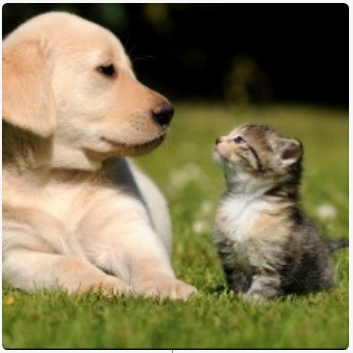
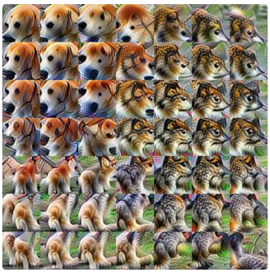
<span style="font-size:42%">Source: https://distill.pub/2018/building-blocks/</span>
</div>

<div class="pull-left">
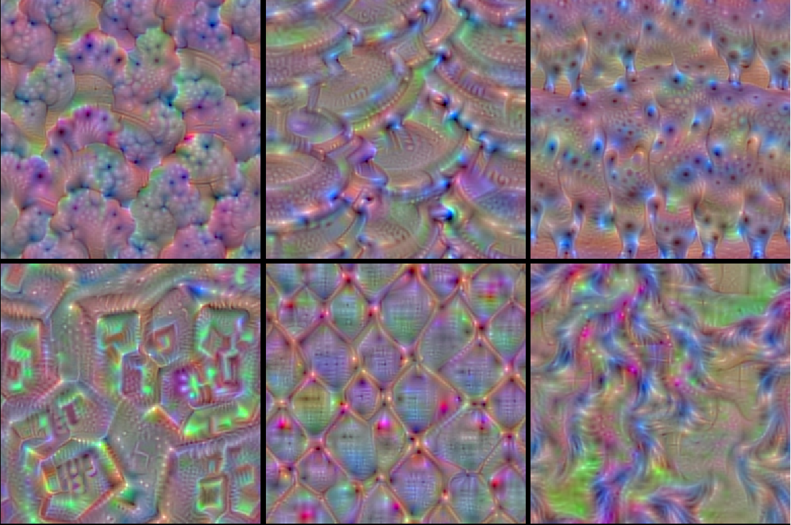
<!-- <span style="font-size:30%">Source: https://blog.keras.io/how-convolutional-neural-networks-see-the-world.html</span> -->
</div>

<div class="pull-right">
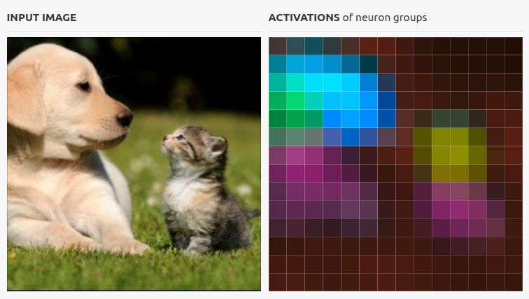
<span style = "margin-left:13%;margin-right:13%;font-size:30%">Source: https://distill.pub/2018/building-blocks/</span>
</div>

???

During this process, it's also helpful to see what the model is using to determine which features are present or absent. 

We'd love to know: 

1. Which regions in an input image are relevant to each class (I will show examples of this on the next slide)

2. Which regions activate which filters  - you can see one visualization of that on the bottom-left, where filters have been clustered and a different color is used to indicate regions activating clusters of filters. Another way to look at this is looking at the maximally activated filter for a particular sub-region of the image; the right side figure shows one way to visualize this. There are more dog-like filters on the top left, cat-like filters on the bottom-right. Both of these are much more interesting in the actual paper, which is interactive. 

3. Which filters are most important for the detection of each class - I haven't seen a great visualization of this yet, but it would be an important diagnostic tool.

4. We'd also like to see what the filters detect, either visually or using semantic categories. You can see at the bottom left a selection of filters from convolutional layer 1 of VGG16. 

This is an extremely active area of research; there is a package for making some of these visualizations in Python, and we're in the process of making an R library with those functions; hopefully within the next month or so we'll be able to generate some of these visualizations for CoNNOR specifically. At the moment, we can look at heatmaps showing activation for each class, so I'll show you those. 

```{r load-model-weights, include = F, eval = F}
model_wts_file <- file.path(newest_model$path, newest_model$base_file)
loaded_model <- set_weights(model_wts_file)
image_dir <- file.path("/models/shoe_nn/RProcessedImages", newest_model$process_dir)
test_images <- list.files(file.path(image_dir, "images"), "*.jpg", full.names = T)
```

```{r heatmap-generation, eval = F, include = F}
if (!dir.exists("heatmaps")) { dir.create("heatmaps")}
calc_heatmap(test_images[grepl("dc-pure-se-navy_product_7270757_color_9", test_images) & grepl("quad", test_images)][4], loaded_model) %>% create_composite(save_file = T, outdir = "heatmaps")
file.rename(from = "heatmaps/heatmap-quad(R)-4-dc-pure-se-navy_product_7270757_color_9.png", 
            to = "heatmaps/heatmap-quad-4-dc-pure-se-navy_product_7270757_color_9.png")
calc_heatmap(test_images[grepl("ugg-kids-bailey-bow-ii-toddler-little-kid-chestnut-pink-azalea_product_8920367_color_705035", test_images) & grepl("circle", test_images)], loaded_model, scale_by_prob = F) %>% create_composite(save_file = T, outdir = "heatmaps")
calc_heatmap(test_images[grepl("jambu-emma-black_product_9089180_color_3", test_images) & grepl("circle", test_images) & grepl("star", test_images)], loaded_model, scale_by_prob = F) %>% create_composite(save_file = T, outdir = "heatmaps")
calc_heatmap(test_images[grepl("adidas-kids-adilette-clf-adj-toddler-little-kid-big-kid-black-white_product_8987203_color_151.jpg", test_images) & grepl("text", test_images)], loaded_model, scale_by_prob = F) %>% create_composite(save_file = T, outdir = "heatmaps")
calc_heatmap(test_images[grepl("seychelles-slow-down-blush-metallic_product_9017725_color_34700.jpg", test_images) & grepl("text", test_images)][2], loaded_model) %>% create_composite(save_file = T, outdir = "heatmaps")
calc_heatmap(test_images[grepl("adidas-kids-rapidarun-knit-toddler-grey-white_product_8987200_color_1522.jpg", test_images) & grepl("text", test_images)][1], loaded_model) %>% create_composite(save_file = T, outdir = "heatmaps")
tmp <- calc_heatmap("heatmaps/test_image.jpg", loaded_model, scale_by_prob = F)
tmp2 <- tmp
idx <- which(tmp$classes %in% c("line", "circle", "text"))
tmp2$heatmap <- tmp2$heatmap[idx, , ]
tmp2$predictions <- tmp2$predictions[idx]
tmp2$truth <- tmp2$truth[idx]
tmp2$classes <- tmp2$classes[idx]
tmp2 %>% create_composite(save_file = T, outdir = "heatmaps")

tmp <- calc_heatmap(test_images[grepl("dc-pure-se-navy_product_7270757_color_9", test_images) & grepl("quad", test_images)][4], loaded_model)
tmp2 <- tmp
idx <- which(tmp$classes %in% c("quad", "circle", "text"))
tmp2$heatmap <- tmp2$heatmap[idx, , ]
tmp2$predictions <- tmp2$predictions[idx]
tmp2$truth <- tmp2$truth[idx]
tmp2$classes <- tmp2$classes[idx]
tmp2 %>% create_composite(save_file = T, outdir = "heatmaps")
file.rename(from = "heatmaps/heatmap-quad(R)-4-dc-pure-se-navy_product_7270757_color_9.png", 
            to = "heatmaps/heatmap-quad-4-dc-pure-se-navy_product_7270757_color_9.png")


tmp <- calc_heatmap(test_images[grepl("seychelles-slow-down-blush-metallic_product_9017725_color_34700.jpg", test_images) & grepl("text", test_images)][2], loaded_model)
tmp2 <- tmp
idx <- which(tmp$classes %in% c("quad", "circle", "text"))
tmp2$heatmap <- tmp2$heatmap[idx, , ]
tmp2$predictions <- tmp2$predictions[idx]
tmp2$truth <- tmp2$truth[idx]
tmp2$classes <- tmp2$classes[idx]
tmp2 %>% create_composite(save_file = T, outdir = "heatmaps")
```
