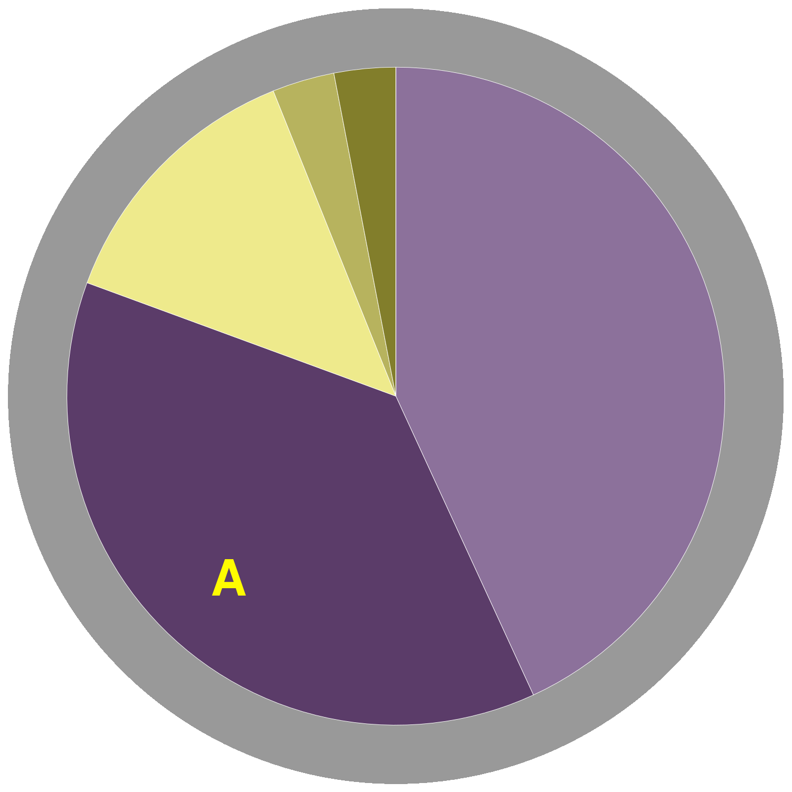
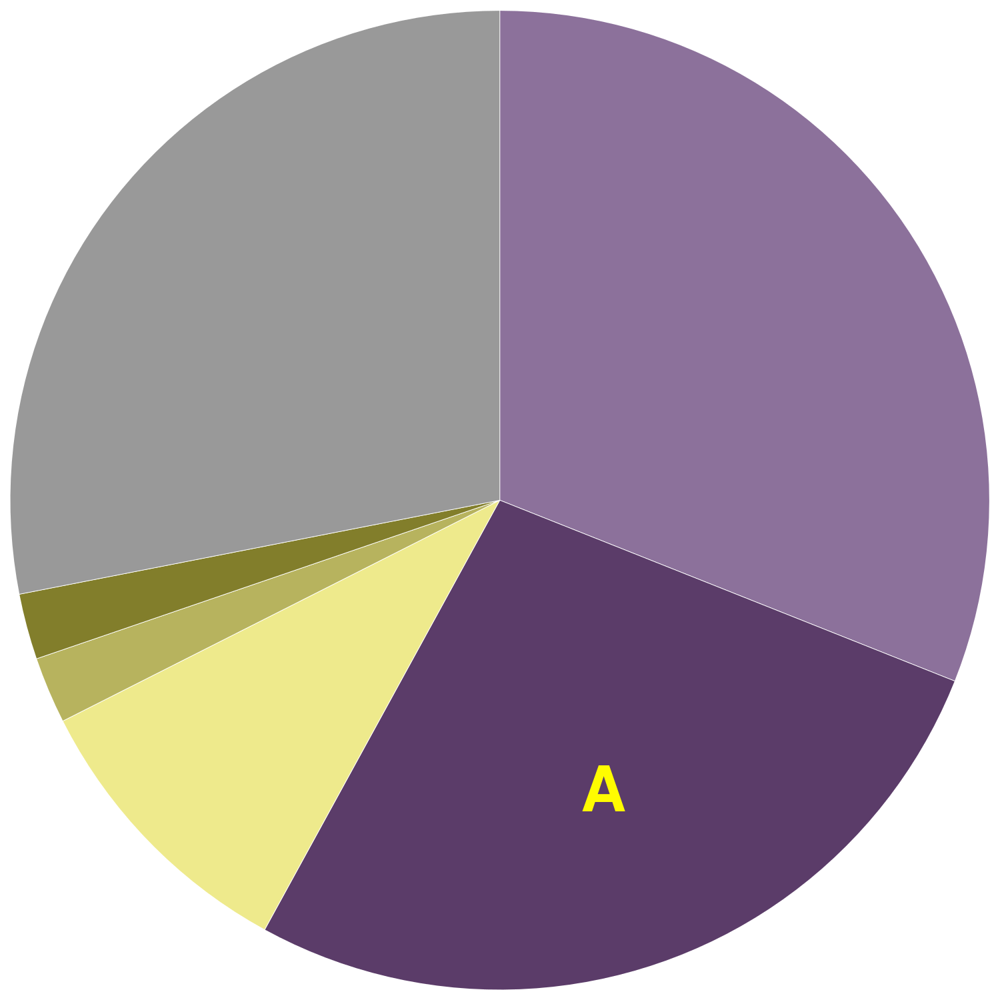

class: primary

## <br/>Shoe Wear Characterization

```{r, echo = F, out.height = "300px", out.width = "auto"}
knitr::include_graphics(list.files("2019a/", "*.jpg", full.names = T))
```

- Goal: Compare images taken at different time points, develop statistical features that indicate wear

---
class: primary
## <br/>"Human Factors"

- How do jurors react to statistical charts?

- Do people use statistical charts to evaluate factual claims?

- What types of charts are most useful for presenting certain types of evidence?

- ``Truthiness" - does showing someone a picture related to a claim make them more likely to believe the claim?
    - Pilot study done - need to run and analyze data from full Amazon Turk study

---
class: primary
## <br/>Data Visualization

- Recent work:    
Replicating Framed Charts from the 1870 Statistical Atlas
.move-margin[
```{r, echo = F, out.width = "100%"}
knitr::include_graphics(list.files("2019a/", "*.png", full.names = T)[1:2])
```
]

<!-- <div class="move-margin"> -->
<!--  -->
<!--  -->
<!-- </div> -->

- Potential projects: 
    - Examine effect of different types of aesthetics on conclusions drawn from visual inference plots
    - Implementing hatching/shading/textures in ggplot2, with perceptual study

.center[
```{r, echo = F, out.width = "35%", out.extra='style="margin-left:auto;margin-right:auto;"'}
knitr::include_graphics(list.files("2019a/", "*.png", full.names = T)[3:4])
```
]
