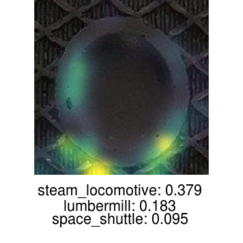
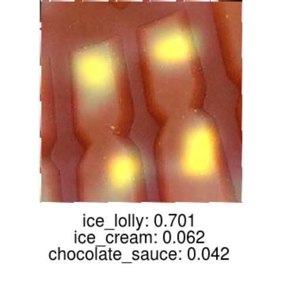
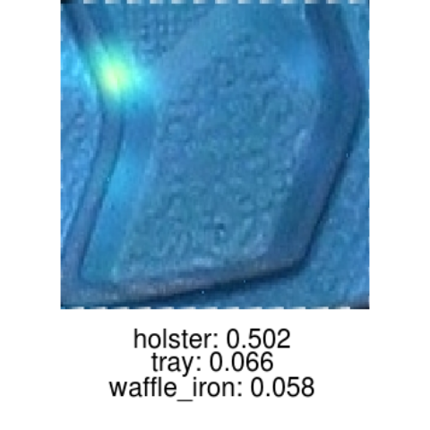
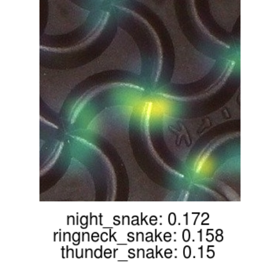
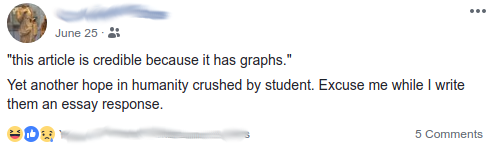

```{r setup, include=FALSE}
knitr::opts_chunk$set(echo = FALSE)
```

## Computer Vision + Forensics

- Currently shoes, but could also involve fingerprints and bullets
- Detect ambiguous/complex features in images and 3D data
- Mimic the power of the human visual system with machine learning!






## Perception of Statistics

- How do jurors (and others in legal system) interpret charts and statistical information?
- Do charts and graphics make related claims more credible?



## Images

- Forensic pattern evidence often requires analyzing images
- Essential pre-analysis tasks: 
    - Alignment
    - Cleaning
    - Edge Detection
- R packages for these tasks are insufficient or nonexistent

