## Automatic Footwear Analysis

.pull-left[
- __Practical Goal__: Automate collection of footwear images from local population

- __Engineering__: (Dr. Stone) Build passive scanning device

- __Data Science__: Recognize geometric shapes, brands, styles from images automatically    
(CNNs & computer vision)

- __Statistics__: Estimate probability of randomly matching a similar shoe in the population

]

.pull-right[
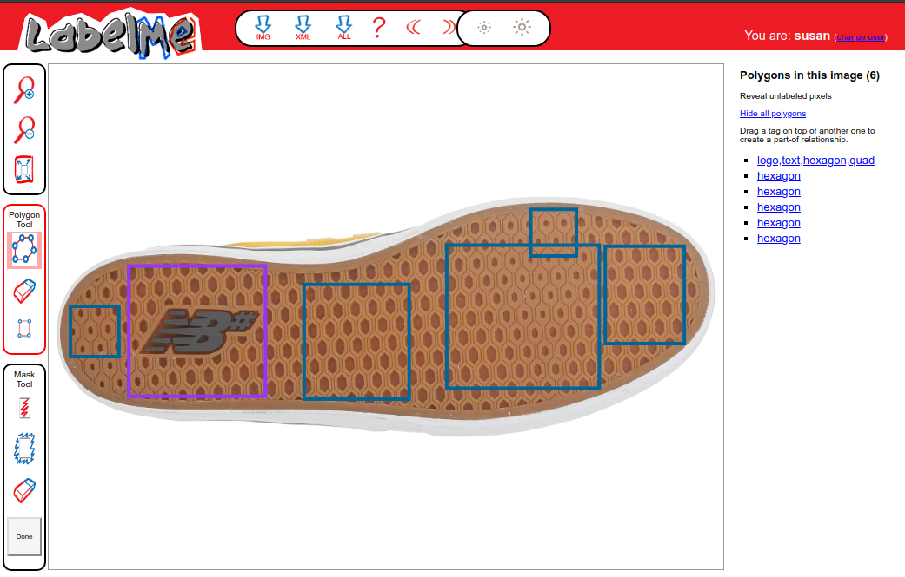
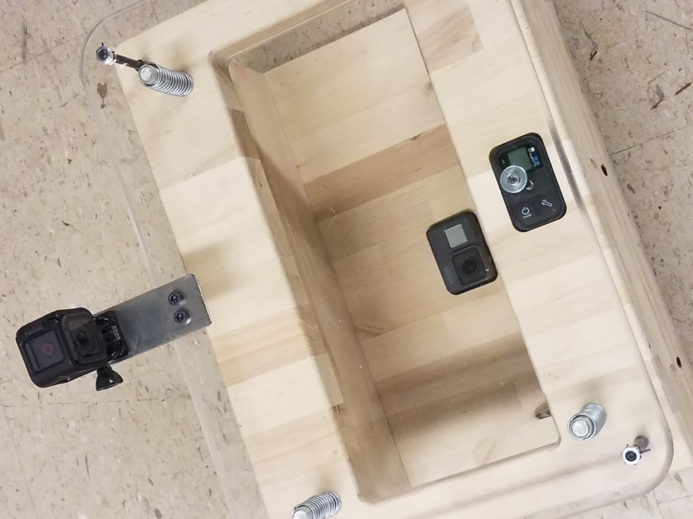
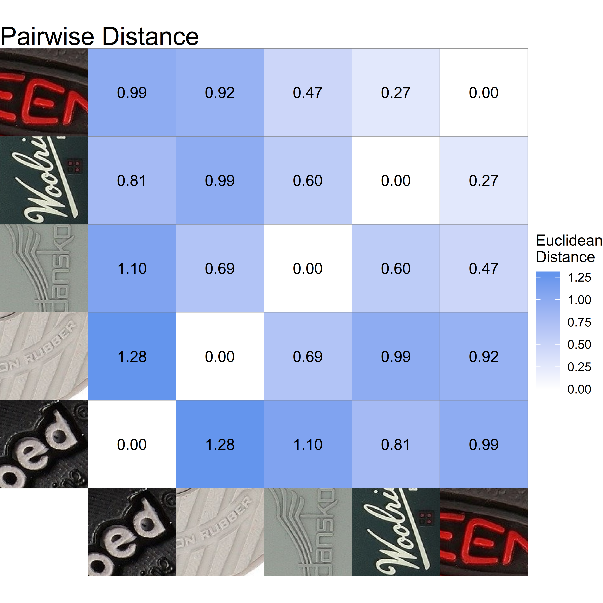
]

---

## Statistical Firearms Analysis

__Overall Project Goal__: Develop statistical methods for matching bullets and cartridges

__Current Challenge__: Use computer vision techniques to improve automatic identification of regions of interest in 3D scans of bullet land engraved areas and cartridge cases

Vertical Line Detection | Annotated x3p bullet scan
--- | ---
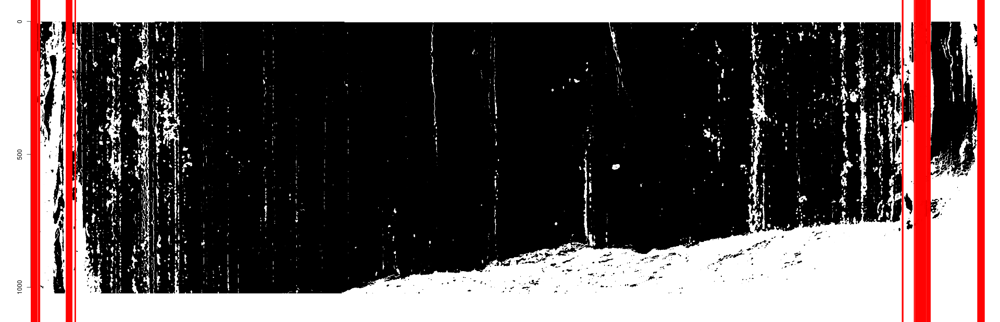 | 

Original Scan    | Circle Detection | Breech Face ID
:--------------: | :--------------: | :--------------:
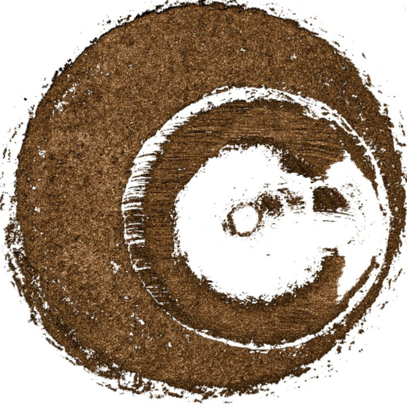 | 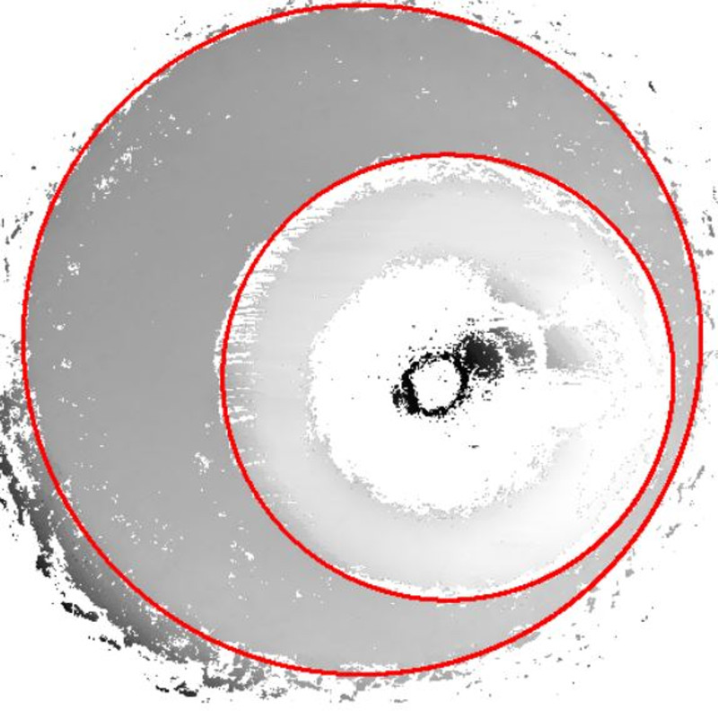 | 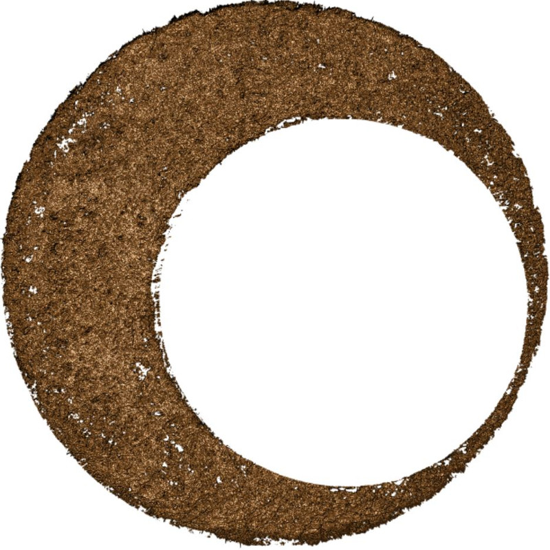

---

## Human Factors

- The __truthiness__ effect: When making a factual claim, showing a picture related to the claim increases the probability of evaluating the claim as true

- __Goal__: Does this effect extend to statistical graphics?    
(Important for assessing the implications of using statistical charts in court)

- Pilot Study in November 2018, Full Study in Summer 2019

##### Over 95% Of Belgium's Population Lives in Urban Areas

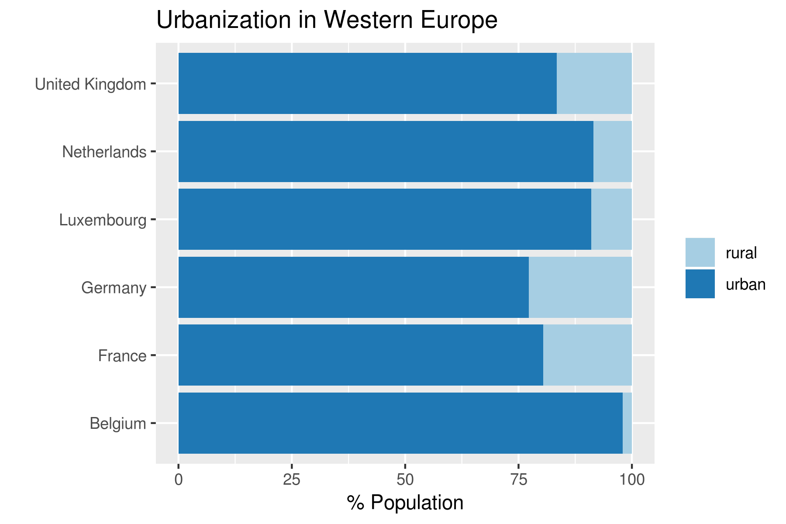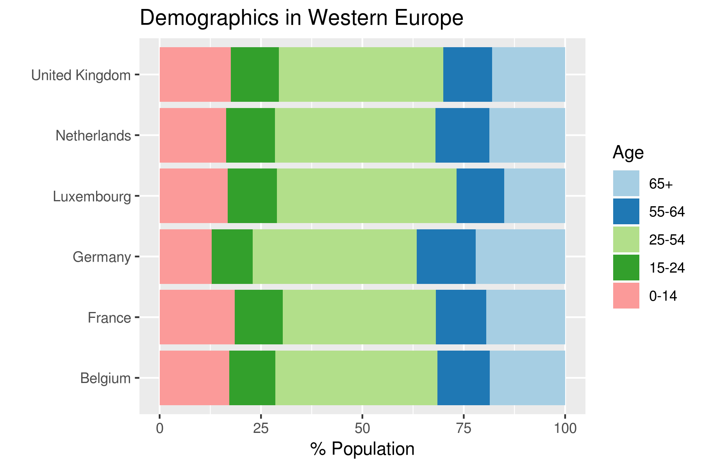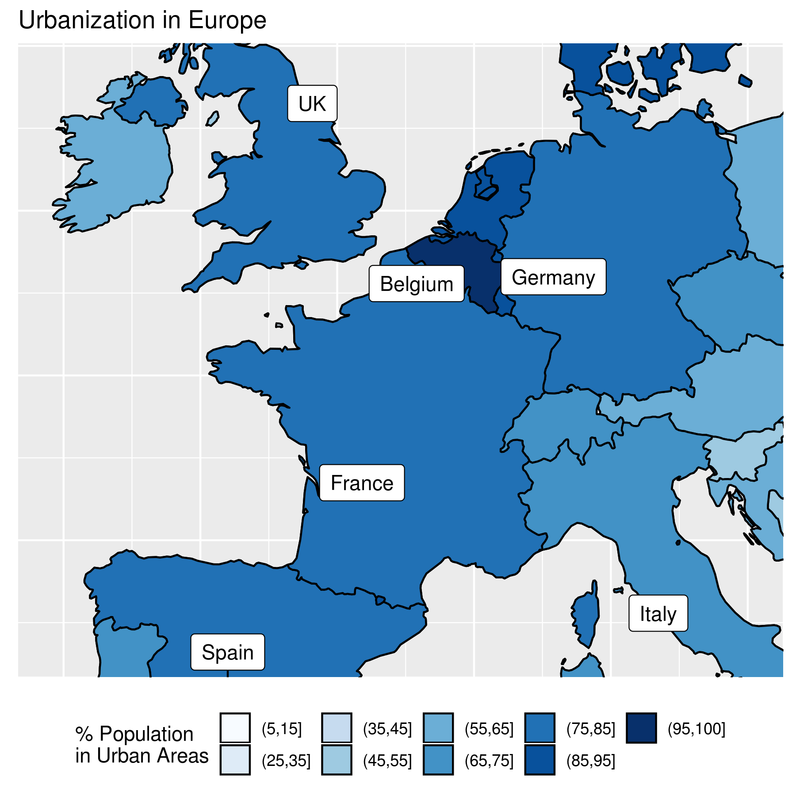
<!--  -->

---

## Statistical Graphics

.pull-left[
- Effect of [optical illusions](https://www.tandfonline.com/doi/full/10.1080/10618600.2014.951547) on statistical chart perception

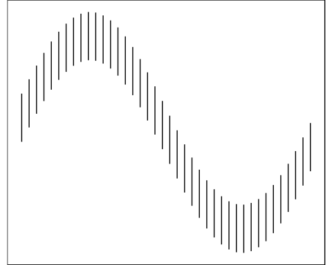

- [Numerical biases in estimation](https://www-tandfonline-com.proxy.lib.iastate.edu/doi/full/10.1080/10618600.2018.1562937) caused by different plot designs

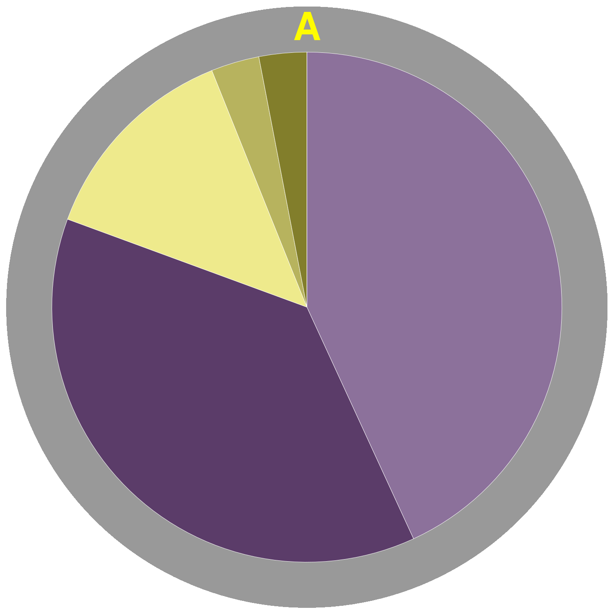
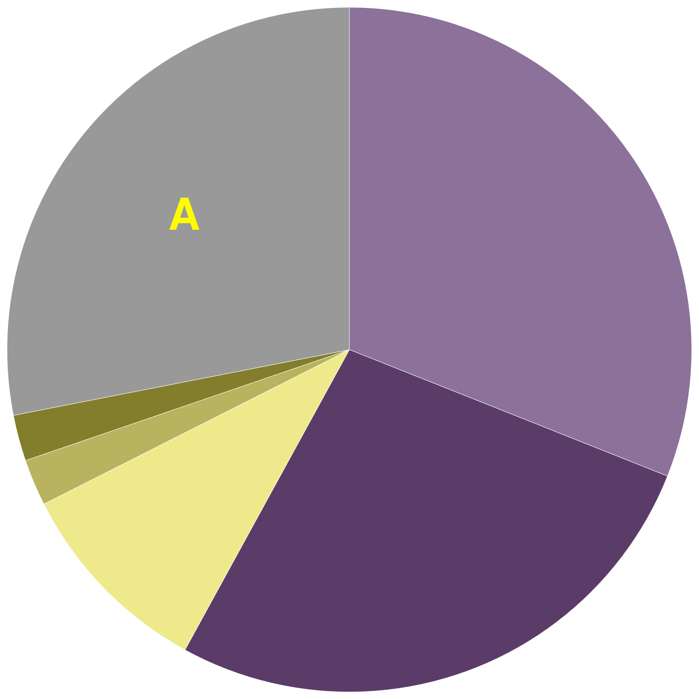
]
.pull-right[
- [Graphical Hypothesis testing](https://www-tandfonline-com.proxy.lib.iastate.edu/doi/full/10.1080/10618600.2016.1209116) with statistical lineups

.center[
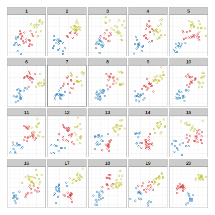
]

- Interactive graphics with ggplot2 and [animint](https://www.tandfonline.com/doi/full/10.1080/10618600.2018.1513367)
]

---

## Industry Experience

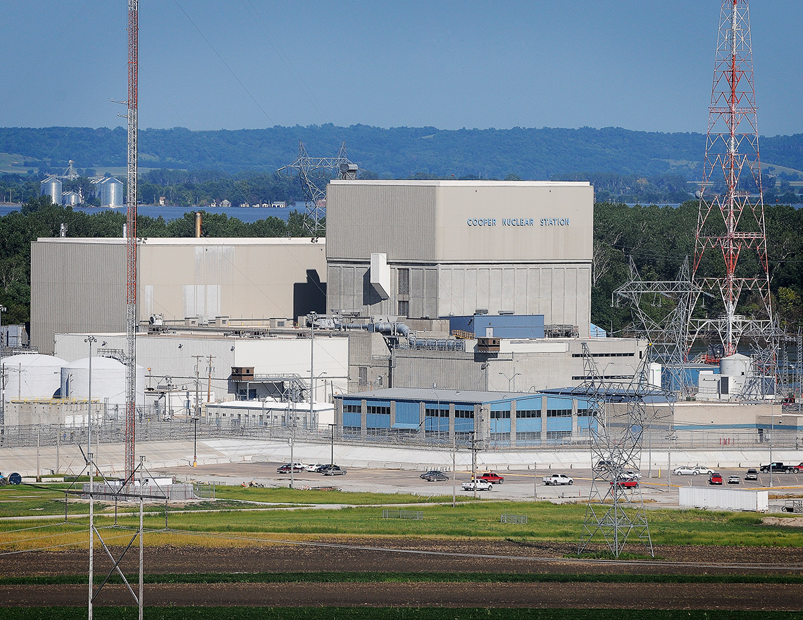

__Statistical Analyst__: 2015 - 2018 at Nebraska Public     
Power District (Cooper Nuclear Station)    
Responsibilities:
  - Develop an internal program to train employees in R and data science
  
  - Statistical analyses in response to NRC inquiries (e.g. tornado guided missile damage assessment)
  
  - Predict time to complete critical tasks based on equipment reliability and previous performance.
  
  - Predict electrical demand based on weather, historical data, and other factors
  
  - Assessment of transformer health based on loading data

__Consultant__: Interactive web applets for statistical data display ([USDA](http://agron.iastate.edu/CroppingSystemsTools/soybean-decisions.html), [Iowa Soybean Association](https://analytics.iasoybeans.com/cool-apps/NitrogenRiskCalculator/))
  
  