class: primary
```{r setup, echo = F, cache = F, include = F}
library(magrittr)
library(tidyverse)
library(ggplot2)
mytheme <- theme_bw() + 
  theme(panel.grid.major = element_line(color = "grey50"),
        panel.grid.minor = element_line(color = "grey60"))

theme_set(mytheme)
knitr::opts_chunk$set(echo = FALSE, message = F, warning = F, cache = T, dpi = 300, dev = 'png')

```

class:primary,middle,center
## Slides at: 
<h3>srvanderplas.github.io/Presentations/PAG2020/</h3>

---
class:inverse
# Alternate Title: <br/>10 ways to screw up your analysis

---
class:primary
## Disclaimer

.large[All of these examples are real. 

*Most* of the mistakes I discuss are my own or occurred on projects I was a major participant in.
]

???

In the spirit of transparency, I'm going to spend this talk discussing some really big, really expensive mistakes (and some other mistakes that were a little less expensive). None of the examples I mention here were complete failures, and they all provided useful data. But if we don't talk about our mistakes, we don't get better. 

---
class:primary
## Disclaimer

.large[
.center[


Making the same mistakes is boring. 
]

]
--

Learn from my mistakes so you can be more creative in making your own.

???

My goal is to ensure that you don't make the same type of mistake - hopefully, you'll find new ways to screw up your studies, and then you can warn others about them.

As with most confessional situations, though, I'd ask that you not judge us too harshly. Every one of my collaborators on these projects is very smart and talented; but even the best of us make mistakes and get carried away sometimes. 

---
class:inverse
# \# 1. Jump Right In: Start a GIANT study in a new field

---
class:primary
## Jump Right In: <br/>Longitudinal Shoe Study

- 160 Pairs of shoes, each worn for ~6 months

- 2 shoe models with different patterns and sole materials

- 7 different methods for imaging the shoes

- 3-4 different timepoints collected for each pair of shoes

<table class="move-down" width="100%">
<tr class="blank"><td>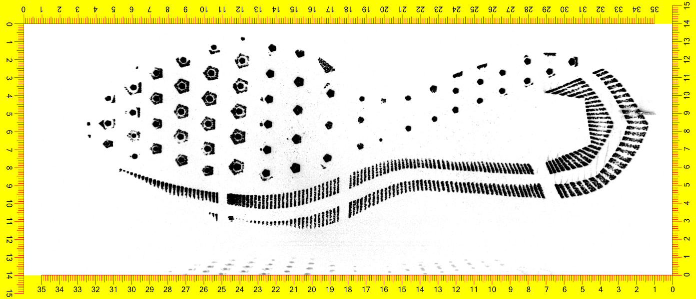</td><td>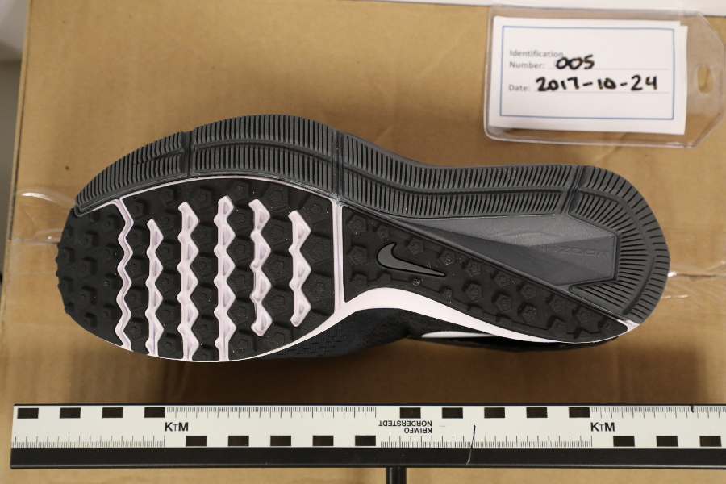</td><td>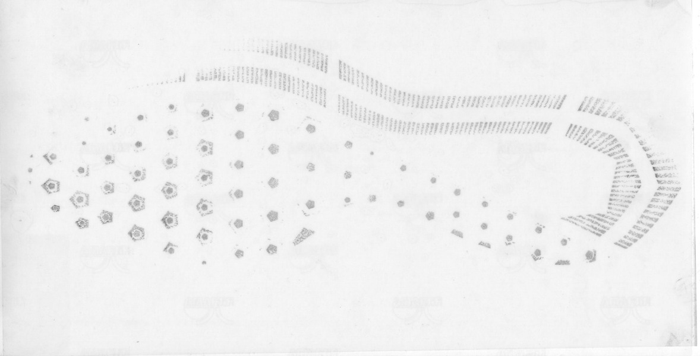</td><td>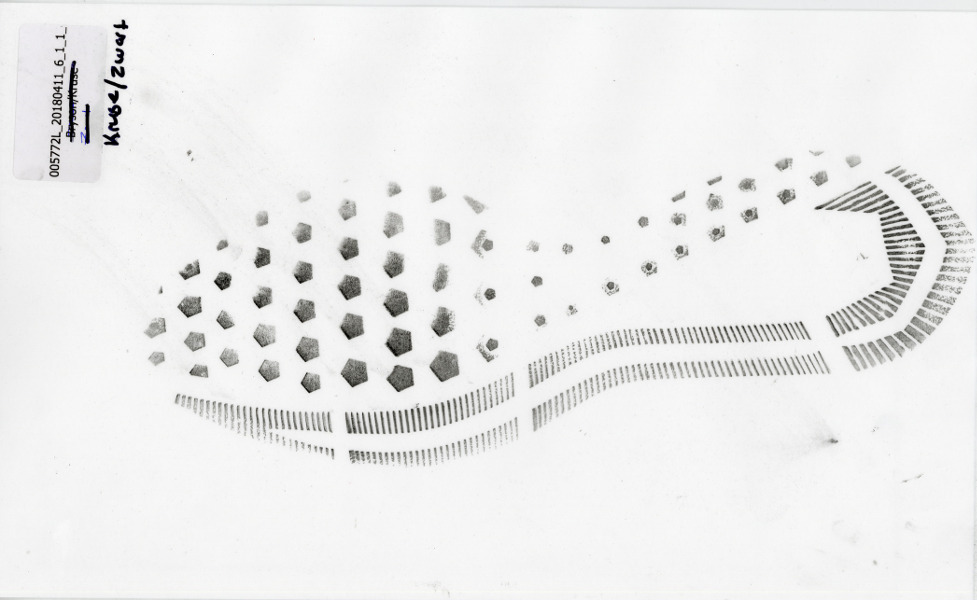</td></tr>
<tr class="blank"><td>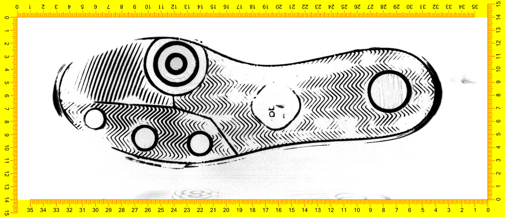</td><td>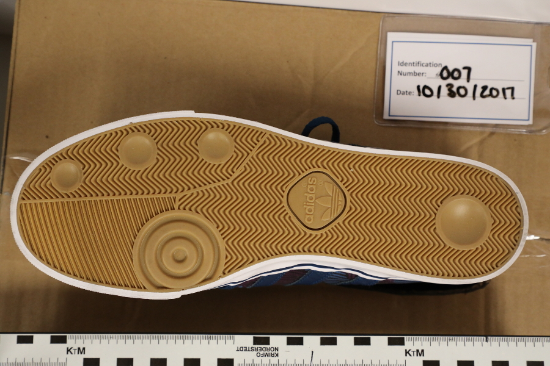</td><td>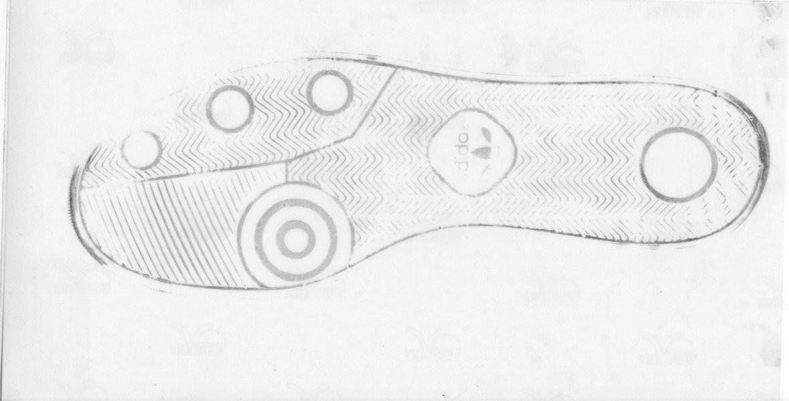</td><td>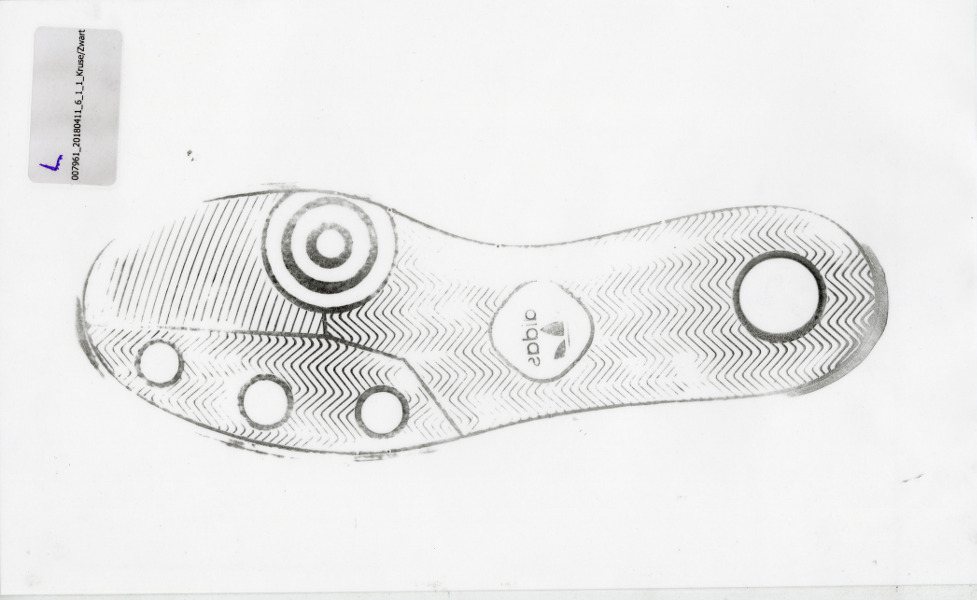</td></tr>
</table>
<div class="move-margin">
<br/><br/>
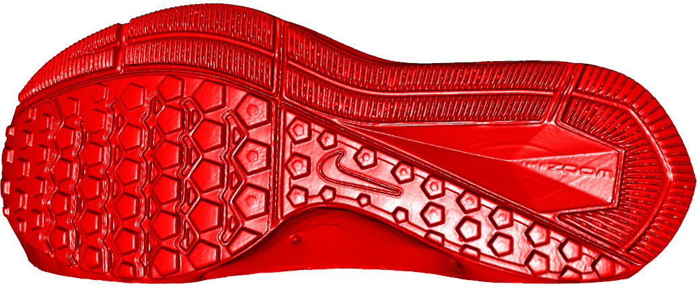
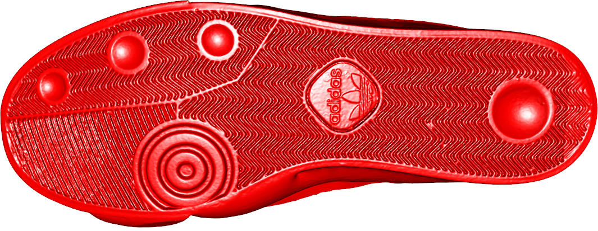
<br/><br/><br/>
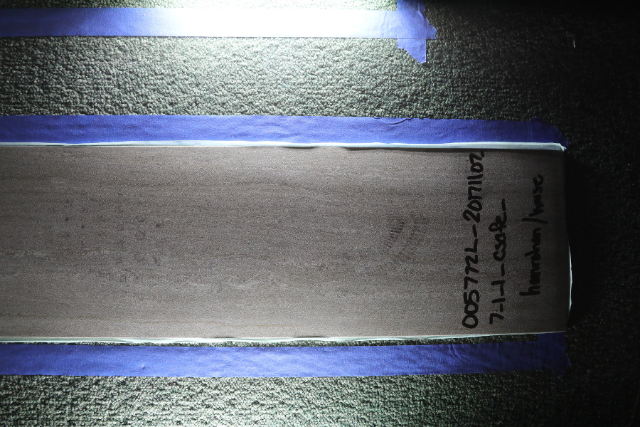
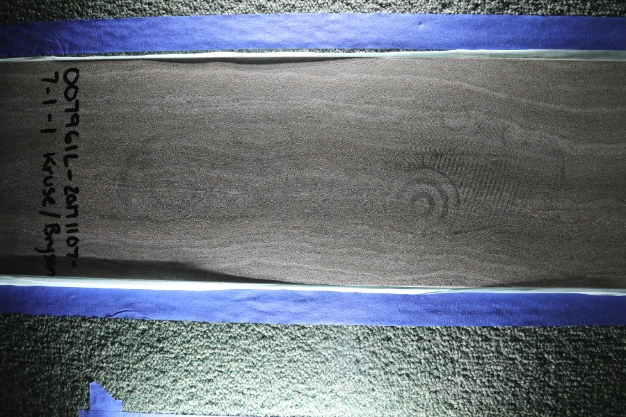
</div>

???

One of the main resources used in forensic statistics is the reference database - you compare method performance based on these things, and you develop new methods by testing them on these reference databases. When CSAFE started, we wanted to address the lack of statistical methodology in forensics, so we needed to build a few reference databases before we could actually develop new methods. This study attempted to address several different factors and fill in multiple gaps in existing knowledge at the same time. 

As a result, the study was designed as a factorial experiment - we used 2 different models of shoes (with different patterns and different sole materials), 6 different imaging methods, and several different procedures for most of the methods. It's a huge study. Because it was so big, it quickly became very complicated and involved. Since we were new to the area, we also didn't know enough to control for the right things. We would have been much better off doing several smaller studies - it would have been cheaper, we would have been able to adapt to new information more effectively, and we could have maintained better experimental control. 

Most of the time, statisticians don't collect their own data. So maybe you wouldn't make these mistakes. But I've found a few examples in the literature of historical studies that made the same mistake, so I suspect it happens more than we'd like to think. 

You'll hear a lot about this experiment during this talk. In my opinion, there were a couple of large errors made in this study, and they can be summarized as "trying to do too much, too soon". Sometimes you have to do the study while you have the money, but we would have been much better off starting with several smaller studies.

---
class:primary
## Don't get in over your <br/>head too quickly
.center[


]

---
class:inverse,center,middle
# \# 2. Pilot studies are a waste of time

???

The next way to screw things up is closely related to the first: don't run a pilot study. This is particularly important for studies that use equipment or analyses you haven't worked with before, or where your experimental protocol changes significantly. 

---
class:primary
## Pilot studies are a waste <br/>of time

Statisticians: 
- pilot studies are to get error estimates (classroom context)

- determine power/study size for the main study

If you don't really need error estimates, and you design your main study to be as big as is feasible, you don't need a pilot study, right?

???

Statistics classes discuss pilot studies as a way to get error estimates, so you can do power calculations. That's great and all, but there are several other reasons to run a pilot study even if you don't need to do power calculations.

--

.center[

]


---
class:primary
## Pilot studies

- Pilot studies give you a chance to test
    - data collection methods
    - equipment
    - lab assistants
    - data cleaning/processing pipeline
    - statistical analysis methods/code
    
- You can write 80% of your paper before you start the main study if you have pilot data + Rmarkdown/knitr/Sweave
    - Just plug new data in and re-generate your results

- If everything goes perfectly during the pilot study and you don't change anything afterwards, you can usually throw the data into the main study (e.g. Phase 1 and Phase 2)

???

The most important reason to run a pilot study is to make sure your data collection methods, equipment, lab personnel, code, and analyses all work together before you spend all the money on an experiment. We'll talk about reproducibility in a bit, but with tools like rmarkdown, you can basically use your pilot study to write most of the final paper, and then just swap out the data.

If you change nothing between the pilot study and the main experiment, then sure, group the data together. I've never seen that happen - there's always something to tweak or make work better.

--

> (I've never seen this happen)

---
class:inverse
# \# 3. You can figure out how to analyze the data after it's collected

---
class:primary
## You can figure out how to analyze the data later


---
class:primary
## You can figure out how to analyze the data later

**Statistics**: you should set up your hypotheses and analysis methods before you collect the data.

**Data Science**: 

1. You need to test the data cleaning pipeline before you collect all of the data
.center[

]

---
class:primary
## You can figure out how to analyze the data later

**Statistics**: you should set up your hypotheses and analysis methods before you collect the data.

**Data Science**: 

1. You need to test the data cleaning pipeline before you collect all of the data
2. How you want to analyze the data may change the methods you use to collect it

.center[

]
---
class:primary
## You can figure out how to analyze the data later

**Statistics**: you should set up your hypotheses and analysis methods before you collect the data.

**Data Science**: 

1. You need to test the data cleaning pipeline before you collect all of the data
2. How you want to analyze the data may change the methods you use to collect it
3. Developing the analysis pipeline early gives you a chance to find bugs 
<!-- (saving time, money, and retracted publications) -->


.move-margin[

]
---
class:primary
## You can figure out how to analyze the data later

**Statistics**: you should set up your hypotheses and analysis methods before you collect the data.

**Data Science**: 

1. You need to test the data cleaning pipeline before you collect all of the data
2. How you want to analyze the data may change the methods you use to collect it
3. Developing the analysis pipeline early gives you a chance to find bugs 


If you do the pilot study and analysis... you're already in the clear on this one

.move-margin[

]

---
class:inverse
# \# 4. Data collection for the sake of data collection

???

Data collection for its own sake is another good way to ruin an analysis. 

I should start out by asking... do any of you have someone leading your group, your organization, or your section who is enthusiastic to a fault, but tends to not want to get into the details?

CSAFE is about to launch a project named "Project Tread" which is supposed to be primarily an outreach project. With that said, we're statisticians, and we can't completely write off the idea of using the data for ... something... at some point in time.

I'll confess that I'm a data packrat. I have datasets sitting on my machine that are obscure and probably useless, but I can't bring myself to delete them. However, not thinking about what you want to do with the data can lead to some really big problems down the road.


---
class:primary
## Data collection<br/>for its own sake

.move-margin[

]

- Project TREAD: Primarily citizen science project

???

We've started planning a citizen science project at CSAFE recently called Project TREAD. We have a procedure for getting nice prints from shoes using cooking spray and cocoa powder. After talking about this as a community engagement project, someone said something about maybe analyzing it...

--

- We might want to use the data later...

???

And after the longitudinal study, I stopped everything and forced us to discuss how we'd use the data, what analyses we hoped to do, and how we hoped to do the analysis.

We came up with important features of the data... and not-so-critical features.

We also used the past study to identify areas of likely trouble - e.g. cleaning the pictures up. We'd need image masks to crop out the useless information.

--
***

- Important features: 
  - many different shoes, 
  - visible tread pattern, 
  - able to see small damage areas, 
  - compare to photo of shoe sole,
  - accurate scale on the print

- Not important: both feet, repeated prints, photographic variation

- Other factors:
  - Hard to clean the data: need shoe-specific mask
  
***

???

Using these goals, we changed the study procedure to better match what we wanted to accomplish. We pared down the number of prints taken, and requested participants trace their shoes to prrovide their own masks. 

---
class:primary
## Data collection<br/>for its own sake

Procedure modifications: 

- Print ruler on the paper for scale
- Request traced outline of the shoe to use as a mask
- Request photo of the bottom of the shoe for comparison

Participation criteria:

- Good camera (resolution)
- Shoe that has been worn for more than a month (random damage present)

Recruitment goals: 

- Wide variety of people
- School involvement

.move-margin[

]
???

Ideally, we'd still have a specific analysis we would want to do with the collected data. Maybe even some code for cleaning that data. But, even with the really rough goals we have listed above, we changed the protocol of the experiment to make the downstream data processing easier with one simple modification: we're now asking each person to trace the bottom of their shoe and upload that picture with all of the shoe print pictures. 

We haven't started the study yet, and I'm still pushing to have the analysis pipeline in place first, but because there isn't a database like this out there at the moment, we're still having some issues doing the full analysis. We will get a cleaning pipeline in place first, though. 

---
class:inverse
# \# 5. You don't need to know how your equipment works

---
class:primary
## Know your equipment

- Play with it (before you start data collection)
- Learn the different settings available
- Read the manual!
- Maintenance/calibration schedules

Handheld scan | Turntable scan
------------- | --------------
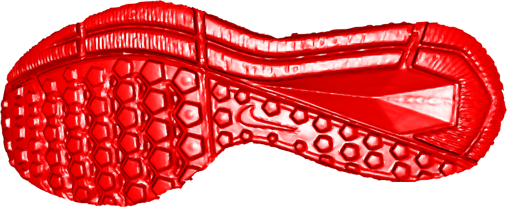 | 

???

During the longitudinal shoe study planning phase, we got a lot of new equipment - 2D and 3D scanners, flatbed scanners, fingerprint powder, a pressure mat scanner... it was a bit overwhelming. So overwhelming that we didn't play with the equipment too much before using it in the study. As a result, we ended up with several things that could have been done *much* better. The best example of this is the 3D scanner. At the very end of the study, we discovered that the scanner actually came with a turntable that took a bit longer to use but resulted in very high quality scans. If we'd used that at the beginning, we would have had an amazing comparison of the wear along different parts of the shoe. Without that, we can't easily compare the low-resolution handheld scans to the high-resolution scans. It's a real waste. 

---
class:inverse
# \# 6. Allow your collaborators to change experimental procedures any time

???

This is another huge problem we came across during the shoe study. We did consult with experts before starting the study about how to collect the data, but we were new to the field and didn't consult with the right experts or get sufficiently detailed instructions.

---
class:primary
## Change experimental procedures

<table class="blank"><tr><td>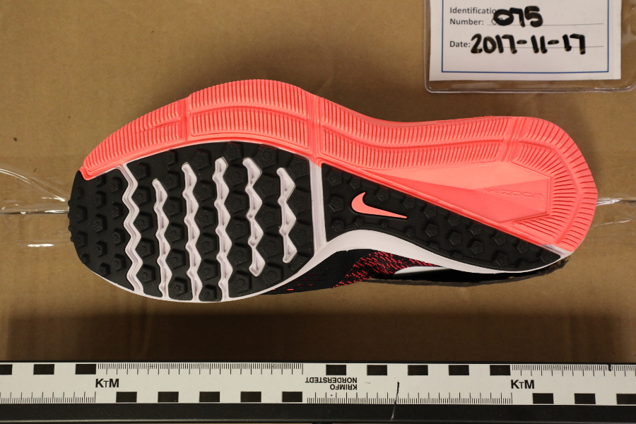</td><td>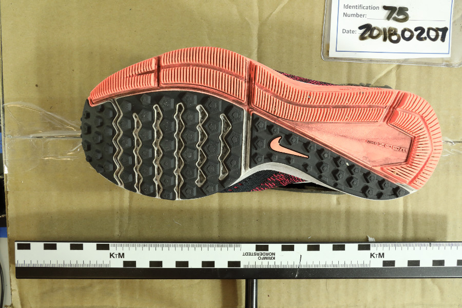</td></tr><tr><td>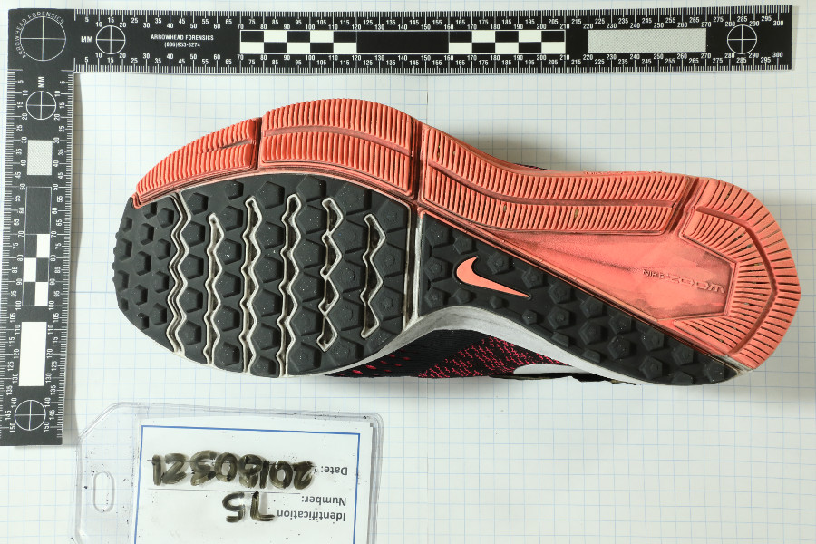</td><td>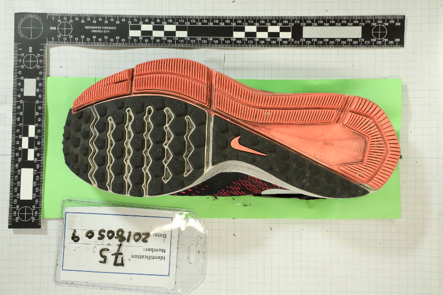</td></tr></table>

???


After the first round of data collection, our collaborators started telling us what to change procedurally to collect better data. That's really nice of them, right? Unfortunately, all of those changes meant that we don't have consistency across each time point of the study. Here's one single shoe over the four timepoints; each picture was taken with a digital camera. 

This happened with most of the ways we were measuring the shoes; it's just easier to see how with this particular set of pictures. 

---
class:primary
## Change experimental procedures

Sometimes unavoidable changes
- Supplier ran out of XYZ, order from somewhere else
- Equipment broke and was replaced with new version
- Unavoidable personnel changes

<!-- .move-margin[] -->

Unnecessary mid-experiment changes
- Black fingerprint powder will work better than silver
- Add another 3 rulers to the image 
- Change the order of data collection in a way that affects the data

???

Some experimental changes, particularly when experiments run over a long time period, are inevitable. Our film supplier changed during the experiment, so some of the film has a slightly different tint and background pattern than the stuff we used in the beginning. Equipment breaks and is replaced. People leave the lab and are replaced.

However, with each non-mandatory change, you have to weigh how much it is going to affect the utility of your data and whether it will complicate the analysis. 

Another example is that we had to change the order of data collection. The fingerprint powder we used was getting into the 2d scanner, so we had to scan shoes before we powdered them up for the prints. The photography step, however, didn't really need to move. It did, though, which means that the image processing code has to be able to recognize black patterns on shoes as well as brightly colored patterns, and then has to compare them. That change wasn't exactly well thought out. If there had been code to analyze this data ahead of time, a lot of these changes would have been weighed more carefully.


---
class:inverse
# \# 7. Don't make anything reproducible

???

The next mistake you can make (very easily) is to not think about reproducibility when you're doing your data collection, analysis, and writeup. There are obviously levels of reproducibility, but keeping track of important code, function parameters, and such is critical. 

---
class:primary
## Reproducibility

- Rstudio projects: keep all of your dependencies in a single place

- R packages: collect, document, and test your code in one place

- Version control (git) and online repositories (github) 
    - save working versions of code
    - stop writing ```paper_version1_revision5.Rmd```
    - share your code
    - make results available

- knitr/rmarkdown: package code, writing, and results together:    
better code documentation ("literate programming") 
    
- Be kind to future you!

.move-margin[.move-up[
.center[


]]]

???

I don't just work on shoes, I also work on bullet matching algorithms. We have a machine learning model that we fit using data processed by the current working version of the code we'd built. Now, the code is in a package, but then, it was just in a script. The problem is, we don't know what script, because if we were using version control at the time, we didn't write down which version we used to fit the model. 

So now, all of our bullet analyses are depending on this model that works really well, but that we can't re-derive from the data, because parameter defaults have changed and none of us knows exactly what they were originally.

This is the kind of thing that happens when you're exploring and playing around with data. The problem is, it's not really great science. If we'd set out at the beginning of the project with the idea that all of the code we wrote would be in an R package and version controlled, we'd have been much better off. 

Similarly, if you've ever gone back to an old paper you wrote and tried to make that code run... it sucks, and not just because past you wrote awful code. You've rearranged your file system since then, or gotten a new computer, and you're missing critical files. Or you can't remember what you did back then, and why on earth did you make that stupid decision? Rmarkdown or knitr help a ton with that - you have your code, your data, your paper, and any comments in the code or paper all in one place. It's harder to get lost. 


---
class:inverse
# \# 8. You don't need to protect your data (from yourself)

???

This one may not be a common problem, but it's one that I hope no one ever repeats, so it made the list. The 3rd chapter of my dissertation involved a simulation model to generate data, which was then plotted and used in a user study. 

I was very diligent and set the project up very neatly. I wasn't using R packages then, but I had code in one folder, simulation data in another, I'd carefully saved all of the pictures we were using in the experiment for posterity, and all of the parameters were encoded in the picture file names. We saved seeds for reproducibility. Great, right? 


---
class:primary
## You don't need to protect </br>your data (from yourself)

- Write protect your data

- Separate your code/analysis from your data: code produces downstream results

- NOTHING CHANGES THE ORIGINAL DATA FILE

.center[

]

???

Unfortunately, I didn't write-protect my experimental stimuli once we had tweaked the data generating model. 

So at some point during the analysis, I was a bit too thorough and re-ran the data generating script; but this time, something changed somewhere and the plots got overwritten, along with the correct keys.

This wreaked havoc on everything and very nearly ruined the (massive, factorial) experiment. We managed to rescue it (yay backups!) and everything was fine, but I learned a very valueable lesson about write protecting data.

If you're separating your code from your data well enough, you should be able to write-protect your original data, then run your code to get your results. You might have to save intermediate results along the way to save time, but the original data can be write protected.

Don't be me.

---
class:inverse
# \# 9. Store your data in a proprietary or closed format

---
class:primary
## Using Proprietary Formats

- You depend on a company to maintain software to access your data

- You may only be able to use a specific OS

- If the company goes out of business or drops support, your data is effectively gone

- The data storage format is less likely to be well documented

- It may be harder to get the data accepted to long-term data repositories

???

Another way to really limit the reach of your experiments (and your ability to use your data later) is to store things in proprietary formats. 

During the shoe study, we used a pressure mat scanner to record the weight distribution across people's feet as they walked. This scanner was cool, but everything was stored in a proprietary format, so you couldn't access the data unless you were using Windows. 

Then, to get the data into a form we could actually analyze properly using R, we had to pay extra for a different piece of software to export the data. 

When we went to upload the data to a long term repository, they wouldn't take the original data format, because no one would be able to open it anyways.

--

.center[.move-down[
.strong[Even the .doc format cannot be fully reverse engineered. ]
]]

???


Sometimes there are reverse-engineered programs to maintain compatibility, but it's worth remembering that as ubiquitous as word is, we still haven't completely reverse engineered doc files. Libre Office and Google docs are great, but they aren't 100% compatible because Microsoft uses a proprietary format to store the data in.

---
class:inverse
# \# 10. No one is that interested in your data, so why share it?

---
class: primary
## Why share your data?

- Help someone else out with pilot data!

- Allow external reproductions of your studies

- The process of curating your data forces you to document it

- Minimal effort + an extra publication!

- Google search optimization - make your work easier to find


Places to look: 


???

I talked earlier about how I got some starter data from the internet for a study that was so exploratory that getting pilot data seemed unlikely. 

In fact, there were a couple of studies that had exactly the types of data I needed. They just didn't have data available (and I couldn't even get in contact with the PIs). While I figured out how to get usable data eventually, the data from those studies would have been much more topically relevant and much better for my analysis.

An open ecosystem for data advances science and makes it more efficient. It allows mistakes to be caught more quickly. Some of you may have heard about the economics study that was one of the main bases for the "deficit spending is bad" claim came under fire back in 2013. The study was done much earlier, but the data was only released in 2013; when it was released, they discovered an error in the Excel spreadsheet that changed the results. They didn't change that much, but it's a bit scary that a single study was a huge factor in determining economic policy across the western world, and that study had an error! Data sharing helps catch these kind of issues, and everyone is better off. 

---
class:inverse
# Questions? <br/> <br/>  .halfsize[Contact me: <br/>susan.vanderplas@unl.edu<br/> @srvanderplas (github)]

---
class:primary
# Acknowledgements

Collaborators: 

- Alicia Carriquiry
- Guillermo Basulto-Elias
- James Kruse
- Heike Hofmann


This work was partially funded by the Center for Statistics and Applications in Forensic Evidence (CSAFE) through Cooperative Agreement #70NANB15H176 between NIST and Iowa State University, which includes activities carried out at Carnegie Mellon University, University of California Irvine, and University of Virginia.