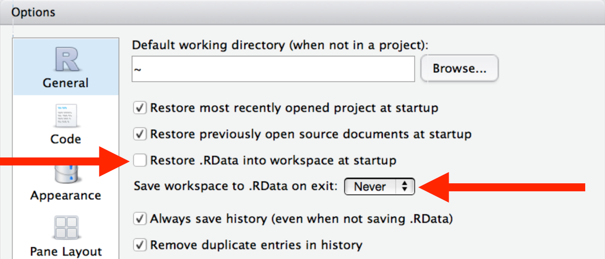
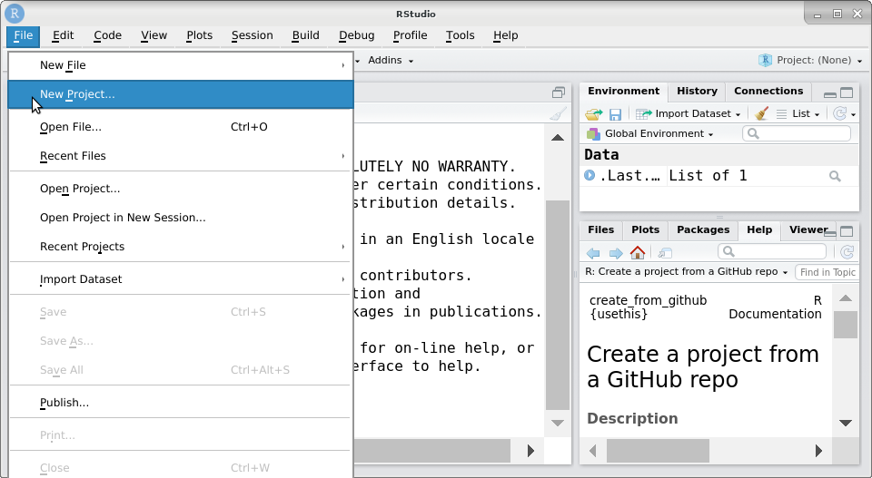
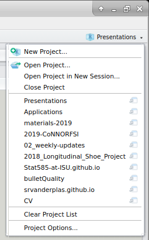
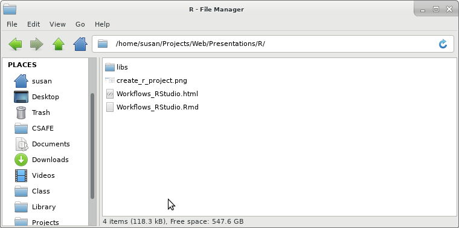
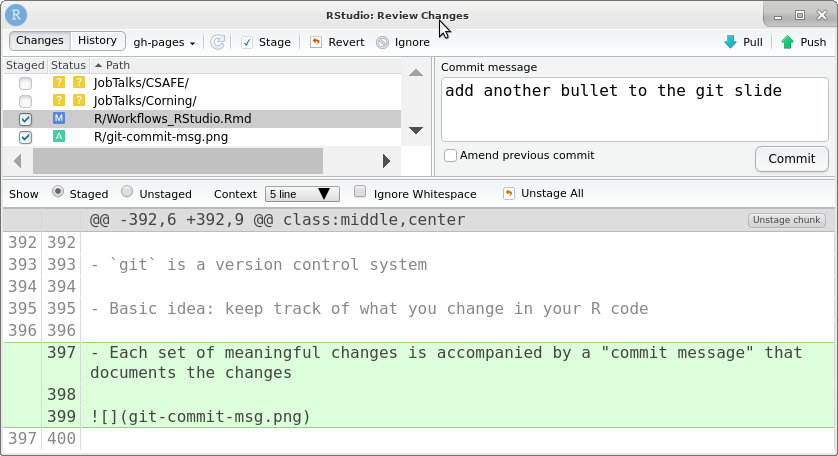

```{r setup, include=FALSE}
options(htmltools.dir.version = FALSE)
library(tidyverse)
# install_github("hadley/emo")
library(emo)
emo_pray <- emo::ji("pray")
emo_up <- emo::ji("+1")
emo_down <- emo::ji("-1")
emo_disappointed <- emo::ji("disappointed")
emo_heart_eyes <- emo::ji("smiling face with heart-eyes")
```


## Before we start

I will use functions from these packages during this presentation:

- `usethis` - helper functions for best practices in R
- `here` - friendly relative paths with R projects
- `testthat` - unit tests in R packages

<br/><br/><br/><br/><br/><br/>

Inspiration for this set of slides: 

- https://uncoast-unconf.github.io/uu-2019-day-zero/02-project-workflows/workflow.html
- https://www.tidyverse.org/articles/2017/12/workflow-vs-script/


---

## Outline

- Pre-test

- [Basic R best practices](Workflows_RStudio.html#5)

- [Project oriented workflow](Workflows_RStudio.html#11)
  - [File Paths](Workflows_RStudio.html#18)
  - [File Names](Workflows_RStudio.html#20)

- [Package oriented workflow](Workflows_RStudio.html#27)

- [Version Control and Other Advanced Stuff](Workflows_RStudio.html#32)

- [Writing Documents in R](Workflows_RStudio.html#36)

---

## Working in R

Pre-test: Do you...

- Save your R code in script (.R) or markdown (.Rmd) files?

- Use an IDE (integrated development environment) like RStudio?

- Use self contained projects (e.g. Projects in RStudio)?

- Use relative paths?     
e.g.     
`./data/data.csv`    
vs     
`/home/me/Work/Projects/this-one-project/data/data.csv`

- Write code for a _clean environment_?    
clean environment = new R session with no data or packages loaded

---
class: middle,center

# Basic R best Practices

---

## Save the source, not the workspace


If your workspace matters, you have a non-reproducible workflow. R processes and workspaces are __disposable__. Everything that mattters should be saved as R code.

---

## Use an IDE

An IDE makes it easy to follow best practices. 

- self-contained projects

- saving R scripts

- version control

- local paths


Best practices make it easier for future you as well as current collaborators. 

---

## Clean Slate in R

- Do not save the workspace to an .Rdata file when you quit R.    
Do not load an .Rdata file when you start R

.center[]

`usethis::use_blank_slate()` helps you set this up too.

---

## Restart R often

.pull-left[

]
.pull-right[
To restart: 
- RStudio:
  - Session -> Restart R
  - `[Ctrl/Cmd] + Shift + F10`

- Shell:
  - `Ctrl+D` or `q()` to quit, then restart R
  
This removes all loaded packages, clears your workspace (if you aren't saving it in .Rdata automatically), and "resets" everything
]


---

## Avoid `rm(list = ls())`

- This doesn't go far enough: 
    - only deletes visible items in the environment
    - doesn't detach packages that you've loaded
    - hidden env items still exist

To power-cycle, restart R.

To switch from one project to another, restart R or use an IDE with project support.


---
class:middle,center
# Project Oriented Workflow

---

## Workflow?

- The computer you use to write code (OS, file path, configuration)

- Custom settings (.Rprofile, .Renviron)

- Your environment
    - loaded packages
    - previously loaded data

## Product

- Raw data

- R code to get from data to results

- Paper (Rmd file, Sweave file, word document, ...)

---

## Projects: Self contained Workflow + Product

Assumptions

- R scripts are self-contained: 
    - Run from a fresh R process
    - in a working directory set to the project directory

- R script creates everything it needs in its own workspace or folder

- R script touches nothing it did not create
    - does not install new packages without consent!
    
This makes your life easier (switching computers, etc.) and makes it easier for collaborators!

`setwd("path/that/only/works/on/my/machine")` won't work for your collaborators, and probably won't work on your machine in 2 years. 


---

## RStudio Projects



---
## RStudio Projects

.left-column[

]
.right-column[

- Opening a project "resets" your environment - avoids cross-contamination

- Provides a (semi)structured, self-contained workflow

- Makes it easier to use relative paths to navigate

- Your *.Rproj file lives in the "project root" directory 

- All other files exist in folders within the root directory

- RStudio knows about recent projects!

]

---

## Project-oriented workflow

- Project: one folder on your computer that holds all files needed for a particular piece of work

- Project-oriented workflow: file system discipline
    - all paths are relative
    - combine development convenience and code portability
````
project_name/
|-- raw-data
|   -- data-raw.csv
|-- data
|   -- data-clean.csv
|   -- data-results.csv
|-- code
|   -- clean-data.csv
|   -- analyze-data.csv
|-- paper
|   -- figure/
|      -- fig1.jpg
|   -- report.Rmd
````

---

## RStudio Project Organization

My personal philosophy: 
- R code in `R/` folder (no subfolders)
- raw data in `data-raw/` folder
- working data in `data/` folder
- paper files in `paper/` folder
- presentations in `presentations/` folder

Biggest thing: discuss with your collaborators how things will be set up!

One advantage to doing things my way: it's compatible with R packages, so you can make your code + paper + data into a package with only a few extra steps.


---

## Using Relative Paths




`/home/susan/Projects/Web/Presentations/R/Workflows_Rstudio.Rmd` is the __global__ path for this presentation on my laptop.

Working within the `Presentations` R project, the __local__ path is `./R/Workflows_Rstudio.Rmd`

---

## Using Relative Paths

`here` is a package to make paths easier

- within an RStudio project, `here::here()` finds the project root directory (by finding the `.Rproj` file)

- From the project root, here constructs a relative path: `here::here("subdir", "data.csv")` is equivalent to `"./subdir/data.csv"` if subdir is in the project root folder.

<br/>
<blockquote class="twitter-tweet" data-lang="en"><p lang="en" dir="ltr">If the first line of your <a href="https://twitter.com/hashtag/rstats?src=hash&amp;ref_src=twsrc%5Etfw">#rstats</a> script is &quot;setwd(...&quot; I will come into your lab and SET YOUR COMPUTER ON FIRE.</p>&mdash; Dr. Timothée Poisot (@tpoi) <a href="https://twitter.com/tpoi/status/720340395901648897?ref_src=twsrc%5Etfw">April 13, 2016</a></blockquote>
<script async src="https://platform.twitter.com/widgets.js" charset="utf-8"></script>

<br/>
See also: [Ode to the here package](https://github.com/jennybc/here_here)

---

## File Names

.center[]

---

## File Names should be...

- Structured

- Machine Readable

- Human Readable


---
## Structured File Names

- If there is an order to the files, use that:
    - `01_clean-data.R`, 
    - `02_full-analysis.R`, 
    - `03_pairwise-tests.R`, etc.

- Pad the numbers with 0s so they're displayed in order

- For dates, use ISO 8601 standard (yyyy-mm-dd) so that everything is sorted correctly in your file manager

---

## Structured File Names

<blockquote class="twitter-tweet" data-lang="en"><p lang="en" dir="ltr">Comprehensive map of all countries in the world that use the MMDDYYYY format <a href="http://t.co/jaOQp0oZyN">pic.twitter.com/jaOQp0oZyN</a></p>&mdash; Michael Donohoe (@donohoe) <a href="https://twitter.com/donohoe/status/597876118688026624?ref_src=twsrc%5Etfw">May 11, 2015</a></blockquote>
<script async src="https://platform.twitter.com/widgets.js" charset="utf-8"></script>

---

## Machine Readable File Names

1. Regex and globbing friendly: 
  - Avoid spaces
  - Limit yourself to `A-z`, `0-9`, `-`, `_`. 
  - Use the same case conventions for every file.    
  Note: Windows is case-insensitive. Your collaborators will thank you for making this consistent!
  - Avoid "." characters that aren't part of the file extension
  
2. Use delimeters deliberately
  - "_" underscore to delimit metadata you want later
  - "-" hyphen to delimit words

---

.left-column[
.center[
<br /><br />

# `r emo::ji("scream")`

<br /><br /><br /><br /><br /><br /><br />

#`r emo::ji("smile")`
]
]
.right-column[

`myabstract.docx`

`Joe's Files with Spaces and Punctuation.xlsx`

`figure 1.png`

`homework1.R`

`JW7d^(2sl@deletethisandyourcareerisoverWx2*.txt`

<br /><br />

`2018-01_bryan-abstract-rstudio-conf.docx`

`joes-filenames-are-getting-better.xlsx`

`fig01_scatterplot-talk-length-vs-interest.png`

`bryan_hw01.R`

`1986-01-28_raw-data-from-challenger-o-rings.txt`
]

---

## Human Readable File Names

Use descriptive file names - not just `01.R`, `01_clean-up-data.R`

Do this as you go along... it's much more work to fix it later. 

<br/><br/>

.center[<iframe src="https://i.giphy.com/media/HtHQEafAxGP4Y/giphy.webp" width="480" height="269" frameBorder="0"></iframe>]

---
class:middle,center
# Package Oriented Workflow

---

## Package oriented workflow

> Any time you copy-and-paste code three times, write a function.
> Any time you copy-and-paste a function three times, write a package.
> - Hadley Wickham (aka the "Rule of three", which is an old concept)

<br/><br/>
Packages keep all of these things together:
- data
- code
- tests for your code
- function documentation (arguments, etc)
- project-level documentation     
(e.g. the paper that goes with the code and data)

Packages are self-contained units that are easily share-able and publishable

---

## Guides to package development

- [R packages book](http://r-pkgs.had.co.nz/) by Hadley Wickham     
(2nd edition is under development, [here](https://r-pkgs.org/))

- [Creating an R package in 20 minutes](https://www.rstudio.com/resources/videos/you-can-make-a-package-in-20-minutes/) by Jim Hester

- [Packages](https://github.com/hfrick/presentations/blob/master/2019-03-12_package_building/2019-03-12_package_building.pdf) and [Best Practices for Packages](https://github.com/hfrick/presentations/blob/master/2018-06-27_goodpractice/2018-06-27_goodpractice.pdf) workshops by Hannah Frick


---

## Advantages to using R packages

- Easily shareable (esp. if you host the package on GitHub)

- Keep track of dependencies using DESCRIPTION Imports

- Inline documentation with `roxygen` - write documentation as you go    
(future you will be very grateful)

- Don't have to source a bunch of files - just __Ctrl/CMD - Shift - L__ to load all package code

- Ensure updates to your code don't break other functions with unit tests and the [`testthat` package](https://testthat.r-lib.org/)

  - Do this automatically with continuous integration using [travis-ci](https://juliasilge.com/blog/beginners-guide-to-travis/) or [`appveyor`](https://github.com/krlmlr/r-appveyor)

- Publish a paper describing your method, then publish an R package with the code!

---

## Outline

- Pre-test

- [Basic R best practices](Workflows_RStudio.html#5)

- [Project oriented workflow](Workflows_RStudio.html#11)
  - [File Paths](Workflows_RStudio.html#18)
  - [File Names](Workflows_RStudio.html#20)

- [Package oriented workflow](Workflows_RStudio.html#27)

- [Version Control and Other Advanced Stuff](Workflows_RStudio.html#32)

- [Writing Documents in R](Workflows_RStudio.html#36)

---
class:middle,center
# Version Control


---

## Version control with git and GitHub

- `git` is a version control system

- Basic idea: keep track of what you change in your R code

- Each set of meaningful changes is accompanied by a "commit message" that documents the changes



---

## Projects and Packages with git and GitHub

- `usethis::use_git()` will set up a local git repository

- `usethis::use_github()` will set up a GitHub repository for your project/package (if git and GitHub are properly configured)

- `git` allows you to collaborate in real-time and helps you resolve conflicts effectively.

- `GitHub` allows the collaboration to happen online in a controlled fashion. 


.center[
### git = local machine, GitHub = on the web
]

---

## Projects and Packages with git and GitHub

Example: [`x3ptools` package](https://github.com/heike/x3ptools)

- `devtools::install_github("heike/x3ptools")` to install a package from GitHub

- `pkgdown` package - make documentation website for your package automatically via [GitHub pages](https://heike.github.io/x3ptools/)

- Continuous integration: [travis-ci.org](https://travis-ci.org/heike/x3ptools), appveyor    
Changes to github -> package automatically built, tested, and checked


---
class:middle,center
# Writing Documents in R

---
## Dynamic Documents

Two main options: 
1. Simple Formatting: [R markdown](https://rmarkdown.rstudio.com/)
    - everything is written in simple text + markup
    - [Cheatsheet](https://www.rstudio.com/wp-content/uploads/2015/02/rmarkdown-cheatsheet.pdf)
    - R (and other code) in chunks that start with     
    ` ```{r chunk-name, options}`     
    and ends with     
    ` ``` `
    - Journal templates using [rstudio/rticles](https://github.com/rstudio/rticles) package
    - Output to pdf, docx, html... 
    

---
## Dynamic Documents
Two main options: 

1. Simple Formatting: [R markdown](https://rmarkdown.rstudio.com/)

2. Complex formatting: [R Sweave/knitr](https://yihui.name/knitr/)
    - everything is written in LaTeX
    - [Cheatsheet](https://cran.r-project.org/web/packages/knitr/vignettes/knitr-refcard.pdf)
    - R in chunks that start with    
    ` <<chunk-name, options>>=`     
    and ends with    
    `@`
    - Use journal templates directly
    - Output to pdf
    

---

## Outline

- Pre-test

- [Basic R best practices](Workflows_RStudio.html#5)

- [Project oriented workflow](Workflows_RStudio.html#11)
  - [File Paths](Workflows_RStudio.html#18)
  - [File Names](Workflows_RStudio.html#20)


- [Package oriented workflow](Workflows_RStudio.html#27)

- [Version Control and Other Advanced Stuff](Workflows_RStudio.html#32)

- [Writing Documents in R](Workflows_RStudio.html#36)